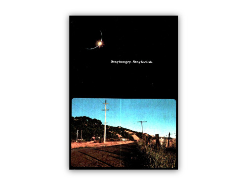

1. Steve Jobs did not say “Stay Hungry, Stay Foolish”, he quoted this line from a 452-page book named “Whole Earth Catalog”.

2. Critics and reporters have been saying the book has changed the world (not only through its influence on Steve Jobs), as a symbol of the formation of counterculture. A lot of new ideas and products, like solar power, recycling, wind power, desktop publishing were firstly introduced to mainstream audience from this book in late 1960s. 

3. The quote was printed on the back cover of its last edition, above a photo of a country road in the morning. Steve Jobs said, 

“It was a photograph of an early morning country road, the kind you might find yourself hitchhiking on if you were so adventurous. Beneath it were the words: “Stay Hungry. Stay Foolish.” It was their farewell message as they signed off. Stay Hungry. Stay Foolish. And I have always wished that for myself. “

4. It was believed Stewart Brand, the man behind Whole Earth Catalog, persuaded NASA to make its Earth shot-from-space photos available to the public. Therefore it was the reason why the book is called Whole Earth Catalog, it was like a glimpse of humanity’s achievement, building tools for a better life. 

Read more at Spatial Agency