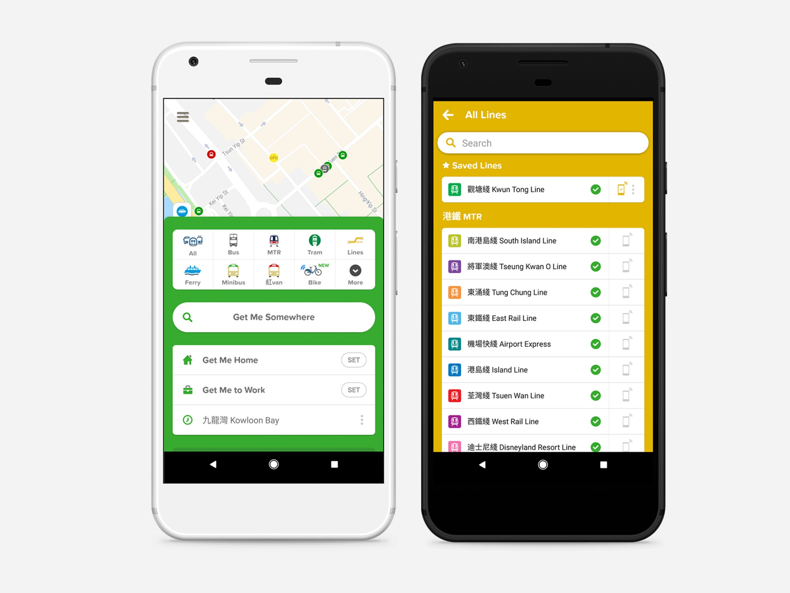
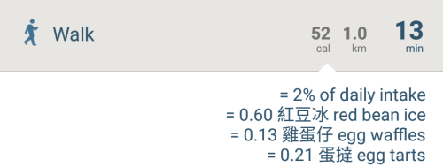

After switching to Android last year, Google Map has been my first choice of transit app. Living in a city that public transport operators [discourage open data](http://harbourtimes.com/2017/08/08/reform-hong-kongs-transport-system-opening-data/), transit app is for navigation most of the time. Although selected lines of MTR and bus operators have their own app to share real-time next train / bus data, yet they refuse to share them with an open API, welcoming third-party apps integration like Google Map or Citymapper.

I downloaded Citymapper ([iOS](https://itunes.apple.com/us/app/citymapper-transit-navigation/id469463298?mt=8) and [Android](https://play.google.com/store/apps/details?id=com.citymapper.app.release&hl=zh_TW), Free) again yesterday when I was looking for alternative transit route as the app include minibus. I took MTR in the end but I was really impressed by all the localization efforts by the team since I was last used a few years back. While Google Map is focusing on location data and personal recommendation as announced this year at Google I/O (Considering Google core business is to collect data as much as possible), Citymapper took a different approach as it help users commute from one place to another. 

The app’s core idea is turn people into a well-informed commuter, so user can make a the right decision to commute. In Hong Kong, Not only did all means of transport (even red & green minibus) are listed in Citymapper, they even collaborate with local transport monitor group to deliver live service update. (Given that MTR broke down all the time). Citymapper also include the location of nearest dockless bike and scooters last year globally, forecasting their vision of a city’s future on transportation. One sweet thing worth mentioning, is that they use local snacks as a reference to calculate calories intake.

Here’s a list of features of Citymapper that you cannot find on Google Map    

- Real-time HKTram Arrival Time
- Route and Stations Search for Red & Green Minibus
- Real-time notification of MTR Status Update, collaborating with [MTR Service Update](https://twitter.com/mtrupdate)   
- Locating the nearest dockless bike (OFO in Hong Kong)
- Fare Calculator 
- Share Live Commute Progress & Estimated time of arrival 

In London, Citymapper is also experimenting with the idea of [Smart Bus](https://citymapper.com/smartride), a bus-taxi hybrid that is responsive to traffic and commuter destination. It could take forever to see it on the road in Hong Kong. But the idea of building next-generation transportation is very exciting.