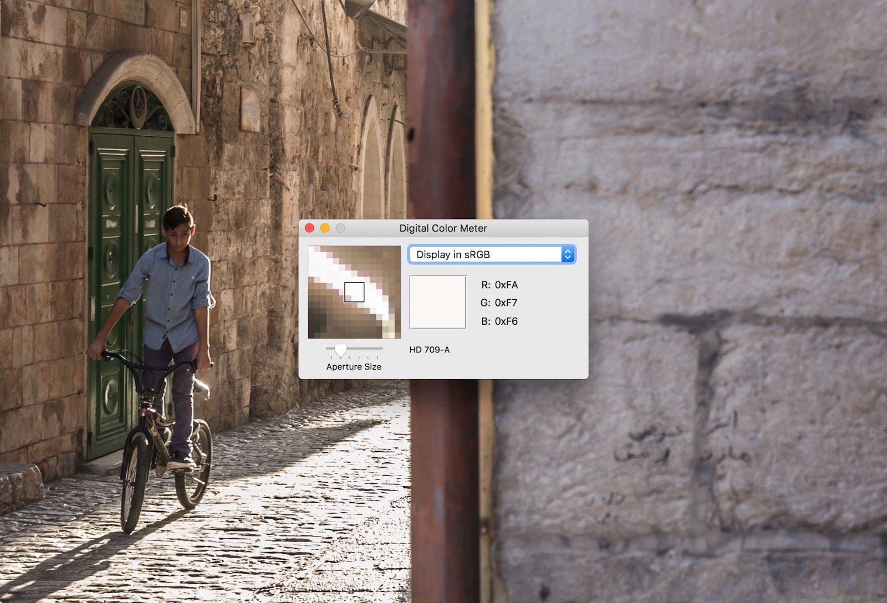
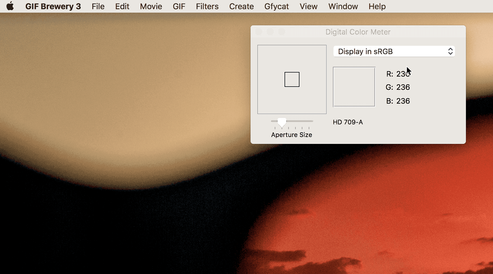
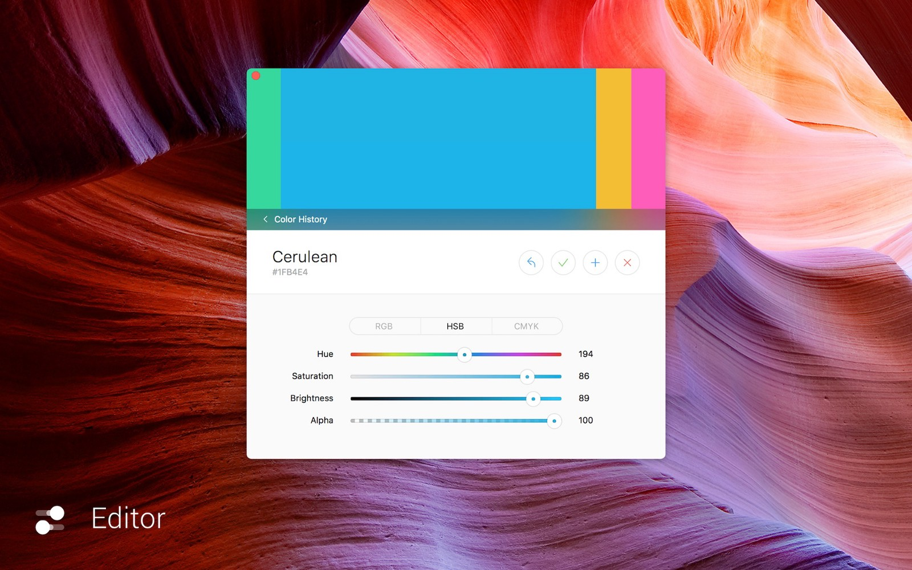
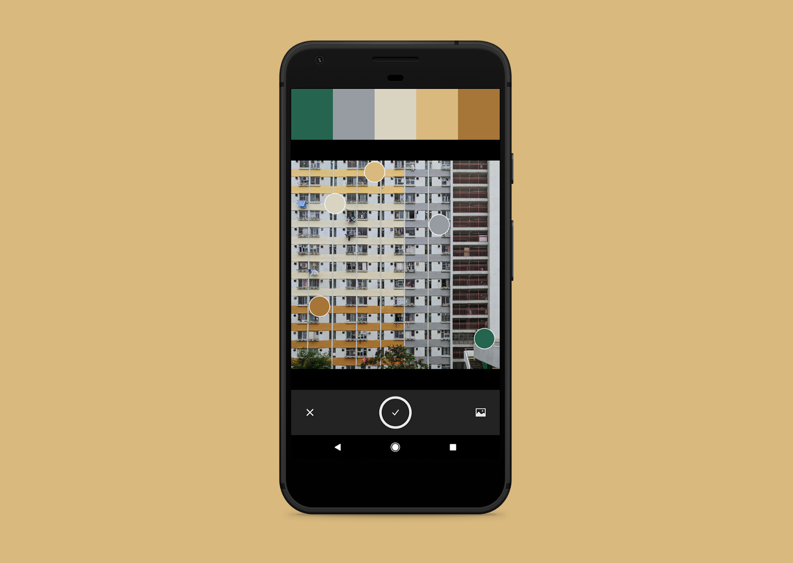
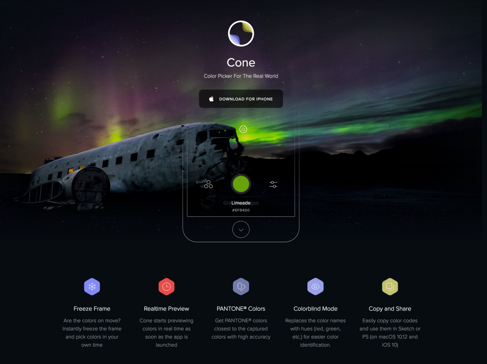
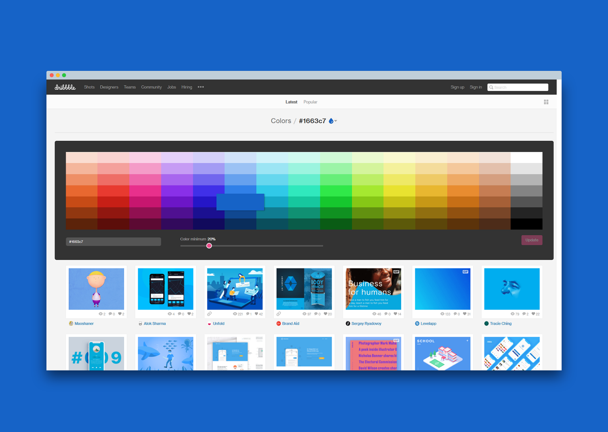
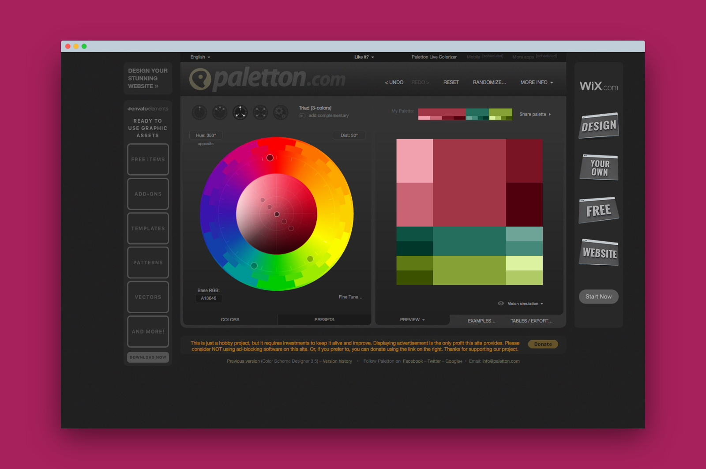
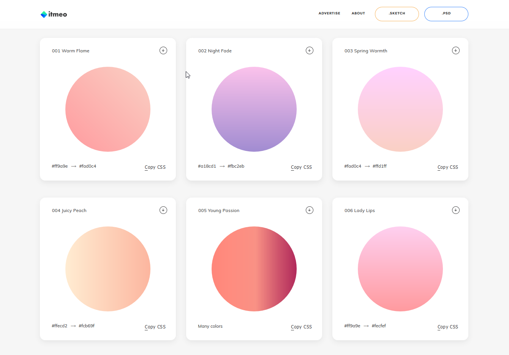
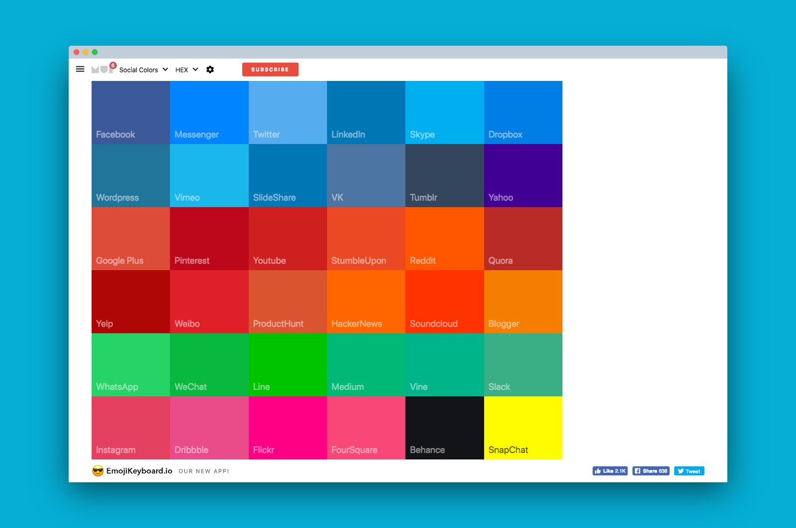

Color is the combination of science and art, a simple color change could have drastic effect on the emotion or perception of the viewer. Being a UI/UX designer, mastering the color theory and its application truly can step up your design game.

Stephen Few’s [“Tapping the Power of Visual Perception”](https://www.perceptualedge.com/articles/ie/visual_perception.pdf) coined the term “Preattentive Attributes” in displaying data. Intensity and hue of color are two attributes that can enhance visual communication quickly. Leveraging color help users to process information, prioritize what they have seen, subsequently convert into actions. Same rule applies in designing social media graphics and user interfaces, using color intentionally reinforces the quality of design.
Here are the best color tools you can use right now to create beautiful palettes and gradients for next design project.

##1. Digital Color Meter (MacOS, Free)

The most convenient app to grab color code is the one built-in to your Mac. Digital Color Meter is the default Mac utilities app hidden in your Application folder. The app does one job great, capture color as you point your cursor. Simply press Shift + Command + C will copy the value into the clipboard. You can also adjust color profile (native, sRGB, Adobe RGB or P3 etc.) as well as the values to display (sRGB hex code for me). To be honest, this free app probably satisfies most people’s need in picking color.

Press “Command + L” to lock the inspectorYou can copy the RGB Hex Code easily by pressing “Shift + Command + S”

##2. Sip ([MacOS, USD$9.99](https://sipapp.io/?ref=todaydojo) / [Available on Setapp](https://setapp.com/get/sip?utm_medium=affiliate+program&utm_source=14&utm_campaign=sipapp.io))

Consider Sip as the professional version of Digital Color Meter, it is the best color tool built  for pro-user in mind, providing seamless integration to professional workflows and applications. I love how it docks color palettes on top of the screen in a minimalist way, which allows cross-app usage.

##3. Apple Human Interface Guidelines — Color ([Web](https://developer.apple.com/design/human-interface-guidelines/macos/visual-design/color/), Free)

Color section of Apple’s Human Interface Guidelines is a great introductory piece for color design when you are designing websites and apps.

##4. Adobe Capture CC ([iOS](https://itunes.apple.com/us/app/adobe-capture-cc/id1040200189?mt=8&at=10lSkU) & [Android](https://play.google.com/store/apps/details?id=com.adobe.creativeapps.gather), Free)

Capture photos and auto convert real-life hues into color palettes with Adobe Capture CC. It also directly integrates to your Adobe CC’s swatches if you are a subscriber.

##5. Cone ([iOS](https://itunes.apple.com/us/app/cone-live-color-picker/id1221305627?mt=8&at=10lSkU), USD$2.99)

Cone is a beautiful and minimalistic color app that you can find on iOS App Store that allows user to capture Pantone colors in real-time. New version of the app has announced by the developer, stay tuned for the update.

##6. Dribbble Colors ([Web](https://dribbble.com/colors/), Free)

Dribbble Colors is a hidden treasure for UI designers who are looking for case studies of color adoption. It allows users to search Dribbble shots by color using hex code. Users also can adjust percentage of the containing color within a shot. This tool comes handy to see how a color plays out in other design.

##7. Coloors.co ([Web](http://coloors.co/?ref=todaydojo), Free | iOS & Android, USD$1.99)

Coloors.co’s Color-blind Mode and Hue & Contrast Adjustment is user-friendly to fine tune your palette
Coolors.co is a multi-color schemes generator, with a super-fast spacebar shortcut to generate color schemes instantly. Thoughtful features including colorblind mode, able to view shades and adjust hue and saturation have contributed it to be my favourite site for color inspiration. It also has paid upgrade for iOS App, Chrome Extension, and add-on for Adobe Creative Suite.

##8. Paletton ([Web](http://www.paletton.com/?ref=todaydojo), Free)

Paletton takes on the scientific approach to find the right palette by adjacent and triad colors. It has plenty of previews and simulations to accommodate different scenarios for palette usage.

##9. Webgradients ([Web](https://webgradients.com/?ref=todaydojo), Free)

Subtle color gradients collection made for website or app background. CSS code, PNG, Sketch and PSD previews are all set to use right away.

##10. Social Colors ([Web](https://www.materialui.co/socialcolors), Free)

Material UI collects brand color for the major social media platform. Now you are one-click away from adopting the tone to your own customised banners and buttons.

##11. Munsell Hue Test ([Web](http://www.colormunki.com/game/huetest_kiosk?ref=todaydojo), Free)

Train your eyesight to be laser-like. Munsell Hue Test is a fun yet challenging game to arrange color block by hue order. Lower the score is better.

##12. Wave ([Web](http://wave.webaim.org/), Free)

Access your website with web accessibility evaluation tool. The tool examines your site’s color contrast to meet WCAG2.0 AA and AAA standard.

I hope the article covers your need in the design field, for color inspiration, palettes creation, and color accessibility. I have created a color resources collection in my personal project Today Dojo, which delivers the best-curated design resources for creators. If I have missed anything that should have made it to the list. Find me on [Twitter](http://www.twitter.com/desktopofsamuel) and let me know! 

