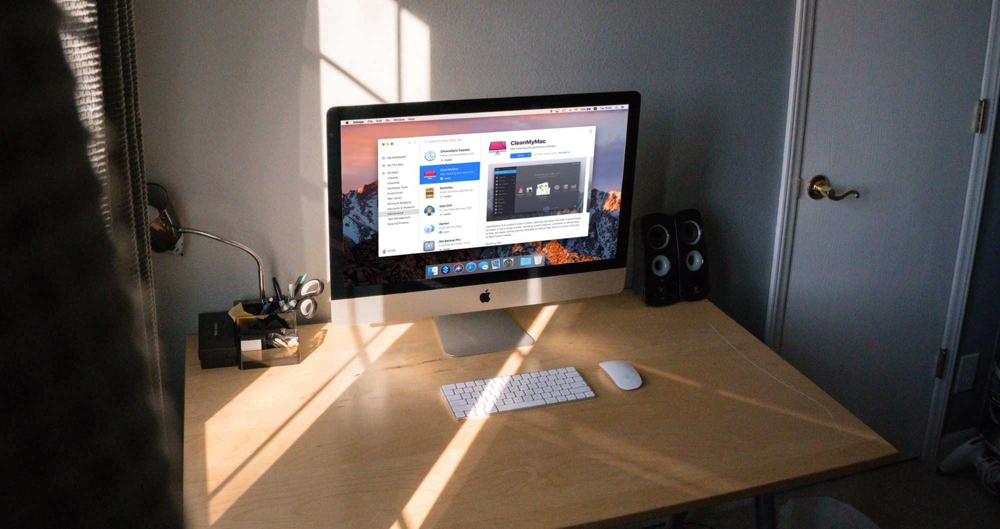
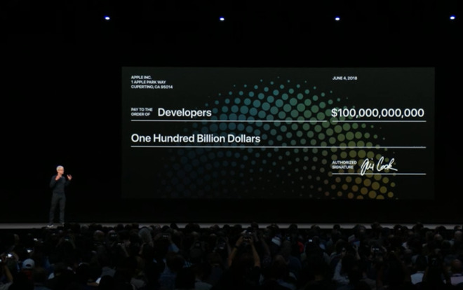
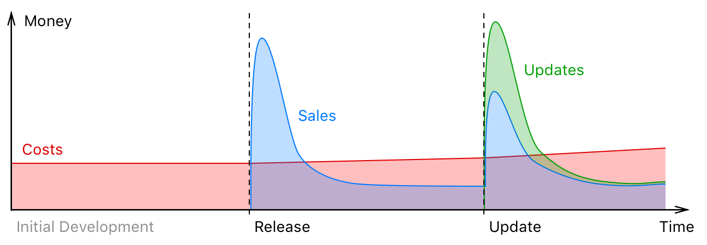
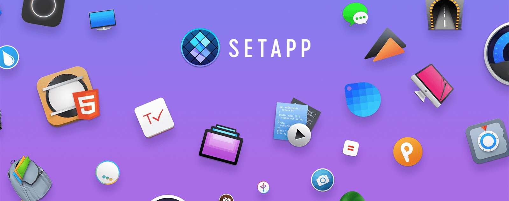
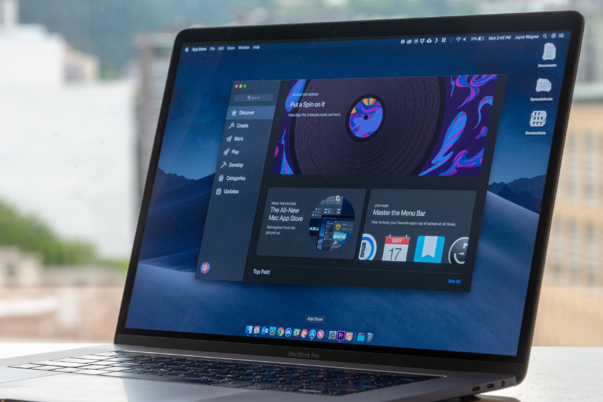
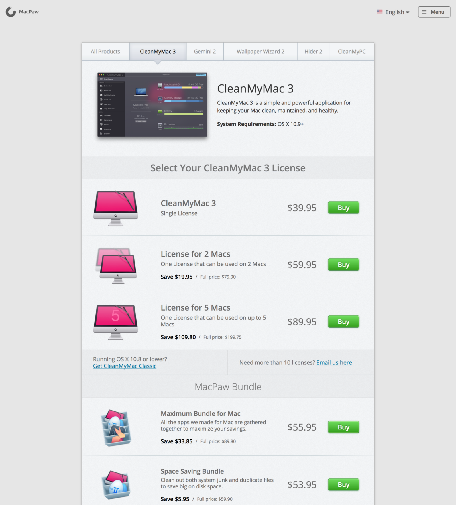

##Thoughts on Setapp — subscription-based collection for Mac apps 

Mac apps are great. They are beautifully designed, crafted with a bunch of handy features, and they have won over the hearts of their users, willing to pay for every update. Mac App Store was launched in 2011, it was Apple’s attempt to replicate the success of iOS App Store.
However, I would hardly call Mac App Store a success today.

##Walls of the App Store

Despite a cheque with a lot of zeroes are written on the slide of Apple’s keynote every year at WWDC, developers share their loves & hatred at the same time toward the monstrous platform. There are a lot of Mac apps (especially those with subscription service) have yet to become available today on Mac App Store. 

1 — App Store split developer’s sales revenue as high as 30%, which is too high especially for subscription-based service. 

2 — Developer’s demand on flexible pricing model (like paid upgrade), free trials, video trailer have been slowly responded by Apple.  

3 — Utilities app are missing on Mac App Store due to the  [sandboxing requirement. ](https://t.umblr.com/redirect?z=https%3A%2F%2Fwww.imore.com%2Fmac-app-store-and-trouble-sandboxing&t=NzcyZDZjNDM3Mjg5ZWQ5ZmJjMzM2YWY2ZDMzZDVkYjNmMjNkMmMzMixSc3dIQkx3eA%3D%3D&b=t%3Amd_XHZDWEUh7XzJM6q1d8g&p=https%3A%2F%2Fjournal.desktopofsamuel.com%2Fpost%2F175975854762%2Fdo-subscription-models-work-with-apps&m=1)  

4 — Mac App Store is not as exclusive as iOS App Store to install new apps on Mac. A lot of developers setup online store on their own according to their pricing needs, like bundles and discount

1Password shares the struggle when they are releasing the new version in May. Their CEO, Jeff Shiner wrote,
> The App Store, for all it does well, struggles mightily when a paid upgrade is introduced because it does not allow developers to charge for an update to an existing app. When considering a paid upgrade, developers have two choices: they can re-use their existing app or submit a new one. Both have their pros and cons.

The third way is not to rely on Mac App Store at all. But to a larger extent, the existence of paid upgrade is originated to the insufficient income for app development. The team behind Ulysses  [explained at length on their strategy switching subscription model.](https://t.umblr.com/redirect?z=https%3A%2F%2Fmedium.com%2Fbuilding-ulysses%2Fwhy-were-switching-ulysses-to-subscription-47f80b07a9cd&t=MDQ3ZmZhMWU2OWYwYmI3ZTYyNDQ5Nzc1Yzk5YTk5OTdlMmViNzliMSxSc3dIQkx3eA%3D%3D&b=t%3Amd_XHZDWEUh7XzJM6q1d8g&p=https%3A%2F%2Fjournal.desktopofsamuel.com%2Fpost%2F175975854762%2Fdo-subscription-models-work-with-apps&m=1)  Especially on how current pricing model is crooked, as developers heavily rely on new releases to get exposure and call for money.
But they raised a bigger question on software development.

##Should apps be a one-time purchase?

Crafted by MacPaw, the team which shipped numerous successful Mac utilities, Setapp addresses the market need for subscription service. Initial media coverage described it as the Netflix for Mac apps. For USD$9.99 per month, users can enjoy a full library of independent & popular Mac apps, including  [CleanMyMac](https://t.umblr.com/redirect?z=https%3A%2F%2Fmacpaw.com%2Fcleanmymac&t=M2U3ZDBmMjk2MWEwNTNlMWJjOTNjZGFhZGIwMDgwZTZmYzZkNWM2ZixSc3dIQkx3eA%3D%3D&b=t%3Amd_XHZDWEUh7XzJM6q1d8g&p=https%3A%2F%2Fjournal.desktopofsamuel.com%2Fpost%2F175975854762%2Fdo-subscription-models-work-with-apps&m=1) ,  [ChronoSync Express](https://t.umblr.com/redirect?z=https%3A%2F%2Fwww.econtechnologies.com%2Fchronosync-express%2Foverview.html&t=NWRhZjk1MjJiMjBlNDBkMjkyZjM5MDZhOGJmNzA3NzJkNWFkNjAzZixSc3dIQkx3eA%3D%3D&b=t%3Amd_XHZDWEUh7XzJM6q1d8g&p=https%3A%2F%2Fjournal.desktopofsamuel.com%2Fpost%2F175975854762%2Fdo-subscription-models-work-with-apps&m=1) ,  [iStat Menu](https://t.umblr.com/redirect?z=https%3A%2F%2Fbjango.com%2Fmac%2Fistatmenus%2F&t=ZTNhNzVlODRlMDc1OWExNjY4YmFlYzU0ZWQ5M2QwZGZjYjI3NDFkZCxSc3dIQkx3eA%3D%3D&b=t%3Amd_XHZDWEUh7XzJM6q1d8g&p=https%3A%2F%2Fjournal.desktopofsamuel.com%2Fpost%2F175975854762%2Fdo-subscription-models-work-with-apps&m=1) ,  [Paste](https://t.umblr.com/redirect?z=https%3A%2F%2Fpasteapp.me%2F&t=Y2ZlYmYyMDFmZDFhMDIxYjVkNDRlYjE0OTdmNjI2Y2IwMTBjZjdiOSxSc3dIQkx3eA%3D%3D&b=t%3Amd_XHZDWEUh7XzJM6q1d8g&p=https%3A%2F%2Fjournal.desktopofsamuel.com%2Fpost%2F175975854762%2Fdo-subscription-models-work-with-apps&m=1)  and more. The convenience of a unified subscription platform, you don’t need your purchase keys anymore or bother to manage license keys on your new and old Macs.
For entertainment, the subscription model is a sweet deal, with higher user acceptance rate, but whether app subscription service is a rip-off, remains a bigger controversy. In “ [The Subscription App Paradox](https://t.umblr.com/redirect?z=https%3A%2F%2Fhackernoon.com%2Fsubscription-software-paradox-d4a1aef4d88a&t=MTQwZTgxZTY0OWE1YjVjMGYzNGFjNDZlOGViMWRmZmY0NGUwMDMzMSxSc3dIQkx3eA%3D%3D&b=t%3Amd_XHZDWEUh7XzJM6q1d8g&p=https%3A%2F%2Fjournal.desktopofsamuel.com%2Fpost%2F175975854762%2Fdo-subscription-models-work-with-apps&m=1) ”, written by Alan Marsden, digital consumption has become an unnoticeable expense, he spent £84.50 every month on digital subscription service (Apps, Media, VPN). The argument of the cost is equivalent to a cup of coffee in a month has become a lot of coffee. Setapp is also part of the solution (or the problem) by splitting its revenue according to the usage of apps listed in its catalogue if a majority of user’s apps can be found on Setapp.

 

Following the success of iOS App Store revamp last year, Mac App Store is also set for revamp in the next version of MacOS Mojave this fall. Yet, Mac App Store is stepping on the road behind the shadow of iOS App Store, Apple is enhancing the experience on user’s side with better-curated collections and editorial stories to discover new apps. But for developers, channels for distributing are still fragmented.
For now, it is safe to say the subscription model for apps will not arrive soon on App Store just like Apple Music. In fact, Those popular Mac apps that I have listed above, all of them have more than a single channel and licenses to purchase or subscribe. Some of them offer single & family licenses with paid upgrade options; some are running multi-platform subscription plus Setapp subscription. Biggest sacrifice probably is the users as they have to decide which pricing model is a better bargain for them. But in a longer run, bug fixing and pushing updates across different versions would be a debt for developers to pay.

Setapp itself is also facing some fundamental problems on its own. Should its app catalogue strikes for quantity or quality? How to keep up with users’ momentum to try new apps and switch to new workflows? I’ll address this issues in the next article.
