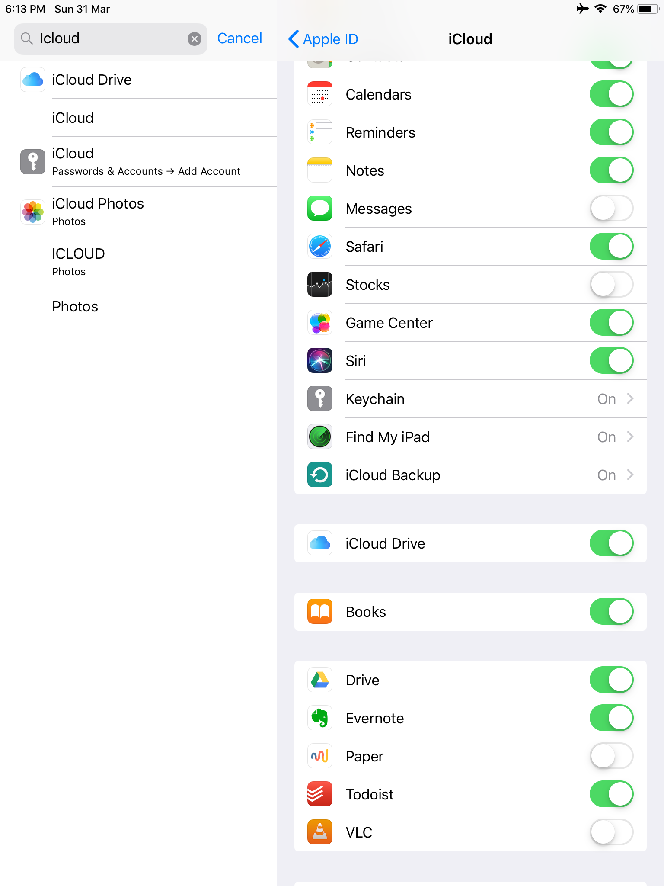

Look at my new iPad Books screen. All book covers are gone. 

I have bought the new iPad Mini 5 recently and I'm trying to transfer all my books from old iPad to the new one. Using iCloud Reading Now allows me to sync all devices with my books, notes and highlights, even those are not purchased from the Book Store. However there is one problem, all the book covers are missing.

After testing on several devices, I realise the cover is still there but unable to display on iPad and iPhone, yet on Mac Books app all of them are displaying correctly. Until Apple resolves this issue, there is a quick fix to make your Books home screen shine again.

## How To Transfer Apple Books to new device via iCloud

Make sure you have plenty of space on your iCloud. I'm using 5GB free plan right now but my books only occupy around 200MBs. There are two places in Settings you will need to check. 

|    |  |
| --- | --- |

1. Settings - Passwords & Accounts - iCloud - iCloud Drive - Books
2. Settings - Books - Reading Now & iCloud Drive

Both options look similar but it functions separately. By turning them on, all books and PDF are now uploading in to iCloud together with bookmarks and highlights. 

## How to fix book cover display problem?

Current workaround requires you t