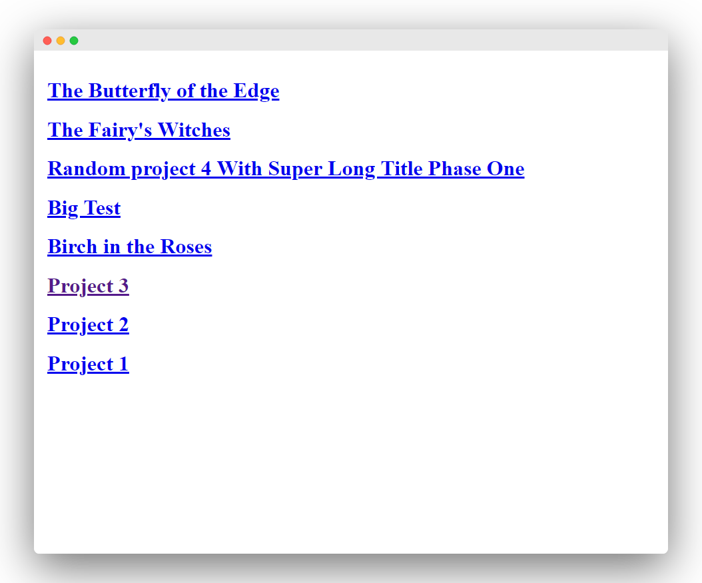

##Intro
This is an update to my previous article [Building Gatsby With Multiple Post Type](./building-gatsby-with-multiple-post-type), as I have rebuilt my whole site using GatsbyJS v2. I switched from [Gatsby default starter](https://github.com/gatsbyjs/gatsby-starter-default) to [Gatsby Advanced Starter](https://github.com/Vagr9K/gatsby-advanced-starter) which save me some time setting up foundation of the website. (e.g. Tags, Category, SEO etc)

But please note that this starter contains no UI or any style, you will need to build it on our own. If you are a designer with some front-end development experience, this is the place.

##Use Case

I want setup my website supporting multiple post types, both blog articles and my previous work will be found within the same site. This freelance / career portfolio setup works the best for designers who love to write.

##Overview

This tutorial has been one of my most viewed article since launch since there are only a few tutorials online. Assuming you have already setup a Gatsby site already.

Things we need to do:

1. Create a new "project" folder and post under source folder
2. Edit gatsby-config.js to include new source folder in  gatsby-source-filesystem plugin
3. Duplicate blog-post.js to create project-post.js template
4. Edit gatsby-node.js CreatePage API to adopt a separate template for different post type
5. Create Project Main page to query project post
6. Edit Blog Main page not to query project post
7. Create Tag & Category Page for Project

##1. Create New Project Folder

```
src
——content
    ——blog
        —— Blog Post #1
            ——index.md
            ——photo1.jpg
    ——project
        ——Project Post #1
            ——index.md
            ——photo1.jpg     
——templates
        ——blog-post.js
        ——project-post.js
```

This is my new source folder setup. I have created one more directory level under `Content` . Example articles will required to move down one level by creating a `Blog` folder. Of course, you need `Project` folder as well. For quick demo purpose, I have renamed some dummy articles as Proejct 1, 2, 3 and saved in `Project` Folder.

I have also add a new field "Posttype" in order to specific the post type in case there are more content types.

My frontmatters in project files are:

```markdown
---
posttype: "work"
path: "/project-1"
date: "2019-05-01"
title: "Project 1"
category: "UI Design"
tags:
- "app"
- "iOS"
- "Android"
cover: "./main.jpg"
---
```

##2.Edit Gatsby-Config.js

We will need to edit gatsby-config.js in order to let Gatsby know where to look when creating a new post page. You will need to rename for blog post as well as we moved them in a folder.

```jsx
{
  resolve: 'gatsby-source-filesystem',
  options: {
    path: `${__dirname}/content/blog`,
    name: 'posts'
  }
},
{
  resolve: 'gatsby-source-filesystem',
  options: {
    path: `${__dirname}/content/projects`,
    name: 'projects'
  }
},

```
Type `gatsby develop` in  command line, you should be able to see both blog and project files showing in the home page.

##3. Create Project Post Template

Then, we will need to duplicate a new post template for project. Duplicate `post.jsx` in `src/template/` folder and rename it as `project.jsx`.

Everything could stay the same except the GraphQL query name, as it requires to have unique name. Let's rename it from `BlogPostBySlug` to `ProjectPostBySlug`.

```jsx
//project.jsx
export const pageQuery = graphql`
    query ProjectPostBySlug($slug: String!) {

```

##4.Edit Gatsby-Node.js
Being a static site generator, `gatsby-node.js` handles how your site is generated. Personally speaking, without knowledge in Node.js and JavaScript, it is rather complicated to understand the meaning of each line.

On the bright side, that is the reason why I started with the advance starter. It already offers basic Gatsby architecture (e.g. rendering path and creating tags and category) in this file and all we need is 3 changes.

1. Import `project-post.js` as one of the template

After the `CreatePages`, look for `const postPage`. We will need to import the `project-post.js` right after the blog template.

```
//gatsby-node.js

const postPage = path.resolve("src/templates/post.jsx");
const projectPage = path.resolve("src/templates/project.jsx");
```
2. Query Posttype In GraphQL
After that, we will use our newly created frontmatter field, "posttype" to filter all our markdown pages. Let's query `posttype` under `frontmatter` in GraphQL.

```jsx
resolve(
      graphql(
        `
          {
            allMarkdownRemark {
              edges {
                node {
                  frontmatter {
                    tags
                    category
                    posttype
                  }
                  fields {
                    slug
                  }
                }
              }
            }
          }
        `
```
3. Add New Argument For Two Content Types
Because most of markdown pages will be blog post, if / else argument is used here. Unless specified post "posttype" is equal to "project" (or any other posttype to be included in the future), Gatsby will recognise the post as a blog post. We'll replace existing CreatePage function to a if/else condition for two content types. Everything should be wrapped within  `result.data.allMarkdownRemark.edges.forEach(edge => {` in case there are any problems with the parenthesis. 

```jsx
// Replace this
createPage({
            path: edge.node.fields.slug,
            component: postPage,
            context: {
              slug: edge.node.fields.slug
            }
          });
```

```jsx
// With This
if (edge.node.frontmatter.posttype === 'project') {
          createPage({
            path: `/project${edge.node.fields.slug}`,
            component: projectPage,
            context: {
              slug:  edge.node.fields.slug,
              category: edge.node.frontmatter.category,
            }
          });
        } else { // blog post
          createPage({
            path: edge.node.fields.slug,
            component: postPage,
            context: {
              slug: edge.node.fields.slug, 
              category: edge.node.frontmatter.category,
            }
          });
        }
```
Try run `gatsby-develop` in command line making sure everything works. Also, remember to change add `posttype: "work"` in all project markdown files. You might notice index page link to project files will result in error since we have specified the path to "/project/project-1" while the PostListing component does not recognize. We will fix that in the later step. 



Before we go on, because Gatsby Advance Starter already built with Tag and Category taxonomies. I will skip this part in this tutorial, you can still reference to the old article for more details. (Codes are the same since Gatsby Advance Starter was based on Gatsby Material Starter). We would move on fixing the index page PostListing component instead. 

##5. Fix PostListing Component

I assume the new project content type will showcase differently with larger photos and less text, let build a brand new component for it. Let's create ProjectListing folder and `ProjectListing.jsx` in component folder. Let's copy everything from `PostListing.jsx`. I have only renamed the component name to ProjectListing and changed the Link to support path prefix.

```jsx
 {/* Your post list here. */
        postList.map(post => (
          <Link to={`/project/${post.path}`} key={post.title}>
            <h1>{post.title}</h1>
          </Link>
        ))}
```


##6. Fix Index Page
Then we will need to edit `index.jsx`. Import the ProjectListing component
```import ProjectListing from "../components/ProjectListing/ProjectListing";``` 

And then we will edit the GraphQL query. I have added `blog` alias to the original query. I have also added a filter according to the file path. `filter: {fileAbsolutePath: {regex: "/blog/.*\\.md$/"}}` Then duplicate the query and rename it to `project`.

```graphql
query IndexQuery {
  blog: allMarkdownRemark(
    limit: 2000
    sort: { fields: [fields___date], order: DESC }
    filter: {fileAbsolutePath: {regex: "/blog/.*\\.md$/"}}
  ) {
    edges {
      node {
        fields {
          slug
          date
        }
        excerpt
        timeToRead
        frontmatter {
          title
          tags
          cover
          date
        }
      }
    }
  }
project: allMarkdownRemark(
  limit: 2000
  sort: { fields: [fields___date], order: DESC }
  filter: {fileAbsolutePath: {regex: "/project/.*\\.md$/"}}
) {
  edges {
    node {
      fields {
        slug
        date
      }
      excerpt
      timeToRead
      frontmatter {
        title
        tags
        cover
        date
      }
    }
  }
}
```
After that, create ProjectEdges in order to start another GraphQL query. `const projectEdges = this.props.data.project.edges;`. We will need to add the new component after existing PostListing. `<ProjectListing postEdges={projectEdges} />` . Try serve with `gatsby-develop` again to see if everything goes accordingly. 

--- 

This should wrap up everything you need in order to create multiple post types in Gatsby. If you encountered any problems in setting it up. Make sure you:

- Restart localhost server every time if you have edited the  gatsby-node.js
- Test it step by step to eliminate any cause of error.

Feel free to share your ways of creating your own personal site using Gatsby. If you have a better solution or encountered any problems, talk to me on [Twitter](http://www.twitter.com/dekstopofsamuel) Stay tuned if you are interested in more Gatsby tutorial and walkthroughs! 

