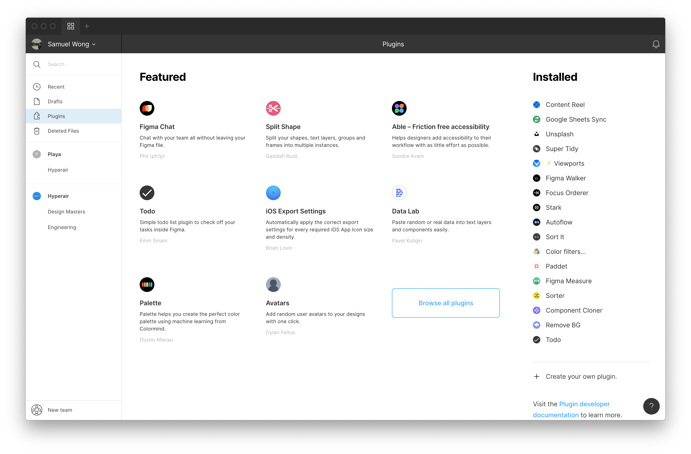
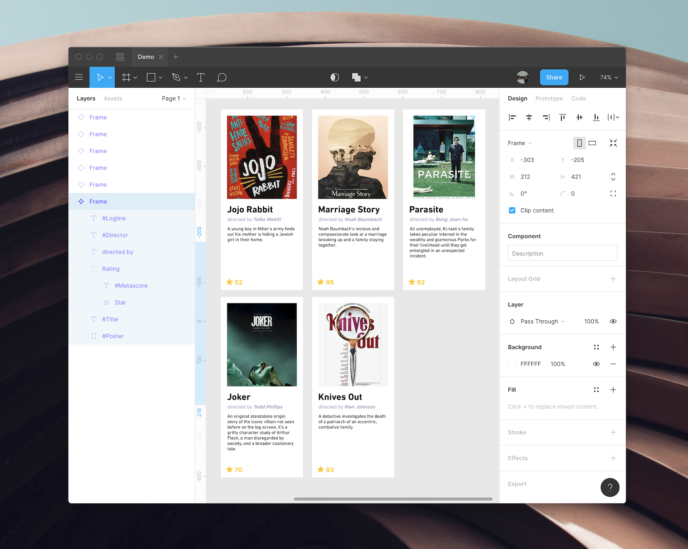
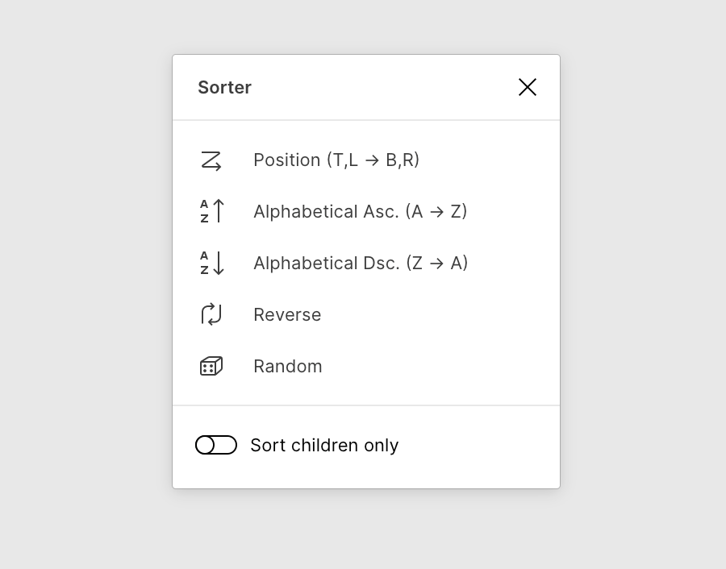
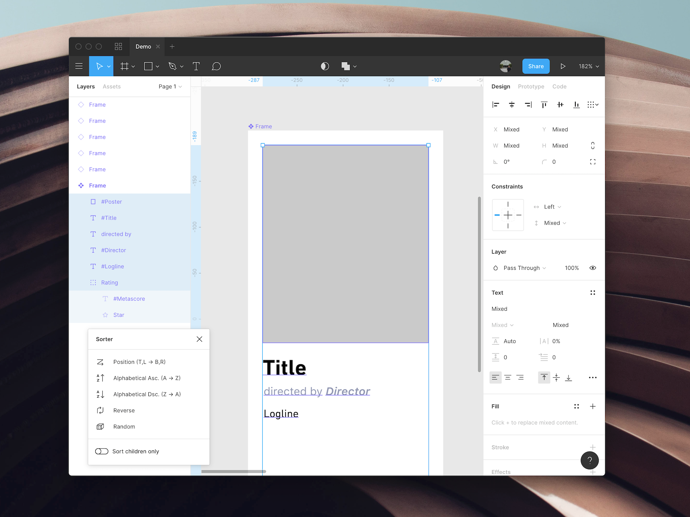
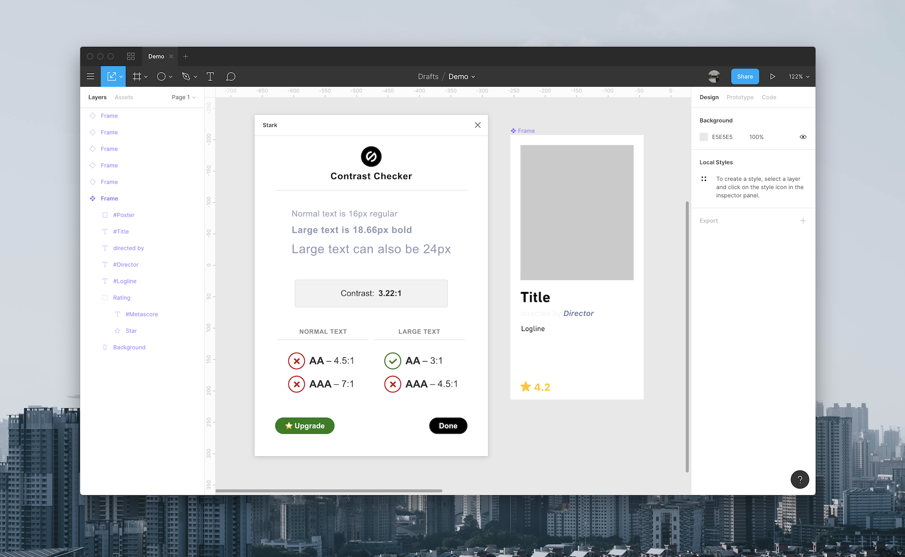
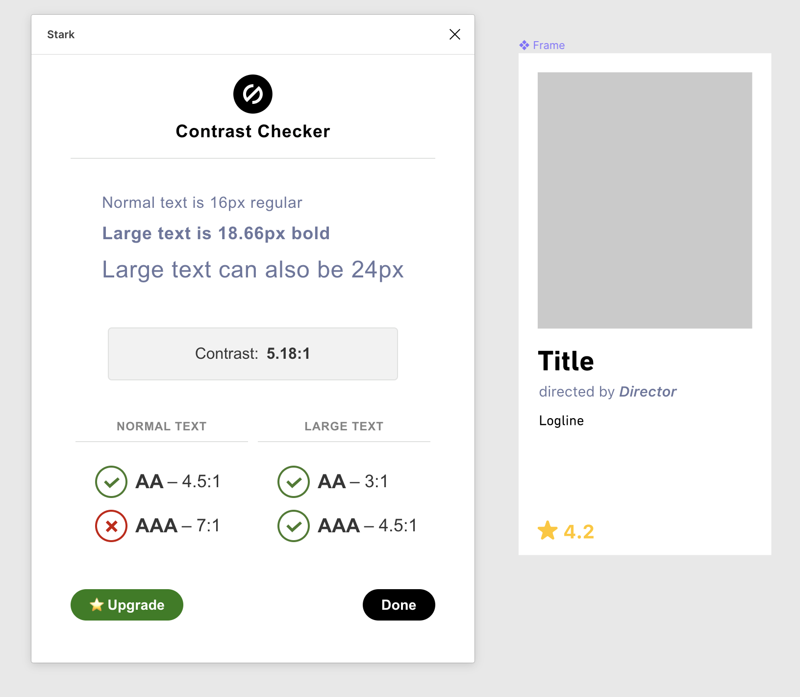
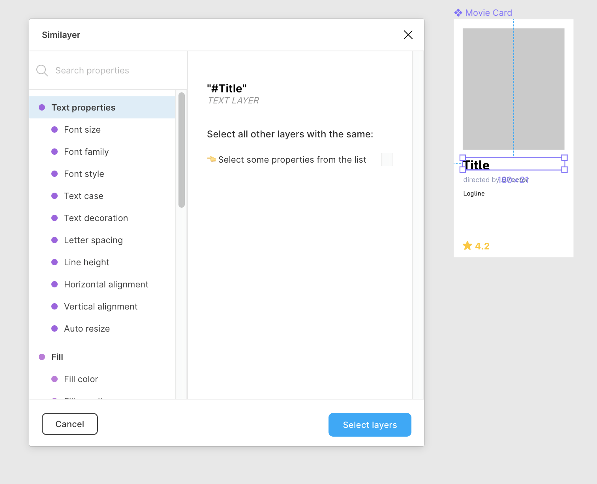

It’s been a while since beta but [Figma Plugins](https://www.figma.com/c) is finally here. While Sketch is catching up with their cloud capabilities, Figma has also been working on proper third party support.

Figma has become my main design tool over the past year. I have been using it for interface and website design on a daily basis. Our social media and marketing assets are also created in Figma for easy collaboration and bilingual support. (I’m writing another piece to elaborate our process, stay tuned.)

After a few weeks of us, I can conclude the best part of Figma Plugins is automation. With Figma Plugins, tedious steps become one simple click. Inputting data can also be set up without any coding effort. Tidying up components finally feel not stupid. I felt motivated to re-organize my artboards again. I started to think it is not a time-consuming process as it was before.

## Getting Started

If you have updated Figma to the latest version, you can find it on the main page. Installing plugins are slightly easier than Sketch as everything is distributed through Plugins page. Simply click install the plugin will be downloaded in no time.

Here is a pro tip that you must try. You can speed up the workflow by learning the quick-search shortcut `Command + .`. Essential it is a shortcut to search for any functions and execute them. (Like Sketch Walker). All you need is to remember the keyword and go for it. It is way faster than clicking "Right Click” - "Plugins” - "Plugin that you want to open” with your mouse. (FYI Figma’s keyboard shortcut is the role model every app should adopt. This is how users can pick up the learning curve, click "Help & Account” to enable the shortcut panel)

Here are 4 plugins that I found the most useful and interesting that can speed up your design workflow.

## Google Sheets Sync - Designing with custom real data

I wrote about my expectation of being able to [design with real data ](http://desktopofsamuel.com/design-with-real-data) a year ago.
With Figma Plugins, it is now possible to write a custom plugin to fetch data from API, take the most realistic approach on design. After trying out [Google Sheets Sync](https://www.figma.com/c/plugin/735770583268406934/Google-sheets-sync), I realized it was an even better way. Here’s why:

1. Zero coding effort, that’s the dream. Export any data in csv and upload it, or just create your own using Google Sheets.
2. You can collaborate on the data with your team. Make sure to include edge cases (like long text, different languages, empty state) in your data set.
3. All data will be updated accordingly when it was synchronized. You can also try formulas like IF / ELSE in Google Sheets to achieve so much more.

Set up the spreadsheet with all data and map first column name with Figma’s layer name, by adding a “#” hash in front. Make sure you have duplicated the components and paste the link in the plugin. All components with matching name will apply with Google Sheets data. The plugin for sure will saves tons of time comparing to inputting fields one by one. The end result may not be pretty but it will allow me to foresee design flaws ahead.

## Sorter - Re-order layers in one click

A part of my design time includes preparation for developer handoff. The process includes cleaning up layers, grouping up and re-naming them. Sorting layers visually from top to bottom enables developers to understand the visual hierarchy. These tasks are useful but can also be menial. But those days are over with Sorter.

[Sorter](https://www.figma.com/c/plugin/742038190980789811/Sorter) is able to sort all selected layers automatically according to the rules you set. This is pretty amazing by speeding up your workflow 10x.

For example, in the previous demo, the movie card components are sorted randomly. Select all layers within the component and open Sorter, it will allow you to pick different sorting rules. For me _“Position (Top Left to Bottom Right)”_ is the most useful for HTML or any component structures. It’s just one simple click.

## Stark - Make a habit to check color contrast all the time

There are plenty of color contrast checkers online, but either you have to input the color hex code or you have to capture the screen and upload it.

[Stark](https://www.figma.com/c/plugin/732603254453395948/Stark?ref=desktopofsamuel) simplified the process by selecting two layers in Figma. It also can simulate 4-8 colorblind situations.

Let’s check the color contrast of the movie card’s director field. For normal size text, the recommended standard is to meet [W3C](https://www.w3.org/TR/WCAG20/)’s minimum AA rating, a contrast ratio of at least 4.5:1 (AA). The current color does not match the rating, so we have to increase to contrast. I have changed the color from #848BAF to #636B94, now we have passed the contrast checker.

Stark also offers a PRO subscription that includes more colorblind situations as well as rapid contrast checking. Check out [their website](https://getstark.co/pricing/index.html) for more details.

## Similayer - Selecting similar layers all at once

As you can tell from the name, [Similayer](https://www.figma.com/c/plugin/735733267883397781/Similayer) allows you to select all layers that share the same properties. I found it extremely useful when you have created a bunch of components and want to edit some of the instances. All the properties from the design panel can be used as select criteria.

## Conclusion: Just the beginning

These 4 plugins that I recommend are highlights that can speed up your design workflow. I hope you found this helpful, I have [shared the Figma project](https://www.figma.com/file/QoxMxPy8PgyYFssbenT7Gx/Demo?node-id=12%3A1) if you need it for references.

<iframe style="border: none;" width="800" height="450" src="https://www.figma.com/embed?embed_host=share&url=https%3A%2F%2Fwww.figma.com%2Ffile%2FQoxMxPy8PgyYFssbenT7Gx%2FDemo%3Fnode-id%3D15%253A0" allowfullscreen></iframe>

During my selection process, I skipped some popular ones (Like [Unsplash](https://www.figma.com/c/plugin/738454987945972471), [Mapsicle](https://www.figma.com/c/plugin/736458162635847353) and [Autoflow](https://www.figma.com/c/plugin/733902567457592893) and those from big design teams ( Did you know [Microsoft Design team](https://www.figma.com/c/org/588096576863690753) has already published 5 plugins!).

Opening up third party developer support surely will speed up the maturity of the platform. I have no regret switching over from Sketch in first place.
