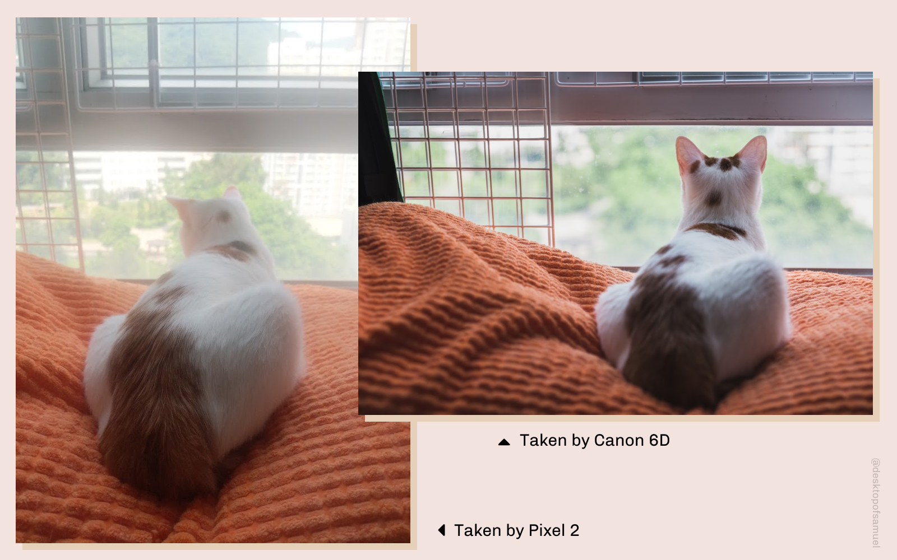
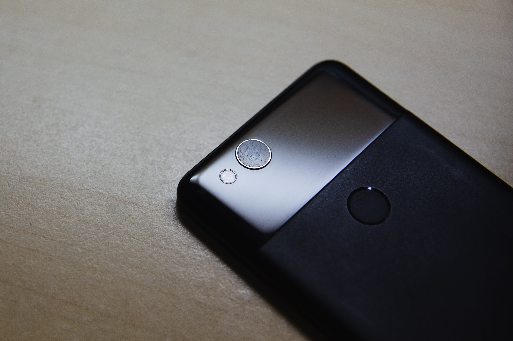
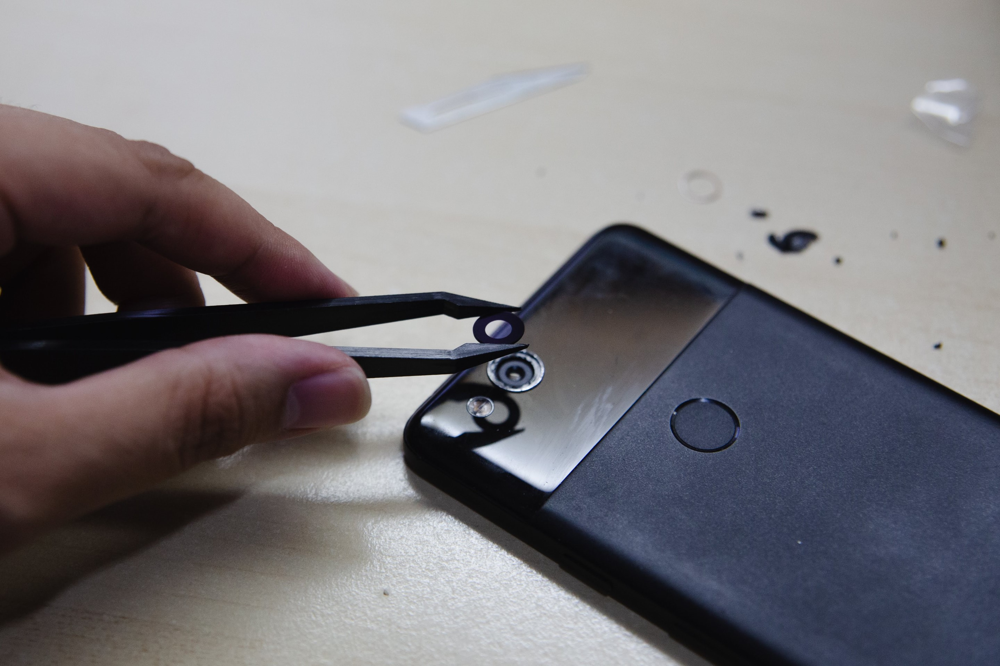
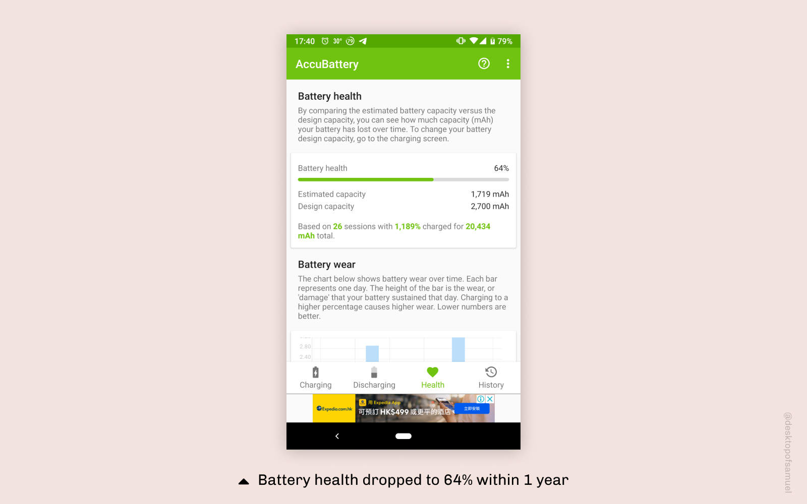

As flagship smartphones are getting more expensive, the lifespan of a smartphone is expected to be longer. We want our phones to be more durable and powerful, so to justify the price. 

Therefore, coming to a conclusion that I need to switch phones should be harder and harder. That is my intention of writing this article, this is a long term review, this is about the tipping point, that makes me want to switch my phone. I would like to call it a “Decommission Review”.

**Pixel 2**

- Developer: Google
- Released Date: Oct 19, 2017
- Purchase Date: Jan 31, 2018
- Decommission Date: Oct 10, 2019

## Brief History with Android

To begin with, I have switched to Android 2 years ago. Pixel 2 was the second Android phone I have ever fully committed to use every day. Before that, I was using OnePlus 5.

My last iPhone was iPhone 6s, which I have been still using occasionally as a backup phone. The phone has battery issues (even after Apple’s battery replacement program) but it is still functioning to this day.

I believe throughout the experience of owning a consumer device, there must be a tipping point, contributing to the determination to retire a phone / buying a new one. My Pixel 2 has several defects that I cannot stand in daily usage. And I hope this will help sorting out my priorities when I make another decision next time.

## 1. Camera is good but the lens is not

This might not apply to everyone, but the cover glass of my Pixel 2 camera is totally scratched. I put my phone alone in my pocket since I have ever owned a phone. That’s why it is very weird to me. And I cannot find any cause to it, even the rear back glass is not scratched as the camera. This has been a slow problem for me to realise my photos are getting overexposed and blurry. 

Although Pixel’s signature computational photo is ahead of its time (at least two years ago), such hardware defects should have been prevented. I have checked my old phones and none of them have experienced the same problem.

I have even tried to buy a replacement unit online, but it also ended up scratched shortly after a few weeks. After that, I decided to get a new phone.
  

## 2. More painful hardware drawback: Loosen USB-C Port

This might be a general USB-C problem, as I know some Nokia phones ports are also too loose to charge anymore and they have to buy a new one despite rest of the hardware is perfectly fine. But in my case, the port is loosened but it is only functional to charge on a flat surface, the cable would fall out as long as I put it in the pocket or in the bag. 

As the battery wears out over time, charging with power banks was more often but I cannot charge it in the bag. It has become a vicious cycle that I plug in my phone most of the time in office.  before leaving work. According to Accubattery, I had 60% of my battery capacity left. The annoyance from the phone’s battery has become a constant worry for me, loosen USB-C port makes the situation even worse as I wouldn’t be able to charge the phone on the go.

 ## 3. OS Wide Lag

Despite the hardware issues I have encountered, the annoyance of Android is also a big drawbacks comparing to my iOS experience, as I still use my old iPhone & iPad occasionally. 

The customisation Android allowed and deep Google service integration were very appealing to me at first, however, I suffered from serious lag in daily usage, especially after the new swipe multitasking gesture implemented in Android 9 Pie. I assumed Android can run smoothly when I'm using a phone made by Google, however, this is not the case for Pixel 2. Even opening camera takes seconds  

When I use a phone made by Google, I assume it can be perfectly smooth to operate for multiple generations of OS. Comparing to iOS support of previous generations of device, the Android experience even on a Pixel device is a disappointment. My camera app took seconds to load and there was occasional freeze that is clearly obstructing my daily usage. 

 ## Looking Back and Looking Forward 
  
And this wraps up all my complaints for Pixel 2! 

>  Normal people do not upgrade their phones after a single year. Most don’t even upgrade after two years. They upgrade when their old phone breaks or gets too slow. Anyone upgrading to the iPhone XS from an iPhone 7 or older is getting a great upgrade in dozens of ways
  
<cite>John Gruber</cite>

 Tech blogger [John Gruber](https://daringfireball.net/2019/09/the_iphone_11_and_iphones_11_pro) wrote this in his review for iPhone 11. Most reviews are not comparing the new phones with those customers currently own. Instead, they point out the incremental differences between generations and users have to figure out how big the jump they can get switching to the new device. This statement is even more true to users who are switching between OS, as the matter of fact, experience of iPhone cannot be measured by hardware specification, in fact my old iPhone 6S's 2GB RAM ran smoother than Pixel 2's 4GB.
 
Therefore, I'm switching back to iPhone again. But at least now I'm' able to say I really tried Android. I'm pretty optimistic about iPhone 11 Pro being a better, stable and powerful phone than Pixel 2 even with its daunting price tag of $1199 (HKD$9899). Looking back at my record, my average phone cost per used day is around $1.28 (HKD$9.92). I need to at least use it for around 3 years in order to maintain a similar average price, which is going to be a new record. Let's see if it can survive!
