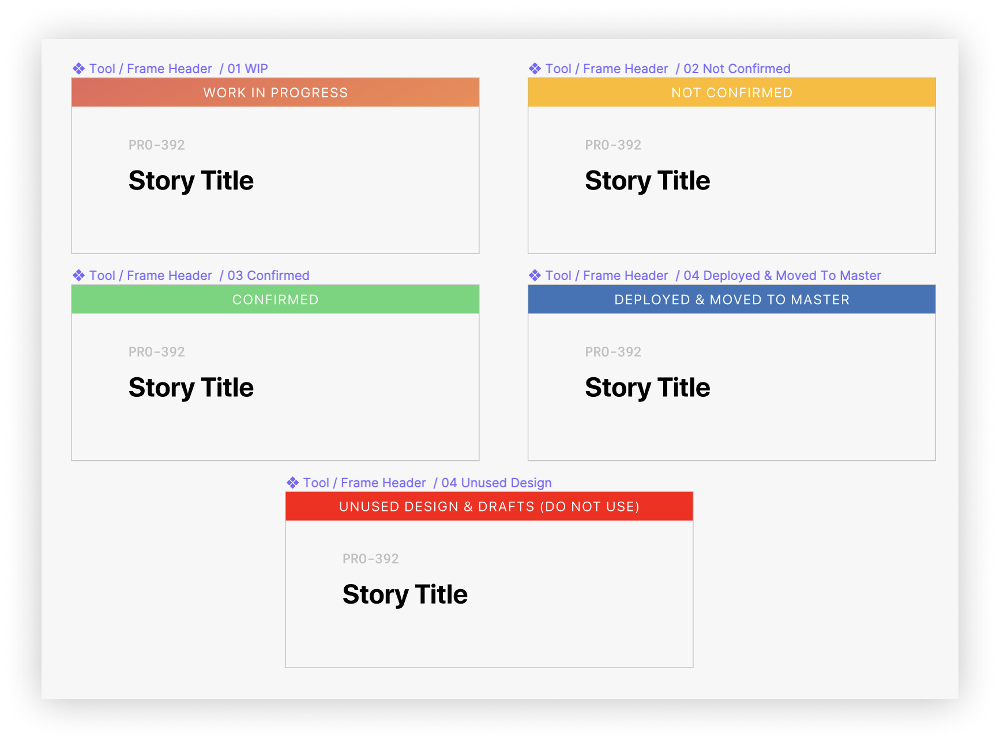
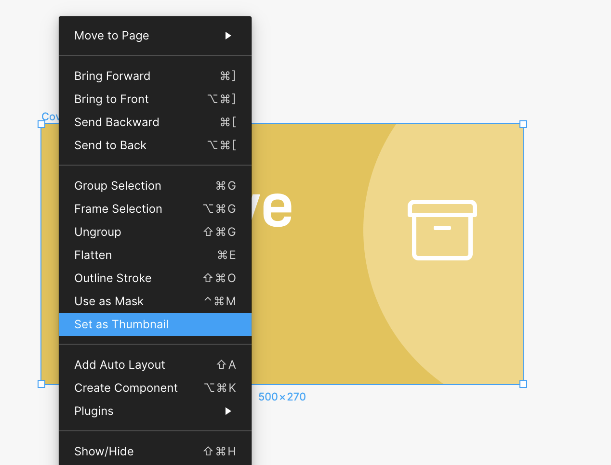

import Tip from 'elements/Tip'

Most people kickstart their project with a blank artboard or template. It is the obvious way to get started. However, user-interface designs tend to be more complicated than just a few pages.

How should we approach to organise our screens, when there are 10+, 100+, or even 1000+ screens? And does the file structure cope with the development workflow? Here's my struggles & takeaways in organizing Figma.

## Before We Get Started

I work at a [travel-tech startup](https://www.hyperair.com) right now, and we work on App and Website. Being the principal designer, I have initially organised all our screens and design in 4 files, Tokens, App, Website and Ops.

1. **Tokens** - It contains all essential elements of design in the company, including typography, color palette, logos, graphic assets. I consider this file as the on-boarding walk-through for new hires. Since Figma has no limit on viewer accounts, even non-technical personnel can access the company’s design token. We also use [Zeroheight](https://zeroheight.com/055c0944d/p/68b40e) to publish our design assets.
2. **App** - All app screens since ideation are placed here. Major pages include Sprint, Master, Archive. We create a new page for each sprint in order to review working items together. Launched screens will be consolidated to the master page.
3. **Web** - All website screens are stored separately in another file. Same as the app file, major pages are Sprint, Master, Archive.
4. **Ops** - All in-app editorial assets, banners, and social media graphics are also created in Figma. Major pages are divided according to the channels, like Landing Banners, Campaign, Website Assets, Instagram.

## 5 Tips Mastering Your Figma Files Organisation

### 1. Think About File Structure You Really Need

Before we get started, let’s learn about Figma’s file structure.

We are only working on 1 single product right now and I think separating screens in files would be sufficient enough. **Having a precise definition on organising design screens is essential**, so everyone can follow the same logic. In my case, 5 files are clearly defined according to their purposes, there are no edge cases to worry about.

### 2. Keep It As Simple As Possible

I used to create a new Page when a new development sprint kickstart, the biggest advantage of creating a "Sprint" Page is being able to review and work together, “Sprint” in App & Web page. However, As time goes by, I was too not hard-working enough to consolidate shipped design in a Master list. It is harder to locate old design and ideas, because features are breaking down and revised across different sprints. Sketched ideas and shipped designs are also mixed in the sea of screens as well.

To make it even simpler, I decided to consolidate all my past designs in a “Master” Page, unused designs are put in an “Archive” Page, and those designs in current sprint will simply be “Work In Progress” Page. **Setting this up has forced myself to clean up “Work In Progress” when each sprint ends, consolidate all designs before the next sprint.**

In the case of tracking old design for archival purpose, here’s a pro tip:

<Tip>For Team Plan, there is unlimited version history, You can name a specific version according to your sprint name, so you can easily track your old design. For Free Plan, Version history is limited to 30 days. You can also duplicate your project and name it accordingly. Or you just keep a detailed changelog separately like <a href="https://keepachangelog.com/en/1.0.0/" target="_blank">Keep A Changelog</a>.</Tip>

### 3. Organise Your Frames

One of the feedback I received from my co-workers is that it’s hard to browse through Figma as there are too many artboards and pages. But I had quite the opposite opinion thinking it's the best tool I have ever used to collaborate on. So I started to reflect on why would non-technical people feel frustrated browsing my files.

Figma is too flexible that my pages were so messy with designs lying all around. Incorporated from the philosophy of traditional design software, like Adobe Photoshop and Illustrators, only those within frames matters. It would make total sense keeping those relevant unused artworks within reach outside your artboard.

But when we started to collaborate, more people are at stake. Becoming the best organised version of ourselves is required to make it work. Therefore, I started to nest screens within a bigger frame, with proper title and user story.
But then I realised Figma actually does not recommend to do so. **For us to consider a Frame as a Top-level Frame, you must not nest it within another Frame or object.”** ([Using Figma](https://help.figma.com/hc/en-us/articles/360041539473-Frames-in-Figma)). So I have created a component to things easier.

<Tip>Create a resizable component to indicate each user story / feature, with all essential information. Title, JIRA story code, description. Then you can create different state using “Component Name / State”, so users can easily switch states, like “Developer Handoff / In Review / Deployed”</Tip>

### 4. Type out your thought with annotations

Not everyone understands your intent and not everyone can spot small changes you made to the previous design. So type out your thought with annotations. Mark up changes that people would miss and make it readable.

Use [Redlines](https://www.figma.com/c/plugin/781354942292031141/Redlines) to annotate measurements that you want to highlight. There’s also a [Figma Redline Components](https://www.figma.com/resources/assets/figma-redlines/) that can make your annotations stand out.

### 5. Thumbnails Are Customisable, Make It Pretty!

Finally, a cosmetic solution to make your Figma more tidy and visually pleasing. Previous Figma only use the first page as a default thumbnail. Did you know you can now [customise any frame as thumbnail](https://help.figma.com/hc/en-us/articles/360038511413-Set-a-Custom-Thumbnail) ?

**How to create custom thumbnail for Figma?**

1. The revamped thumbnail does not have a fixed resolution as it is fluid across screen sizes. First, create a page and named it "Cover"
2. Draw a 500x270px Frame. I found this size works great for both Desktop and Laptop.
3. Let your creativity flow and make it pretty. The thumbnail template I created includes 1) Title, 2) Short description, and 3) An icon using [Font Awesome font](https://fontawesome.com/download) that I can type out an icon.
4. Right click the frame and set as Thumbnail. You can also create it as a component and share it across your files.

## Outro

That’s it. Heres my 5 tips to organise my design workflow. My biggest lesson is learning not to make things too complicated. Yes, it is always possible to create a complicated system that is perfect but in a world that is moving quickly, that amount of work might not be justified at all.

> We should forget about small efficiencies, say about 97% of the time: premature optimization is the root of all evil. Yet we should not pass up our opportunities in that critical 3%.

<cite>Donald Knuth</cite>

This article, [Keeping files organized for your team,](https://www.figma.com/best-practices/guide-to-developer-handoff/file-organization/) from official Figma is also a great resource. If you have any other ideas to organise your Figma, please share with me on [Twitter](https://www.twitter.com/desktopofsamuel)!
