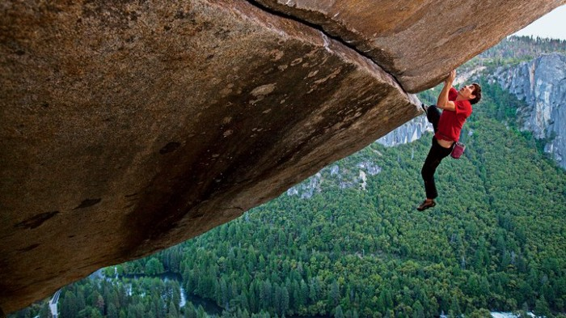
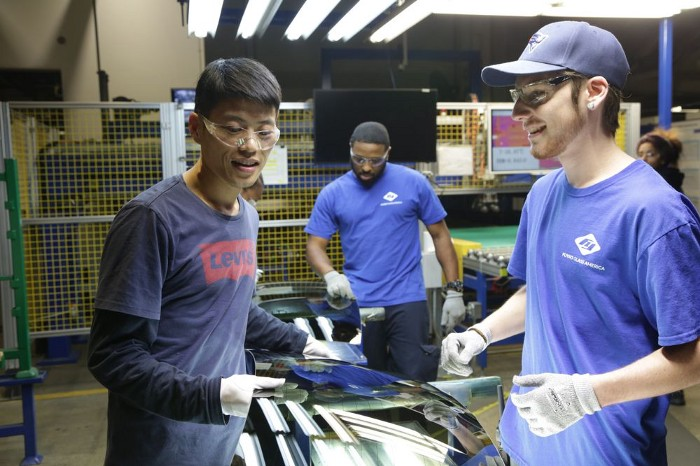
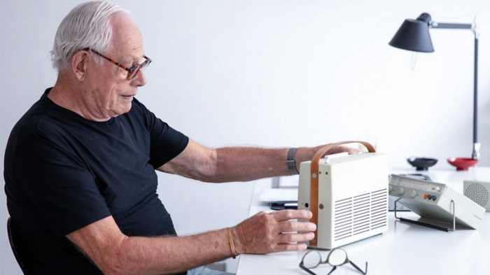
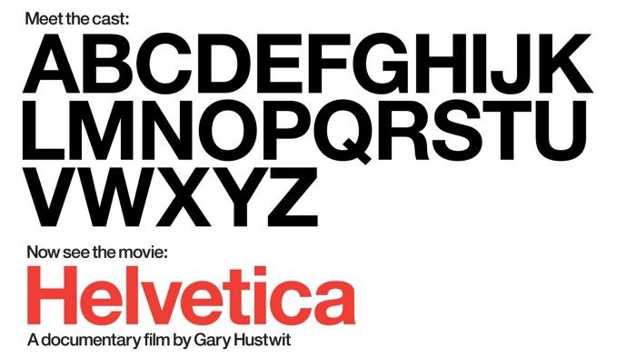
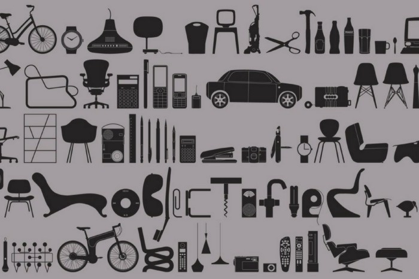

One of my year resolution over the last couple of years was to watch more documentaries. Why? Documentaries are fun and informative, it’s a standard medium where creativity and unique style can make a huge difference.

Best of documentaries is the attention lifespan it required, is so little compared to finishing a book. Watch documentaries was a process to me feeding new knowledge around the world, and after that, I would dig deeper and read on the topics that I’m interested in.

Here is a list of documentaries I’ve watched this quarter.

**Free Solo**, _2019_ (Jimmy Chin, Elizabeth Chai Vasarhelyi) ★★★★★

Almost forgot how good it was to watch a great documentary. Free Solo is more than a sports doc, the film is meta in a way that filming process with drones and crews posed pressure on Alex’s climbing attempt. Alex Honnold, is a professional rock climber attempt to climb El Cap without any rope at Yosemite National Park. The film is incredibly frank on this subject matter.

**American Factory**, _2019_ (Julia Reichert, Steven Bognar) ★★★★½

Watched just right before the Oscars when the film was awarded Best Documentary Feature. The film offered a down-to-earth insight into the dynamics between Chinese and Americans is the best part of it. It gets political as expected regarding the labor union dispute.

But the most part of the film is about the daily lives of workers in Fuyao. The Chinese corporate visioned to expand in America, where they transition a closed GM plant into a glass manufacturing factory. Two groups of people with distinctive cultures, languages and their backstories working together under the same roof.

Remember to watch the [additional video](https://www.netflix.com/title/81176188) the directors talking to the Obamas (producer of the film).

**Rams**, _2018_ (Gary Hustwit) ★★★★

The film was on my watchlist for months but what a coincidence that a week after watching this film, it has come to my knowledge that director Gary Hustwit [made his films available for free, week by week](https://www.ohyouprettythings.com/free) during the Coronavirus outbreak. Making a majority of my film record these months are all his work.

Rams took a deep dive into Dieter Rams’ life and work in Braun and Vitsœ, who is a key design figure in influencing modern industrial design. Previously interviewed in Objectified (2009). The film is certainly more in-depth and focused on Dieter’s design philosophy.

**Helvetica**, _2007_ (Gary Hustwit) ★★★★

Helvetica was also a documentary I meant to watch for a long time. I believe it is one of the first documentary feature focusing on one, single font. But there is no better font like Helvetica, in terms of its popularity, cultural impact if you need to choose a font to make a film. The neutral nature of the font style has made it so successful but also ubiquitous. Until someone points it out for you, “That font is actually Helvetica”.

**Objectified**, _2009_ (Gary Hustwit) ★★★½

Another work by Gary Hustwit. The film explored the relationship between designers and their work in making objects. How objects become products and then become a part of our everyday life. However, the film was focused on the creative process of the makers. That’s where I felt the film was inadequate. It barely touched on the relationship between objects with its users, how people use products out of designers’ expectations or how bad design could affect our lives. I personally think that was a tipping point why I feel good design worths and deserve to be treasured.

—

That’s it. Here’s my round-up of the documentaries I watched so far this year. I just started this habit in reflecting on the films I watched. If you are even more interested, my movie diary is also available to view on [Letterboxd.com](https://letterboxd.com/samuelisme/).
