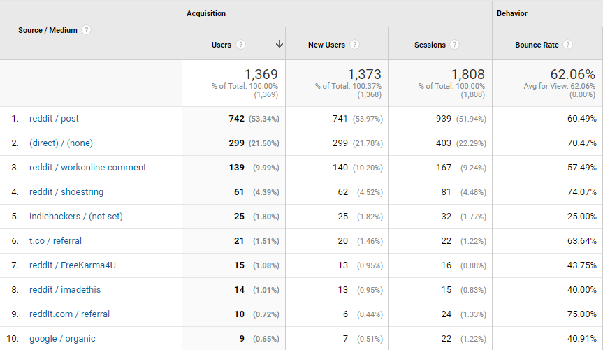
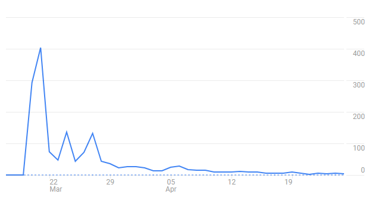
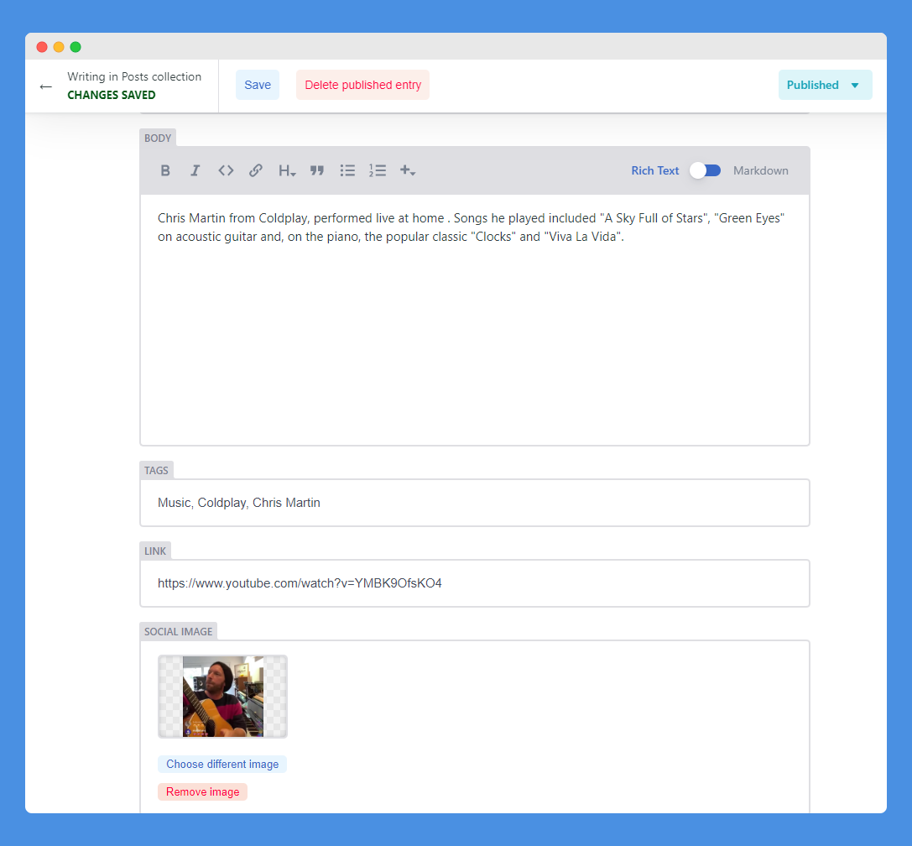

A month ago, when [#StayAtHome concert](https://tgtathome.club/category/music/) started, generous companies and creators follow the trend by offering their work and service for free to encourage people to stay at home. People started collecting and sharing what they could do at home in a text list. When more people started to share their work for free, with emerging apps, movies and games were made available for free. Then, an idea of putting all available content and service has come to mind.

For side projects like this, you should always experiment using the tools that you are the most familiar with. In my case is [GatsbyJS](https://www.gatsbyjs.com/), which also was used on my [website and blog](/), I quickly adapted the starter template and created [“Together At Home Club”](http://tgtathome.club/?utm_source=medium&utm_medium=blog&utm_campaign=launch) in a night. The site has been running for 1 month, Here are my takeaways.

](./TgtAtHome-Behind-1.png)

## Keep The Design Minimal and Informative

](./Desktop.jpg)

Using GatsbyJS, each entry is actually a Markdown file in my source repo uploaded via Git. Keeping the information architecture simple is essential, main layout would be all the resources that I have gathered, and sidebar would be supplementary information and navigation. I simplified the [template layout](https://www.gatsbyjs.org/starters/alxshelepenok/gatsby-starter-lumen/) so clicking on each card will point to the designated hyperlink of the resources directly. So everything is based on one single page only.

After applying the core brand style to the site, my next objective is to keep the card design as informative as possible. Limited-time offers will include a deadline right next to the View More button. So it would be more timed even the offer has expired. Categories will be linked to a detailed category page if visitors are interested in a specific category. You can also view the original [design draft](https://www.figma.com/file/bDL1o713kTHgopoXB0eA62/Together-At-Home?node-id=0%3A1) of the project on Figma.

## Gatsby RSS Plugin + IFTTT = Automated Twitter

Keeping minimal effort and focusing on your energy on the right task is also my lesson here. In the beginning, I doubted a separate [Twitter account](https://www.twitter.com/tgtathomeclub) is necessary. Because there’s little time to maintain the content as well as social media. However, Gatsby comes with RSS plugin, [gatsby-plugin-feed](https://www.gatsbyjs.org/packages/gatsby-plugin-feed/), using it together with IFTTT, by setting a recipe to send a tweet whenever RSS feed updates. This automation setup has saved me additional time on a duplicated task. I can even set up a template hashtag to be added at the end of every tweet.

](./ifttt-twitter.png)

## Initial Traction Was Great, But That Was It.

For launching, the major response came from a Reddit post I have posted on [r/SideProjects](https://www.reddit.com/r/SideProject/comments/flqtaf/a_website_collects_all_free_online_courses_music/). Then, I have also posted to more subreddits like [r/Free ](https://www.reddit.com/r/FREE/comments/g8caiv/collection_of_free_services_apps_films_and_games/)and [r/IMadeThis](https://www.reddit.com/r/IMadeThis/comments/fnvynq/together_at_home_club_a_website_collects_all_free/). I have also shared on my personal Facebook and Twitter.

Setting up UTM parameters properly using tools like [Campaign URL builder ](https://ga-dev-tools.appspot.com/campaign-url-builder/)allows me to track which particular thread brings in traffic to the website. However, traffic has dropped gradually after the course of a month.

## Keep The Cost As Low As Possible

You would never know how long the project would last, and for most of the cases, all the costs would come from your own pocket.I have managed to keep the cost to minimal so far. [Netlify’s free tier plan](https://www.netlify.com/pricing/) with 10GB traffic is more than enough for the site to kickstart. However, build time is limited to 300 minutes, which are shared over all my websites.

Current spending only includes $7 of extra build time I need on Netlify and $9 for purchasing the domain ([https://tgtathome.club](http://tgtathome.club/?utm_source=medium&utm_medium=article&utm_campaign=may)). Therefore, no matter how great those business or pro plans are pitched, you should always opt for free solutions in the beginning.

## Looking At The Alternatives

Of course, I am not the only one doing a curatorial list for free resources. After launch, I have dug up some competitions for my reference. It may not appear in exactly the same format, but the same problem they are trying to resolve.

In my findings, some similar website are focusing on a specific group of target audiences (e.g. parents, creatives, startups, etc), created also by hobbyists like me.

- [saasforcovid.com](https://saasforcovid.com/)
- [learn-from-home.herokuapp.com](https://learn-from-home.herokuapp.com/index.html)
- [phlearn.com](https://phlearn.com/resources)

But the real giants here, are actually news outlets, content farms, and different institutions across industries. They have full-time staff to work on articles on the same subject matter. From the perspective of SEO, they have a much higher domain authority and traffic, and they have dominated the related results in keywords like “Free Stuff”, “COVID-19”.That’s when I know it may not go as big as I thought it could.

## The Hardest Part: Keeping Up The Content

With all the excitement, I put up dozens of FREE resources every day I can find to the website manually.

After that, I have set up [Netlify CMS](https://www.netlifycms.org/) to simplify my workflow. I was hoping Netlify CMS was my answer to support guest submission and replace my [Google Form](https://forms.gle/B6yXL7xEUSKTnLY98). However, current version of Netlify CMS has limited configuration settings. It does not support guest posting on a specific content type, and visitors would still need to register before submitting any information. I regard this as a step back and therefore I didn't implement it.

So far, I have received 10 suggested content from Google Forms feedback and I have inputted 40+ resources all by myself while [saasforcovid.com](https://saasforcovid.com/) has 250+ resources collectively input on a [Google Sheet](https://docs.google.com/spreadsheets/d/1QdMr6TYlPLgc8nip165CyuDrr5WPcxnzqxJBJK_EfJ0/edit#gid=0), which has made me started to think if I have got off the wrong foot. Making things more simple like a collaborated Google Sheets may also be sufficient.

## Keep Calm and Carry On

The essence of curatorial site is the **unique way of thinking or approach putting up resources together for the ill-informed target audience**. In my reflection of this project, time was the advantage I had, which information spread so quickly my target audience is no longer ill-informed.

Framing your project and state your premises will help you to ponder what went wrong and how can you make it better next time. I’m writing this piece just as a reminder for myself. I am still inputting new content (but not as often) to the site since worldwide lockdown still happening right now. Welcome to [message me](https://twitter.com/@desktopofsamuel) about your suggestions or let me know if there are any free resources you discovered.