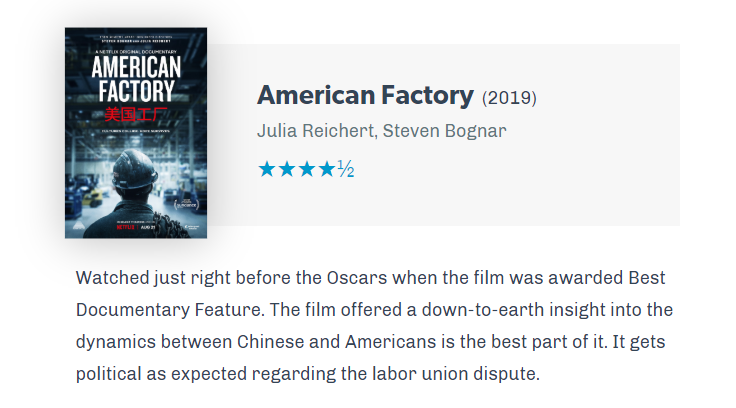

After settling down for the basic functionality of a website, its time to dig deeper and let some personality shines! We want your website to speak who you are, so enjoy the freedom of building anything possible, as it is one of the advantages building your own website.

However, personal style does not just drop in one day. In fact many designers have been developing styles for clients or company, they may not have a clear answer.

I also had a long thought on this and **I have put together a list of small changes that you can work on in order to discover your style**. Most of my suggestions apply for blogging platform like Wordpress and Tumblr, as long as CSS can be customised. In my case, I'm using Gatsby and MDX, therefore I own more control on the visual style and integration between design and content.

I believe building a website is a continuous process and for myself, so none of these were designed at the first place when I first launched my website.

For Gatsby users, I have simply apply my styles on a global css either you inject globally or referenced in a layout component file. Additional customised component would rest in your components folder. I am looking to share all the styles across my whole website, so I did not implement my style specifically in `MDXProvider` as some tutorials did.

## 1.  Ordered and Unordered List

If you use lists in your blog all the time, you should definitely style your lists, all you need is CSS. Reset your style first by clearing all the margins and padding. I learned about styling order list from [Josh Comeau](https://joshwcomeau.com/css/styling-ordered-lists-with-css-counters/). 

```css
ul li {
  list-style-type: none;
  margin: 0px;
  padding: 0px;
}
```

You can replace the default bullet point by assigning a image or character. 

```css
ul li:before { 
  content: '\1f852';
  list-style-position: outside;
  }
```

The content property refers to unicode of the special character. Feel free to check all options [here](http://xahlee.info/comp/unicode_arrows.html). 

For ordered list style, I have realized Josh's way of using `counter-rest: variable` is not compatible when the list span through other elements (seaprated by a code block or image). But there's a new standard coming, a new pseudo-class `::marker` is in experiment (which is not support by default by Chrome right now). You just need to make sure it fallback on non-compatible devices.

```css
ol li::marker {
  font-family: var(--font-primary);
  font-weight: var(--font-weight-bold);
  color: var(--color-primary);
  font-style: italic;
}
``` 

## 2. Blockquote

Quoting from other people is a terrific way of getting backlinks and bringing more authenticity to your writing. I also use blockquote to emphasis on  key message in my writing. For example,

> We should forget about small efficiencies, say about 97% of the time: premature optimization is the root of all evil. Yet we should not pass up our opportunities in that critical 3%.
<cite>Donald Knuth</cite>

 A typical approach to style your blockquote would be using a different font and much larger text size. I also used Quotation mark to indicate. Once again, you can use pseudo elements `:before` for adding the quotation mark before the quote begins.

```css
blockquote:before {
  content: "\201C";
  position: absolute;
  top: -20px;
  left: 0;
  width: 3rem;
  height: 3rem;
  font: 8rem "PT Sans", sans-serif;
  color: var(--color-primary);
}
```

Remember to set `position:relative` to the parent element so the absolute position could be fixed. In case you want to add the source of quote, an HTML element called `<cite>` can also added after the end of blockquote. However, Markdown does not support cite directly, so you have type the markup by yourself.

```markdown
> We should forget about small efficiencies, say about 97% of the time: premature optimization is the root of all evil. Yet we should not pass up our opportunities in that critical 3%.
<cite>Donald Knuth</cite>
```

## 3. Strong & Link Style

Highlighting important sentence or your conclusion help guide your readers. In CSS, sentence that you put on bold in text editor can also be tweaked, by adding more fun and grabbing the attention to it.

In markdown, `**Bold Style**` would translate into `<strong>` in HTML. Then we could style the selector in CSS. Like this animated underline on [Codepen](https://codepen.io/Varo/pen/jOOaLLG), you can easily turn it into a highlight. 

For example: **premature optimization is the root of all evil.**

In most case, external hyperlink would be styled already. Please keep in mind links and highlight should be separated, so readers would be  able to distinguish which one is clickable and which one isn't. 

## 4. Custom Components

This is the part where Gatsby excels at. Being able to build custom components meaning you have unlimited possibilities in displaying your content. 

For starter, a Tip component would be a easy trial making your article more rich. You would be able to separate additional information with your writing.

```javascript
import React from "react";
import styled from "styled-components";

const Wrapper = styled.div`
  background-color: var(--color-primary-background);
  border-left: 4px solid var(--color-primary);
  padding: 1rem;
  border-radius: var(--border-radius);
`;

const Title = styled.p`
  font-family: var(--font-primary);
  font-weight: var(--font-weight-bold);
  display: inline;
  margin-right: 8px;
`;

const Tip = ({ children, className }) => (
  <Wrapper className={className}>
    <Title>Tip:</Title>
    {children}
  </Wrapper>
);

export default Tip;

```

Then in your markdown, remember to import Tip component. Then wrap Tip around the paragraph.

```javascript

import Tip from "components/Tip"

<Tip>Tip Content</Tip>

```

import Tip from "elements/Tip"
<Tip>This is a tip to demonstrate custom component. It's extremely useful to put additional knowledge to the writing or to remind readers about new update </Tip>

I have also created a Film component for my quarterly documentary review blogs. These two are just the most simple component you can tailor for your own need. Imagine adding support for affiliate links, GPS, maps and more! 



That's it. Here's an example of custom component that I would love to try some day. 
This is a map module from [Paul Stamatiou](https://paulstamatiou.com/photos/africa/rwanda/)'s photo journal'.


If you have more ideas or good inspirations in mind please feel free to share with me. 
