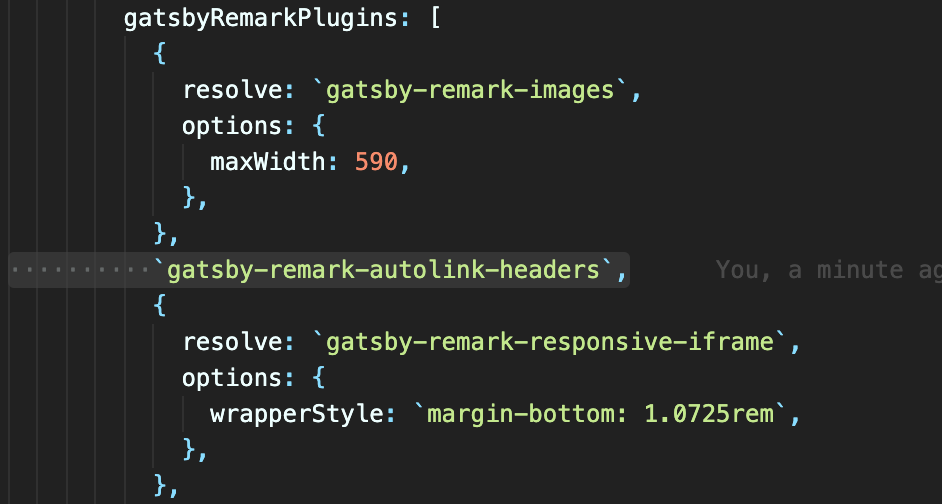
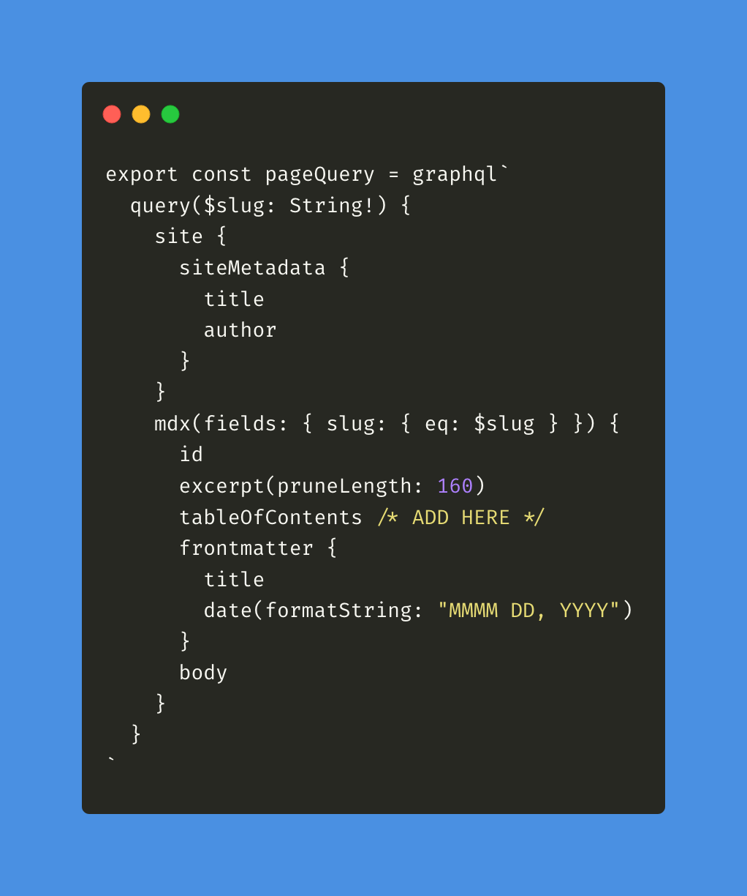
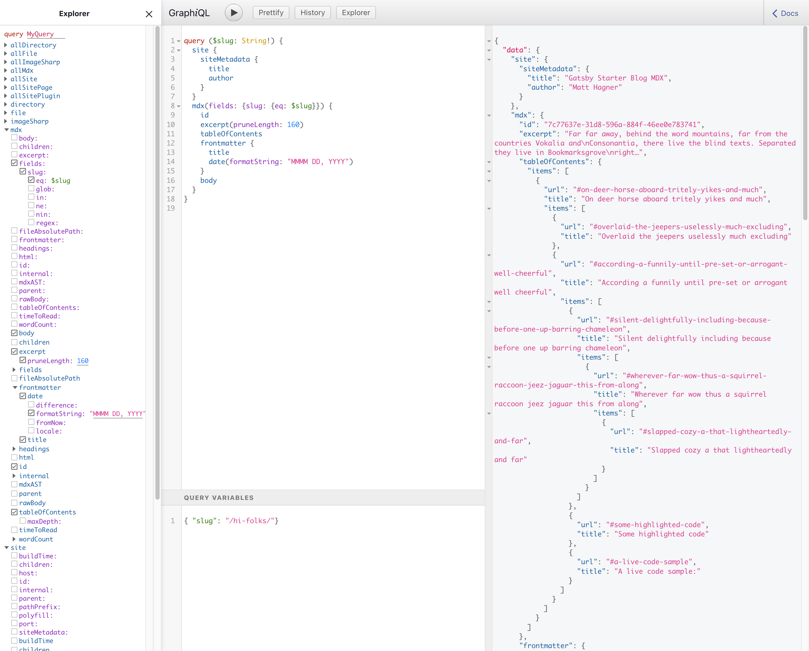
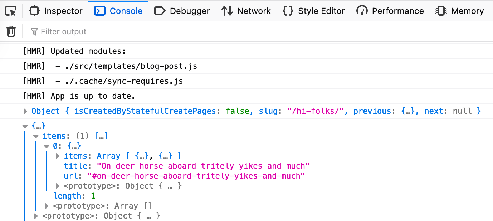
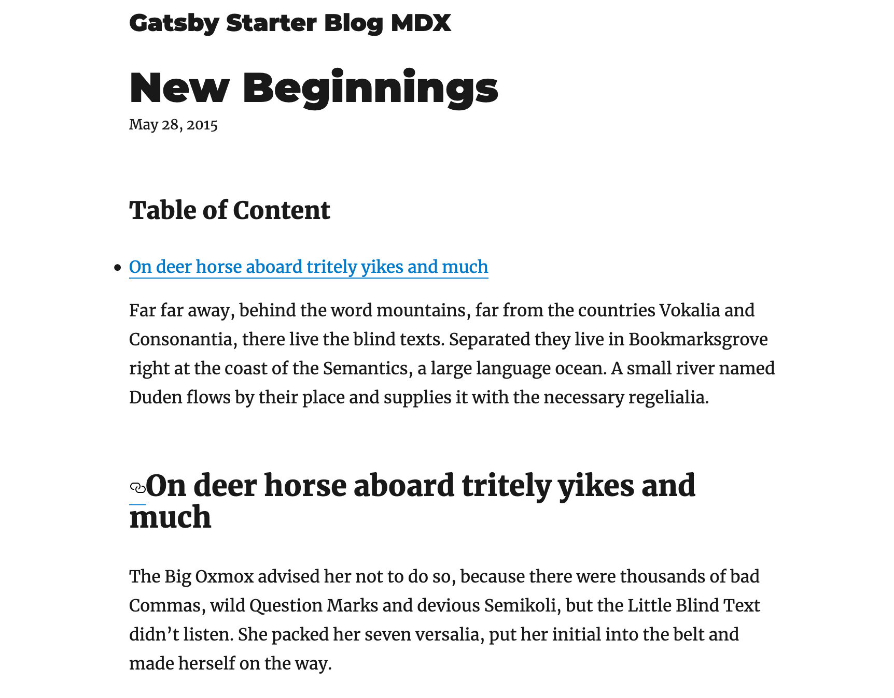
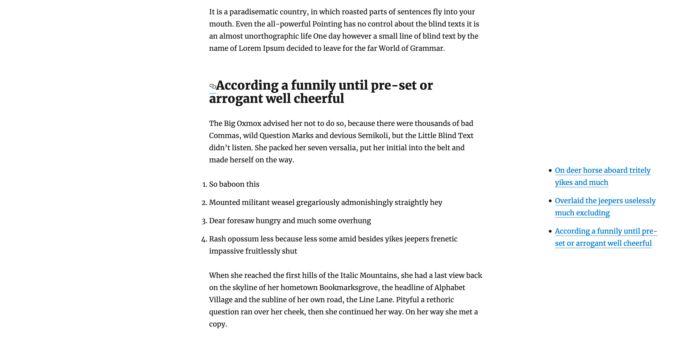
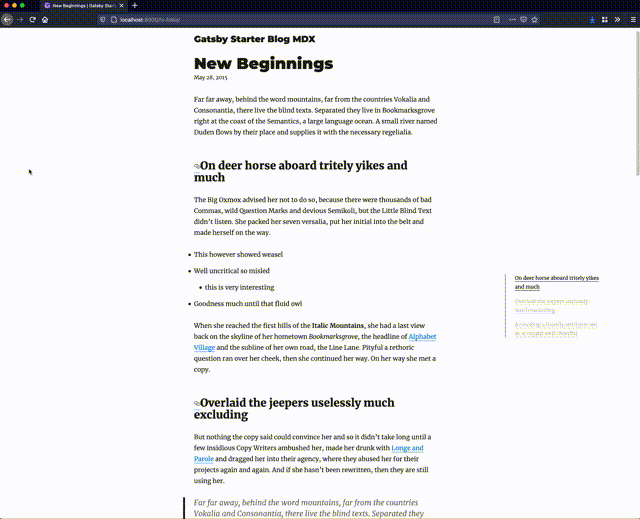

Have you visited some documentation and tutorial sites, that allow you to see which section are you reading on the side? If you want to improve the readability of your Gatsby website. In this article, I will share my process in creating an interactive table of content component that can respond to your scrolling. 

Let's take a look at the requirement:
1. Reader will be able to navigate section of content easily 
2. Reader will be able to know their reading progress

We will be using a package called `react-scrollspy` to detect if the headings are in viewport, which will trigger an active class name in return. 

By including a Table of Content component, users will be able to navigate within your article easily, finding the content they are interested. Let's get started and skip to step 2 if you have a Gatsby site already.


# 1. Create a Gatsby Site
We will install a simple MDX starter at the beginning

```
gatsby new gatsby-tutorial-table-of-content https://github.com/hagnerd/gatsby-starter-blog-mdx
```

Use `yarn` or `npm install` to initialise the repository. 

# 2. Install react-scrollspy & gatsby-remark-autolink-headers
Taking a look at `react-scrollspy`, we will need to provide the headings for each page to the component, which luckily generated automatically by default in each post node. We will also need to state the class name to activate when in view. 

```
yarn add react-scrollspy gatsby-remark-autolink-headers
```

In `gatsby-config.js`, you will need to add `gatsby-remark-autolink-headers` within the `gatsbyRemarkPlugins`.



# 3. Update Post GraphQL Query



Include `tableOfContents` in your blog post template GraphQL query, in my case it's `blog-post.js` in templates folder. After that, if you use GraphiQL, you should be able to see table of contents return as an object. We will call all the `url` value in the object and return as an array.



# 4. Passing Post Props to Toc component
Create a new file called `Toc.js` in Components folder. We will be adding function step by step to isolate problems that may arise. By adding a very simple component, we need to make sure all the props will be passed through first. 

```js
import React from 'react'

export default function Toc(props) {
  const { post } = props
  console.log(post)

  return <h3>Table of Content</h3>
}
```

Save file and back to `blog-post.js`and import Toc component.
```js
import Toc from '../components/toc'
```

Then I will add Toc just before the MDXRenderer.
```js
<Toc post={post.tableOfContents} />
<MDXRenderer>{post.body}</MDXRenderer>
```
For now, only the Table of Content h3 title will be displayed. But in console, as we logged the post props. We can also check if the objects of `tableOfContents` are returning.


# 5. Mapping Table of Content Props

For a simpler demo, we will be only listing all first-level heading in the Table of Content. Let's update `toc.js` by mapping the props value. By doing so, we would be able to access all the headings information and link from `tableofContents`from GraphQL.

```js
return (
	<nav>
		{post.items.map(p => (
			<li key={p.url}>
				<a href={p.url}>{p.title}</a>
			</li>
		))}
</nav>
  )
```

Since we have installed `gatsby-remark-autolink-headers`to add anchor automatically for each heading. Clicking on the Table of Content would redirect to the heading immediately.



# 6. Styling Table of Content Component on the side
Now basic functionality has been completed, let's take care of the styling first show we can test the scrolling easier. Here I will be using the simplest implementation using CSS. But any style implementation should work just fine.

Let's create a `Toc.css`in the same folder and import it in the component.
```
import './Toc.css'
```

We will make the Table of Content fixed on the right side of the window, so users can navigate easily no matter which part of the page they are. Also, since we do not want to alter normal list style. We will be specifying a class name `.toc-list`, which will be added in the next step.



We will be also adding a `is-current`class so Scrollspy would able to add the class name when the heading is in view.

```css
nav {
  position: fixed;
  top: 50vh;
  right: 5vw;
  margin-left: 36px;
  max-width: 250px;
}

ul.toc-list {
  border-left: 1px solid #363636;
}

ul.toc-list > li {
  list-style-type: none;
  margin-left: 24px;
  font-size: 13px;
}

ul.toc-list > li > a {
  color: #c2c2c2;
  text-decoration: none;
  border-bottom: 0;
  transition: 1s all ease-in-out;
}

ul.toc-list > li.is-current > a {
  color: black;
}

/* Hide Table of Content when screen is smaller than 1440px */
@media only screen and (max-width: 1439px) {
  nav {
    display: none;
  }
}
 ```

 # 7. Implement React Scrollspy
 Last but not least, we will need to detect if the heading is in view. `react-scrollspy`will help us to identify if the anchor is in view after we pass through 2 things.
 1. List of anchor URL link as an array
 2. Class name when the heading is in view

It took some time for investigation, but since Gatsby `tableofContents`conveniently added anchor already, we actually need to remove the `#` from the provided object. Here's a simple function to call `url`value in the object and remove the first character.

```js
  let url = post.items.map(function(post) {
    return post['url'].substring(1)
  })
  ```
  
  After that let's import Scrollspy right after the `nav` and pass the `url` and add the current class name:
  
  ```js
   <Scrollspy items={url} currentClassName="is-current" className="toc-list">
        {post.items.map(p => (
          <li key={p.url}>
            <a href={p.url}>{p.title}</a>
          </li>
        ))}
      </Scrollspy>
  ```
  
  The final file for `Toc.js`should look like this
  ```js
  import React from 'react'
import Scrollspy from 'react-scrollspy'
import './Toc.css'

export default function Toc(props) {
  const { post } = props
  let url = post.items.map(function(post) {
    return post['url'].substring(1)
  })

  return (
    <nav>
      <Scrollspy items={url} currentClassName="is-current" className="toc-list">
        {post.items.map(p => (
          <li key={p.url}>
            <a href={p.url}>{p.title}</a>
          </li>
        ))}
      </Scrollspy>
    </nav>
  )
}
  
  ```
 
 
 That's it. I have created a [minimal repo](https://github.com/desktopofsamuel/gatsby-tutorial-table-of-content) using [Gatsby Starter Blog MDX](https://github.com/hagnerd/gatsby-starter-blog-mdx). Feel free to reference it and raise any issues on [Github](https://github.com/desktopofsamuel/gatsby-tutorial-table-of-content). You can also [preview the demo here](https://gatsbytutorialtableofcontent.gtsb.io/). 
 
 
 
 Here are some of the errors and questions I faced when developing the Table of Content component using Gatsby.
 
 # How to conditional render when there are no headings at all?
 
 At this time, if you have a blog post without any heading. You will encounter into error. We will need to add conditional render to the Table of Content only when it is available to the post template.
 
 ```js
/*blog-post.js*/
  {!!post.tableOfContents.items && <Toc post={post.tableOfContents} />}
 ```
 
 
 # How to debug all the error using Gatsby Build?
 If you have a lot of blog post, you will not be able to test everyone by yourself. If you have been using `gatsby develop` to test the Table of Content component. I highly recommend you to use `gatsby build`to test all blog posts before commit. Making sure there is no error in the blog post. I managed to find some blog post without any headings and one blog post that had a wrong heading hierarchy (h3 before h2) which resulted in build error.
 
#  How to remove icon next to the headings?
The plugin in `gatsby-remark-autolink-headers`add an icon before each headings that it process. According to the documentation, make `icon: false` under plugin options will remove the icons before anchor headings.

```js
/*gatsby-config.js*/

{
	resolve: `gatsby-remark-autolink-headers`,
   	options: {
    	icon: false,
    	},
   	},
```
 
 # How to make scroll smooth?
Install `smooth-scroll` add the following code to `Layout.js` or anywhere that will be loaded on every page.

```js
    if (typeof window !== 'undefined') {
      // eslint-disable-next-line global-require
      require('smooth-scroll')('a[href*="#"]')
    }
```
 
# What next? 
There are still some problems with existing solutions. Like `react-scrollspy` only recognizes the heading instead of the heading + following paragraphs. So long article may experience  (Heading 1 In View -> Out of View -> Heading 2 In View) such problem.

Also, only first-level heading is rendered currently. Putting a loop would also be the next step in making the table of content better. 

Last but not least, mobile display is also worth working on, currently, the table of content would not be rendered in mobile as a majority of my reader come from desktop. But implementing a floating button with pop-up menu would also be a feasible solution. 