Obsidian is the up-and-coming notes app that has great potential, however the platform is still in early stage, the syncing capability is still limited. Offcially, you have to pay USD4 per month for [Obsidian Sync](https://obsidian.md/sync) service and subscribe as a VIP member for mobile app early access. Or you can sync between desktopo (Windows, macOS, Linux) only. However, that does not mean we cannot access to our notes on mobile.

As Obsidian allows customizing vault save location and adopt open file format like Markdown. By using cloud sync service like Dropbox, Google Drive and iCloud Drive, whole folder can be synced and edited using any app that support Markdown, like  [iA Writer](https://ia.net/writer), [Ulysses](https://ulysses.app/), [Pretext](https://apps.apple.com/us/app/pretext/id1347707000). Two-way linking and tagging feature will not be supported. 

However, even though cloud services are easy to set up and most people probably subscribed to one already. These services were not made for tracking notes and changes. Conflict versions across devices might result in lost of data. Therefore, I'm recommending Git as an alternate solution. This tutorial will guide you to setup Git to sync Obsidian for free (without typing any command line as normal Git does).

Be aware this approach is not recommended if you have safety concern since none of the files are encrypted, therefore accessible by third-party platform.

## What is Git and How does it help?

Git is a software for tracking and synchronizing codes for developers. Because it can compare versions between different text files, it will allow us to track any changes made to the Obsidian Vault. There is a very rare chance that your notes will be lost. Also it is also a very popular platform, most Git on desktop are free (while mobile apps require single payment only).

Note: First 3 steps of my tutorial will be creating a Github Repository. If you are already familiar with Git, please initiate a git by yourself and jump to step 4. Since this article is written for general public, I will avoid using command line tools in this tutorial.

Let's get started!

## 1. Register and Download Github for Desktop
Register an account at [Github.com](https://github.com/), we will be using Github repository to sync our Obsidian Vault. Remember to setup two-factor authentication to secure your account. Then, download and install Github for Desktop](https://desktop.github.com/). It is an app that allow us to perform most Git commands without using command line tools.

## 2. Add Obsidian Vault into Github
If you already created an Obsidian Vault, we will need to prepare the vault folders for Git. It will allow the plug-in that we'll install to sync with Github. Open Github for Desktop, click "Add an Existing Repository from your Hard Drive".

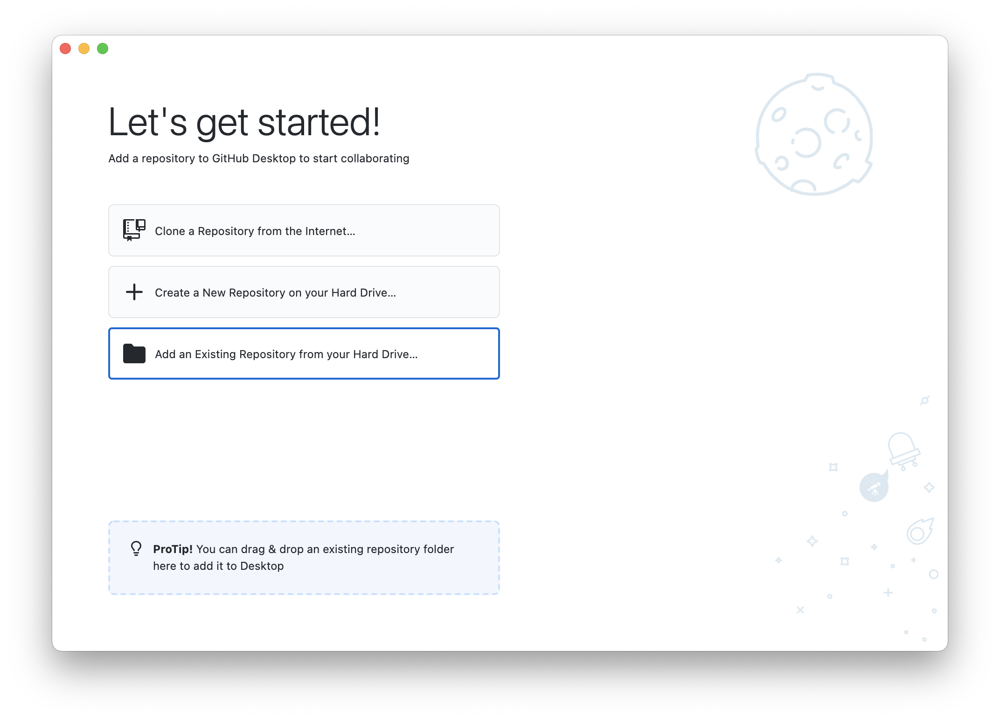

Then you need to select your vault location, Git will use dotfile (hidden folders) to store data under your directory. (You can see the .git folder afterwards by pressing <kbd>Cmd</kbd> + <kbd>Shift</kbd> + <kbd>.</kbd> or select to display hidden items on Windows). There will be a warning saying "The directory does not appear to be a Git repository".  Then you will need to click "Create a repository" to continue.

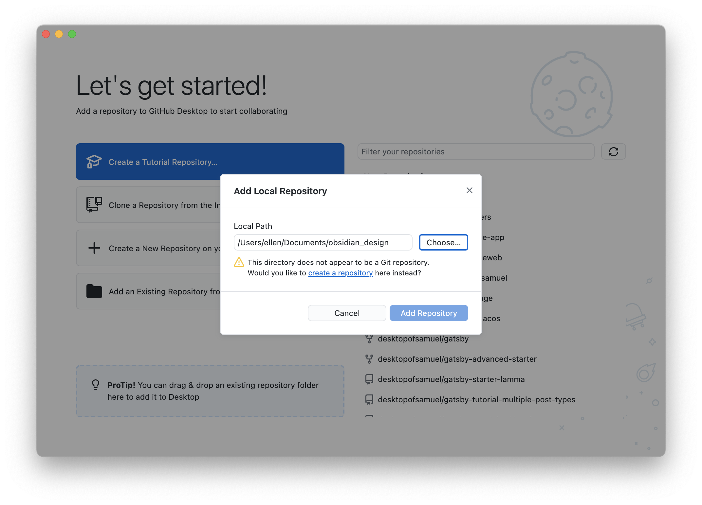

Then, fill in  project name and description, local path has already been filled. Rest of the questions can be ignored for now. Then click "Create Depository".

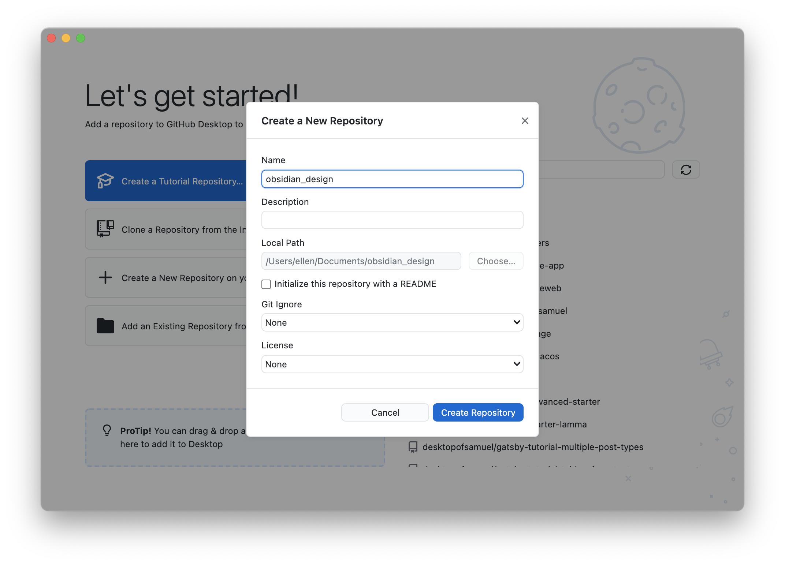

(You can also click "Create a New Repository" at the beginning, however, Github will create subfolder using the Name field, instead of picking the selected folder as git repo. Therefore you will need to match folder name at parent level.)

## 3. Login and Push Vault to Github

At this moment, we have only complete the git setup on the computer. Add your commit message (e.g. Initial Commit) and then click "Publish Repository" to upload the entire folder to Github. We would still need to login our Github account, click "Github.com" to login via browser.

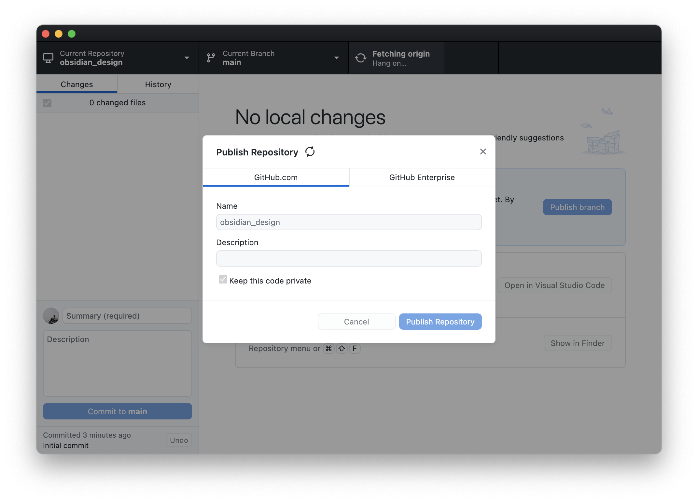

After login, click Publish again, we will need to input the Repository name in Github (same as the name is step 2). Select repository to be private (default is public) to avoid unwanted access to your notes. Then click "Publish Repository". When the "Publish Repo" text changed to "Fetch Origin", Congratulations, you have successfully upload the vault the Github! Check in your browser, you should find your repo on Github.com now. 

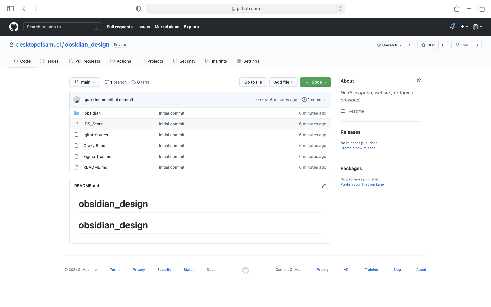

##  4. Install Obsidian Git

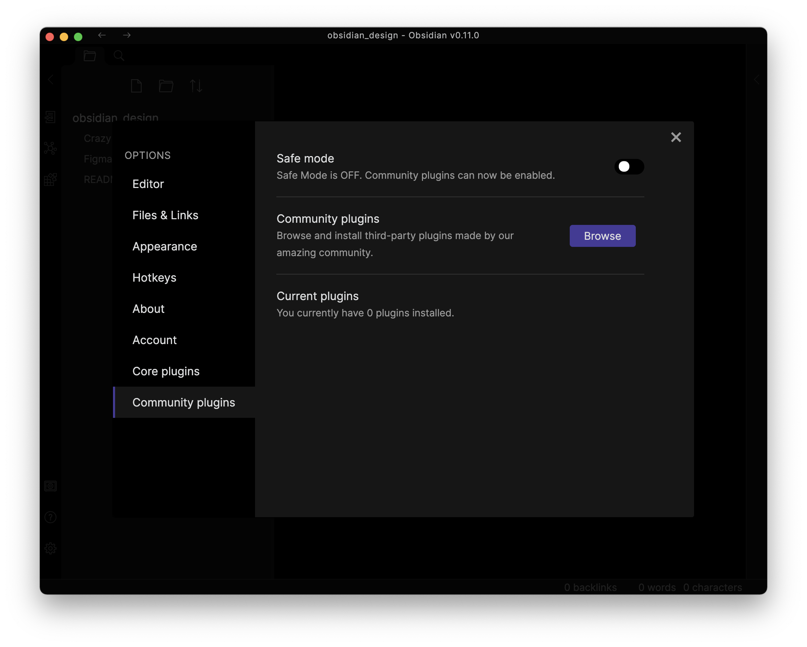

Open Preference in your Obsidian, in Community Plugins, you will need to turn off Safe Mode before installing plugin. Since plugins can access and alter the content of your vault. You should backup before installing. Search "Obsidian Plugin" to install, then you will need to activate at the Community Plugins page. This plugin will directly use your git settings in the folder to sync to Github.

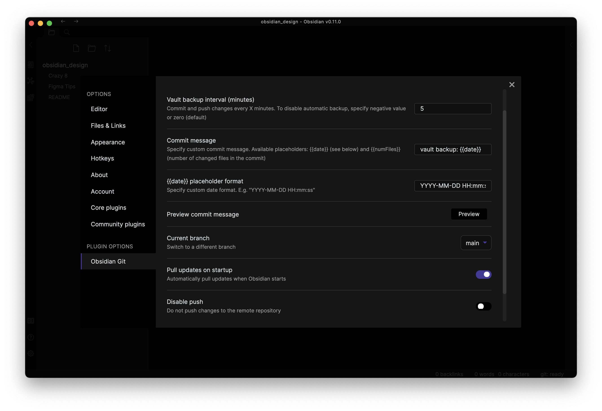

After installation and activation, there will be a plugin settings for Obsidian Git. If you just want to view Obsidian content on secondary devices, I would recommend:
- Change backup interval to be 5-10 minutes to reduce app workload and increase performance
- Change Pull updates on startup to ON, it will make sure our devices have the latest update whenever the app has start up. 
- Add your device name as an identifier in the commit message template, so you can track which device has the latest update (PC vault backup: {{date}})
- Last but the most important:  turn OFF Disable Push to enable pushing the commit to Github, or else it will only be available in local.

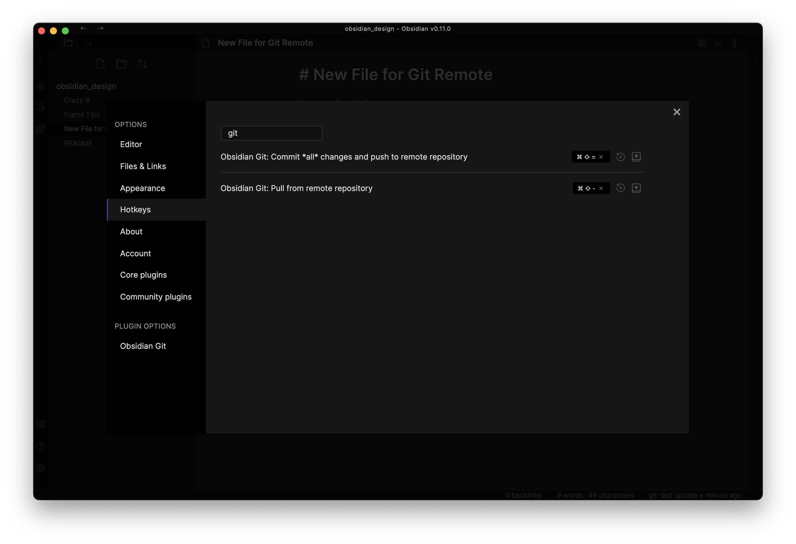

Also in Hotkey page, I added keyboard shortcut for Obsidian Git, so I can quickly commit and retreive update.  <kbd>Cmd</kbd> + <kbd>Shift</kbd> + <kbd>+</kbd>for Commit，<kbd>Cmd</kbd> + <kbd>Shift</kbd> + <kbd>+</kbd>to pull any changes.

Now try add a note, use the keyboard shortcut or wait a while, at the bottom right corner. The plugin will indicate your commit! Then we have successfully sync to Github! 

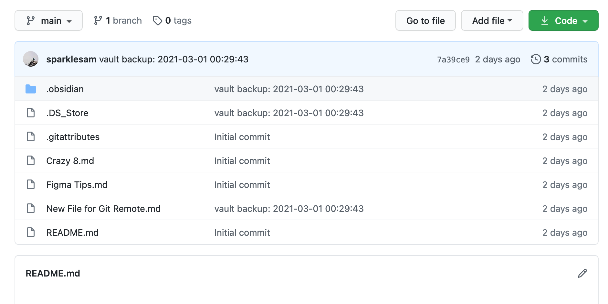

## 5. Use Obsidian In Another Devices

Now, all you need is download Obsidian and [Github for Desktop](https://desktop.github.com/) on other computer, clone the depository that you have just created, and do step 1 to 4 to setup Git and Obisidian Git. Your computers will be synced automatically.

For mobile, we would need Git-support App in order to read or write the notes.
- If you just want to read, [Github official app]((https://github.com/mobile)) allows you to view all your repositories.
- If you want to read and write, [Working Copy](https://workingcopyapp.com/) would be your best choice to pull the repo and commit any new changes. It cost US19.99(HK$158) but it is only a one-time payment. In additional to that, you will also need a writing app like Pretext or iAWriter that supports Files opening with Markdown support.

## How to Solve Sync Errors in Obsidian Git?

Even if you set up sync, there might still a chance you might encounter conflict like the below screenshot. We will need to use Github for Desktop to resolve the conflict.

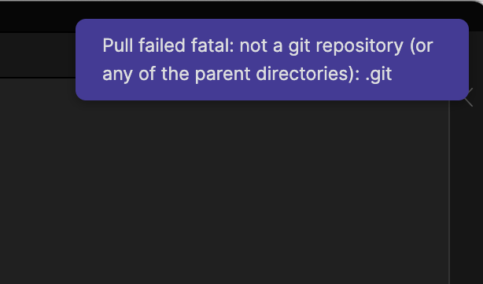

In most cases, Github will recommend you to stash the conflict files, pull changes and apply stash. See the screenshots below, first click Stash & Continue, then Pull Origin, and View Stashed after pulling, then you can restore the changes. Last, commit manually in Github and push will usually resolve the conflict.  If the conflict is within the same line, you might need to delete the incorrect version manually in Obsidian.

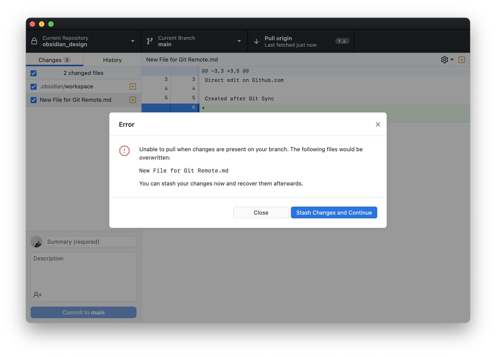

## Conclusion

Currently, I'm still in an exploratory stage using Obsidian. Making notes sync is just the first step, but I feel Obsidian has great potentials. It is not an replacement for Evernote or Notion but something better. 

Community plugins also is a big part of the ecosystem that allows customisation and enhance productivity. Like [Day Planner](https://github.com/lynchjames/obsidian-day-planner) can combine Markdown with Calendar, serving as a personal daily journal. I would love to share more about my experience with Obsidian, feel free to ask if you have any questions on Twitter.