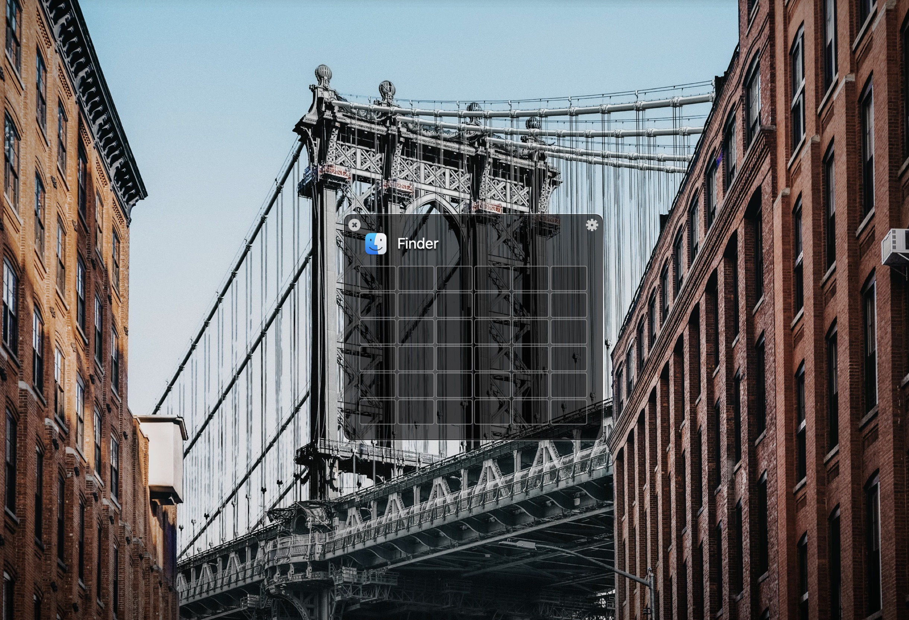
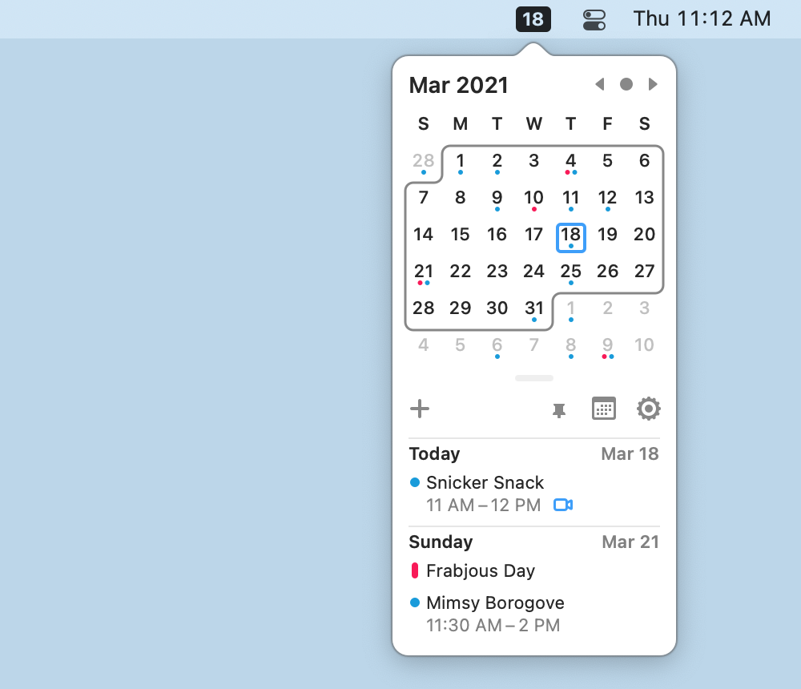
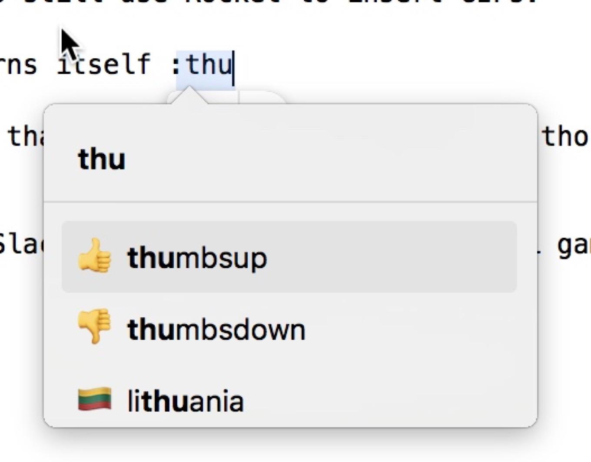
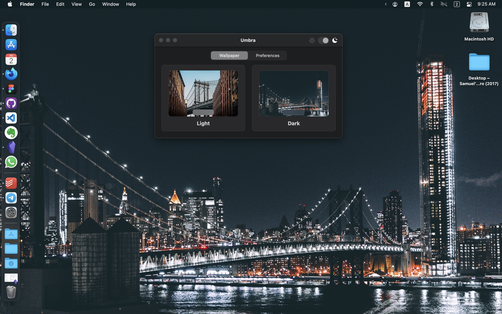

For years, I have been using Mac for work and PC for leisure (refer to my [PC setup](/a-journey-of-computer-setup/) article) since my PC setup has better graphic performance for games and multi-media production. Not being able to use Mac 24 / 7, means I probably missed out so many great indie apps in Mac ecosystem. Here's some of my recent discovery of Mac Apps with my setup

## Divvy - Windows Management

Divvy is one of my earliest macOS app that I have used. macOS's windows management apps are There is no competition in windows management arena between  and windows. While I miss Windows snap to half feature, there are TONS of windows management apps on macOS with that is fun to use

Divvy is an intuitive and customizable one. Without the need to memorize different keystrokes for each window size and position, I just remember one to open Divv,  <kbd>Cmd</kbd>+<kbd>` </kbd> (A custom global shortcut that I set). It will open a small window that allows you assign window to a proportionate size of the screen.

Download: https://mizage.com/divvy/ ($13.99 with free trial)

## Vanilla - Hide Menu Bar Icons

Menu Bar apps are all about productivity which could be a separate topic to talk about. Vanilla is a good free alternative to hide your unnecessary menu bar icons, free version requires

Download: https://matthewpalmer.net/vanilla/ (Free with Pro version at $10)

## Itsycal - Free Menu Bar Calendar

Before I had [Day-0](https://shauninman.com/archive/2020/04/08/day_o_mac_menu_bar_clock_for_catalina) replacing my default date & time on Menu Bar so it can show a mini calendar. Now, I switched to Itsycal since it offers more functionality with iCloud Calendar supports. Basically it's a stripped down version of Fantastical, it even support direct meeting links for Zoom, Google Meet, and Microsoft Teams.

Download: https://www.mowglii.com/itsycal/ (Free, support Apple Silicon)

## Rocket - Quick Emoji Input

Although Mac has built-in emoji input keyboard (through Keyboard input menu in Menu bar), wouldn't it be easier if it can support Slack style input, typing a pre-fix of `:` to start searching for an emoji. Developed by [Matthew Palmer](https://matthewpalmer.net)

Download: https://matthewpalmer.net/rocket/ (Free with Pro version at $10 )

## Umbra - Dark Mode Wallpaper App

My very recent discovery is Umbra by Replay Software. Even though macOS Big Sur has added Dark Mode support and dynamic wallpapers. Very limited options are available right now, since it require complicated process to create it by yourself like [Dynamic Wallpaper Club](https://dynamicwallpaper.club/gallery). Umbra is way more simple, with two wallpapers set for light and dark mode. It also support Unsplash, pretty much you can find anything already.

Download: [https://umbra.replay.software](https://umbra.replay.software)