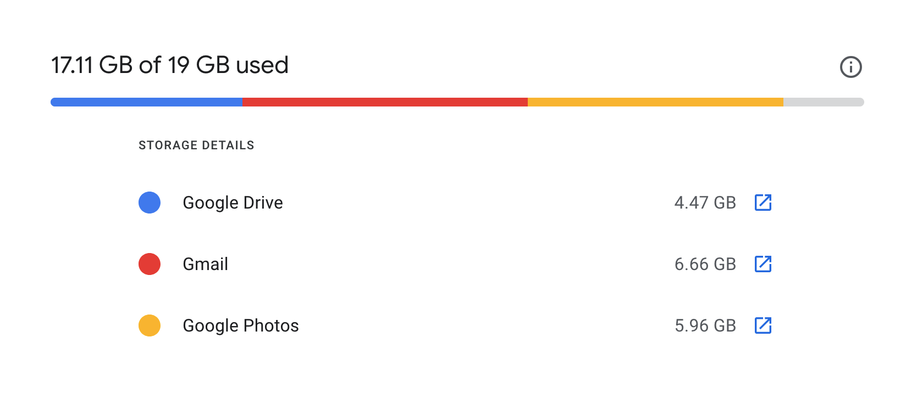
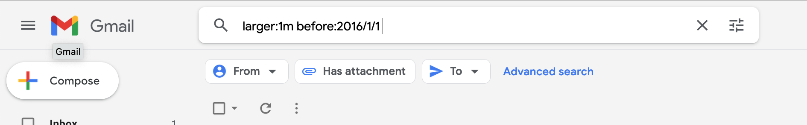

It's a new year, let's spend some time to declutter. I have been going through my inbox during holidays. In 2021 June, Google started to count any new photos toward the 15GB Google Account storage. 6 months later, I finally received the alert saying my account is running out of space.

First, head to [Google One](https://one.google.com/storage), you can see which Google service occupy most of storage space. In fact, my Gmail occupied more storage (8GB) than my Google Drive (4GB) did. This probably because I haven't delete any of my emails since I since 2005. Therefore, I'm sharing some tips to identify emails that are occupying most of your storage!

Now, I have deleted more than 2GBs of email in the end and I save few more months of money before subscribing Google One. Let's call that a win.

Using Gmail search operators is available on both desktop browser or mobile app, just simply start typing in the search fields in Gmail. Let’s get started.

## 1. Find space-consuming emails

Let's start with the largest emails first, did you know you can use a simple text query to filter your email? Aside from typical `from:someone@gmail.com` or `to:someone@gmail.com`, there are queries specific to mail attachments. Try `has:attachment` to find all emails that contain attachements and you can also use `larger:10M` (10M means 10MB) to pinpoint attachments that are too big.

I have got rid most of my emails that contains attachments that is larger than 10MB, but you can also try with different file sizes depends on your need (1M or 2M or 5M). If you have a specific time range that want to avoid, `before:2016/01/01` would also be very useful to filter out emails before a certain date. You can mix and match multiple queries by simply adding space in between.

2. ## Delete Mails that You Never Read

Use `is:unread`to find mails, newsletters or notifications that you never read. I used this in combination with `before:2016/01/01`and `from:someone@gmail.com`to delete all series of email coming from the same sender. Especially if you didnt turn off notification emails from social media sites, like Twitter or Facebook, the accumulated emails that you have received might shock you.

3. ## Some Mail Categories Probably Does Not Matter

Promotional emails probably does not matter after a few years, why not delete all of them? You can simply use `category:promotions`or `forums` or `social` or `forums` to filter different types emails. Be aware this automated categorisation, which Google called Tabbed Inbox was introduced in 2013. So it doesn’t apply to all the emails before 2013.

That’s it. Share your tips if you have any secret queries that I missed!

