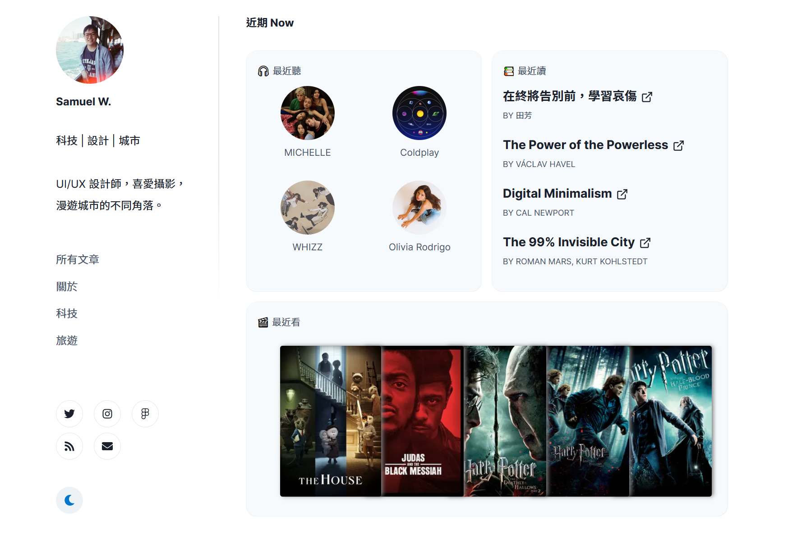
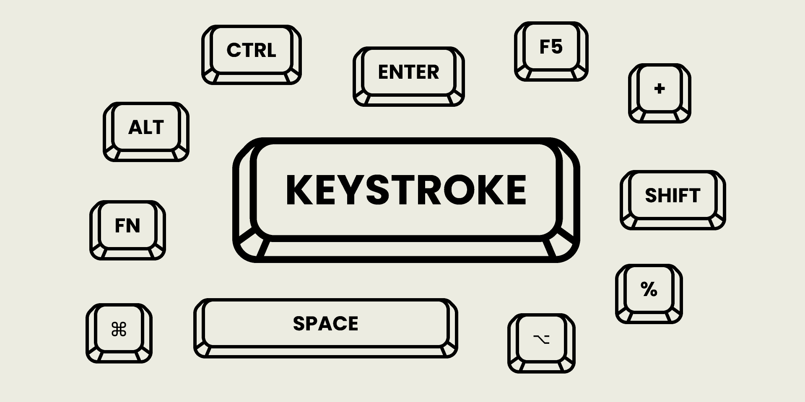

import Film from "components/Film";
import MayorPoster from "./mayor-poster.jpg";

Sorry for the delay, probably this will be the LAST year review you will ever read this year, which arrives right before the first quarter has ended. Reflecting on 2021, there’s steady progress on personal and career development.

## ❌ Read 12 books

I completed 9 books this year (↑3 comparing to 2020) yet I still failed to meet 12 books' target. One book I really enjoyed is Project Hail Mary, written by Andy Weir. Continuing after the success of The Martian, Project Hail Mary is a fascinating interstellar journey that reminds so much of "Arrival". I remember I physically could not stop reading until I've finished for 3/4 days.

## ✅ Publish 12 blogs

I published 14 blogs (↑1 comparing to 2020) last year, more than a half of them were Chinese published in my Chinese blog. But the most viewed one is [How to sync Obsidian vault for free using Git](https://desktopofsamuel.com/how-to-sync-obsidian-vault-for-free-using-git/). I could see the article sits at the top search results in Obsidian-related keywords. My personal favorite is actually Design OKR, as I shared my own career reflection and management framework, more on this alter.

## ❌ Watch 20 documentaries

I watched 12 documentaries (No change comparing to 2020). My Favourite documentary this year is **Mayor** by David Osit. It captured the fascinating of job of Musa Hadid, mayor of Palestinian city Ramallah, which was described a city without country.

<Film poster={MayorPoster} title="Mayor" year="2019" director="David Osit" rating="★★★★★"/>

## ✅ Build new things

This year I tried to build a variety of stuff:

- **Music, Films & Books I’m enjoying**: Integrating with Spotify API, [Letterboxd](https://letterboxd.com/samuelisme/) feed as well as my reading record from [Oku](https://oku.club/user/desktopofsamuel/collection/reading). I started using `gatsby-source-spotify` & `gatsby-source-rss` that update per build time, but as I migrated [my chinese blog](https://notes.desktopofsamuel.com) to NextJS few months ago, the current version will sync automatically using SWR.

- [**Design OKR Template:**](/navigating-design-career-with-design-okrs/) I love sharing my career planning progress and thought behind, Design OKR was my first attempt, creating a framework for reflection and planning that I adopted for the past years. I have also shared my [notion template online]([https://desktopofsamuel.gumroad.com/l/pftUQ](https://desktopofsamuel.gumroad.com/l/pftUQ))
- [**UX Design Career Kit**](/ux-design-career-kit/): Using Airtable, I started collecting useful career and job search resources and links, making it a free career kit.

- [**Keystroke on Figma**](https://www.figma.com/community/file/979571292056443766) : Created a Figma community template to create a auto-layout keyboard keycap easily on Figma & FigJam.

## ✅ Film Photography

Film photography was a new hobby for me in 2021. Used some disposable film camera before, but this is first time operating a “real” one. Finding my father’s old Nikon FM film camera at home (comes with a prime 35mm, 50mm, even a zoom lens), took me nearly 2 months back and forth in SSP to fix and another month to finish the first roll, but it’s still working! Hopefully after lockdown, I will be able to go out more and share some more photos.

## ✅ Keep Up with Monthly Reflection

I love writing my monthly reflection, as well as reading them back after a while. Even though I change the format quite often. I often considered monthly reflections as the summary of my month. Most questions are around highlights of the month, new things launched / shipped that month or things that I should acheive this month.

Goodbye 2021, Hello 2022

