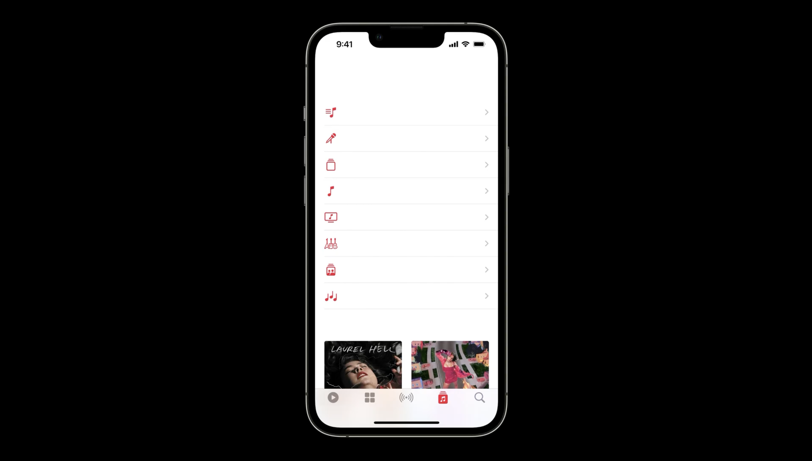

Design talks are hidden gems for designers to quickly learn from other teams' successes and failures! No matter you are a beginner in UX or currently in the field, check out these recent design talks that I really enjoyed watching and found them greatly related to my everyday’s work.

## UX in China

Yuan Qing from Shopify shared his observations and analysis on UX design in China.  His sharing is particularly useful in places like Hong Kong, where bilingual design (Chinese and English) is ubiquitous. He analysed why Chinese-reading users prefer densed information, due to both Chinese language as well as the culture, justifying crowded design is not ill design but well justified.

[Watch UX in China - Yuan Qing (Config 2022)](https://www.youtube.com/watch?v=ohxyxGR9tsA)

## Writing for interfaces

Beautifully written as an introduction, Interface writing is to **design through the lens of language.** Writer team from Apple shared their own framework in writing for interfaces. The most helpful tip is to be conversational in interfaces and read the copy out loud. They mentioned the importance to include writers as a early as possible.

> The earlier you make writing a part of the process of designing your app, the better the experience will be for the people who use it.

[Watch Writing for interfaces - Apple (WWDC 2022)](https://developer.apple.com/videos/play/wwdc2022/10037/)

## Design System Are Flawed

Another great talk from Shopify team, José Torre narrated his design journey with great analogy and humour. I always thought designing for designer is the most challenging job as you’re designing for yourself to use. But one great point that Jose pointed is that design system will not replace designers’ job.

> You can't expect the design system to do the job of a designer.

> Design system is just a tool.

Allowing designer to contribute as a part of the process instead delivering it top-down is also important.

[Watch Design systems are flawed by José Torre (Config 2022)](https://www.youtube.com/watch?v=tWXowpigqi0)

### Design accessibility for individuals with Material Design

User research is always a luxury that most companies prefer to spent on topics that bring in revenue. Therefore it’s great that Google are sharing their research findings. First part of the talk explained how they structured their  color system based on tonality to ensure sufficient colour contrast even in highly customisable environment, like the Material You system.

They also shared their research on “Should 3:1 colour contrast always be required” when creating non-textual components. Their findings have thus support their revamp on Switches which is now more accessible as well as customisable.

[Watch Design accessibility for individuals with Material Design by Google (Google IO 2022) ](https://www.youtube.com/watch?v=b6FTDYrJWRA)

## The hardest part about building dark mode is that people think it’s easy 

Following up on the topic of colour, with the introduction of dark mode, more and more websites and apps are supporting multiple colour themes. But it is not as easy as creating a opposite colour scale (especially for colours applied in inactive & disabled states). The whole color tokens system may require revamp as it it adds a new dimension to all the colours currently used.

[Watch The hardest part about building dark mode is that people think it’s easy by Figma team - Config 2022)](https://www.youtube.com/watch?v=1DTnojio89Y)

That’s it! Share your favourite CONFIG, WWDC and Google IO talks with me if I missed any.

