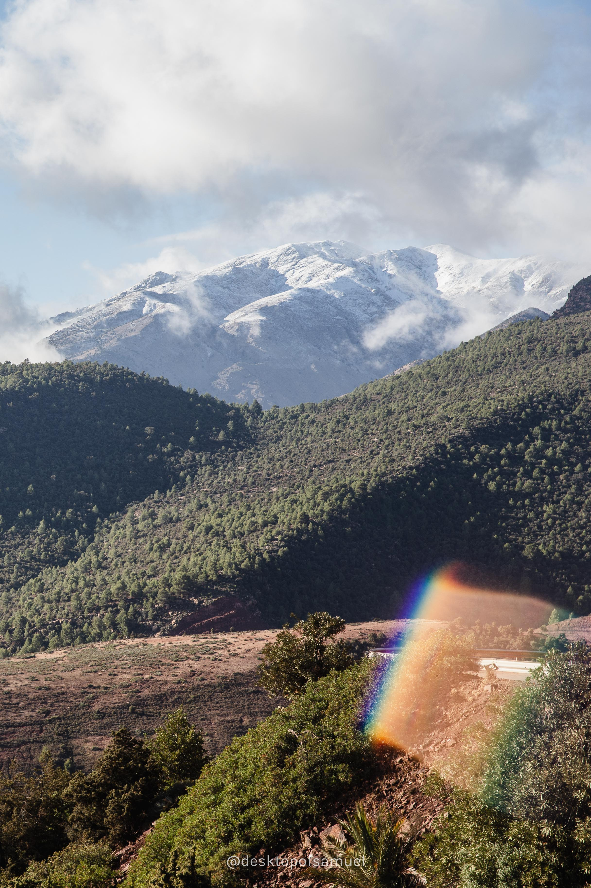
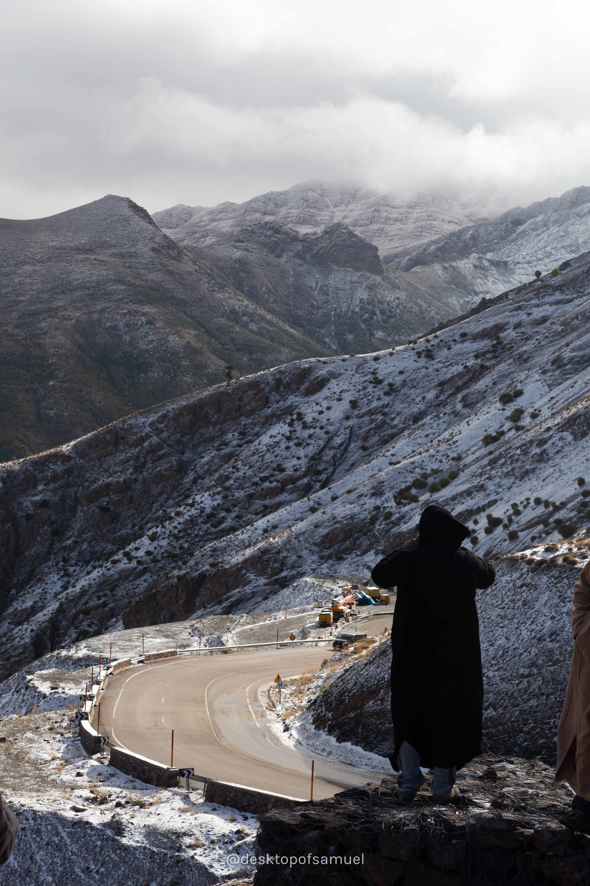
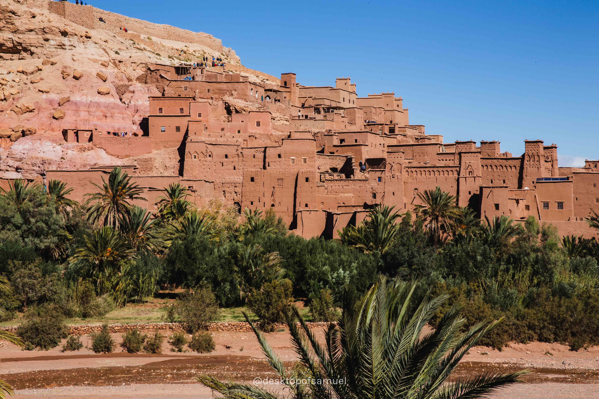
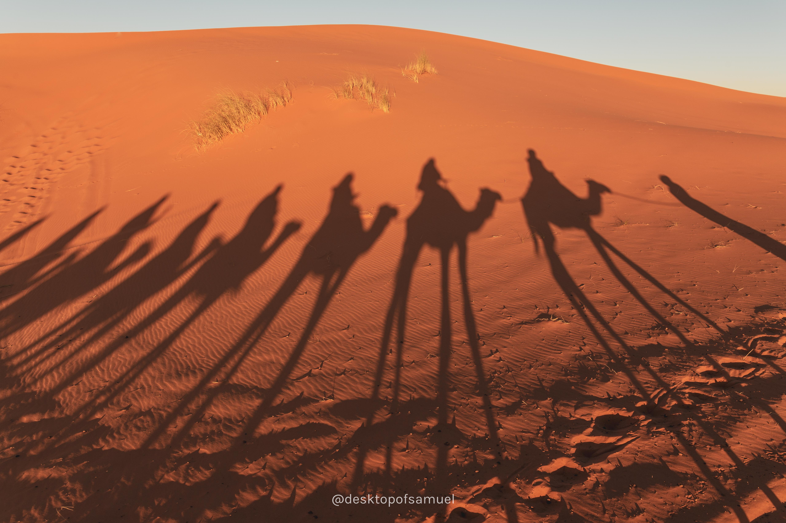

+------------------------------+------------------------------+
| Spent days in Lisbon capturing tramway. The earthquake in   |
| 1755 almost destroyed the city, but it also gave the        |
| European port a clean slate for modern city design. As trams|
| climb through the hills of Lisbon, passing through streets  |
|and places other public transport do not reached. It has     |
|become a unique city landscape.                              |
+------------------------------+------------------------------+
|  |  |
+------------------------------+------------------------------+
|                                 |
+-------------------------------------------------------------+
|                                 |
+-------------------------------------------------------------+
