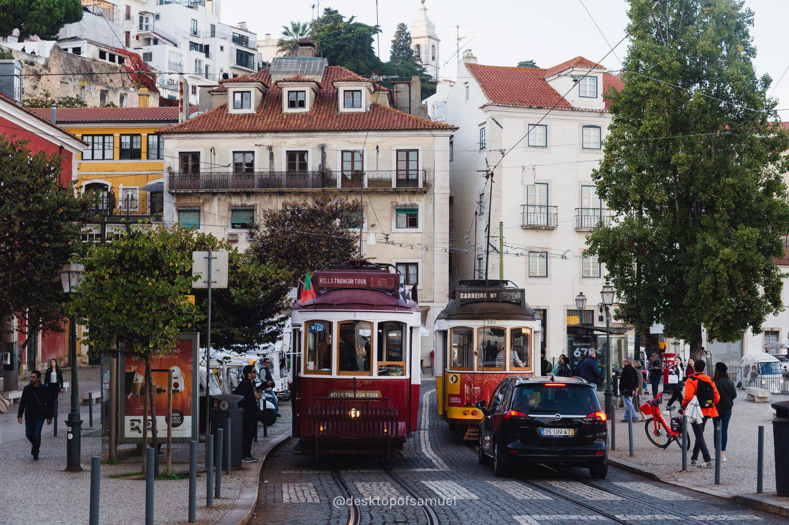
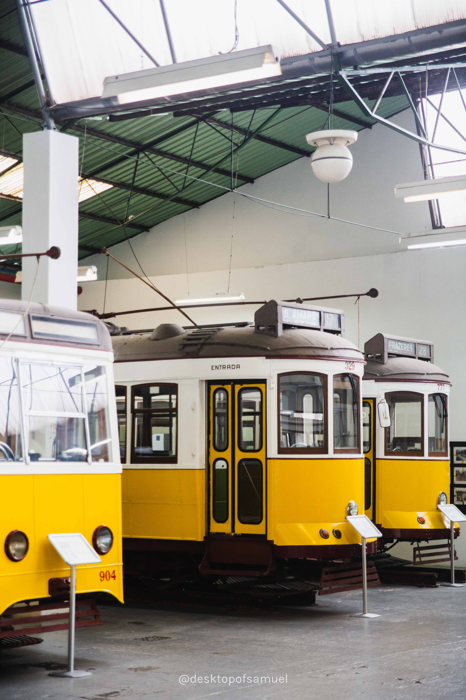
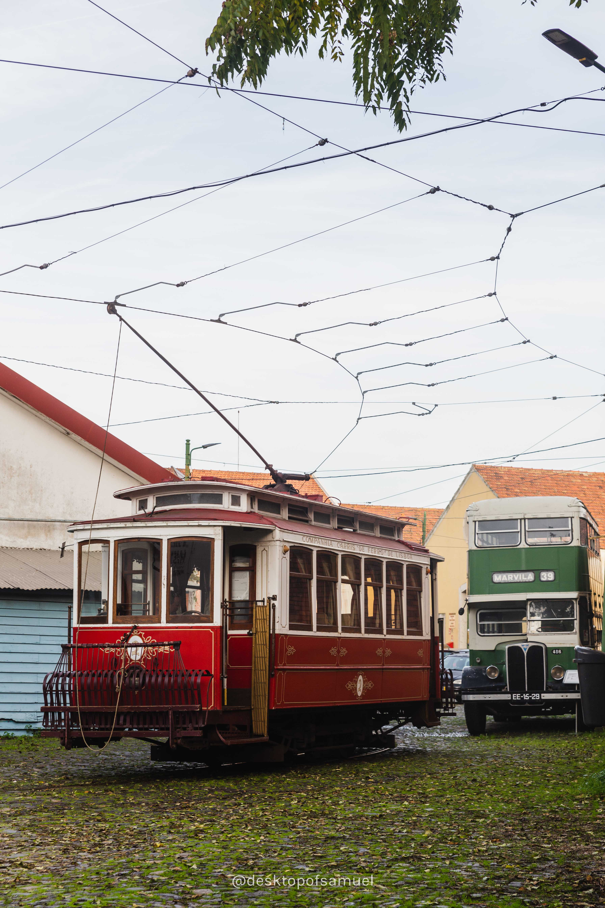
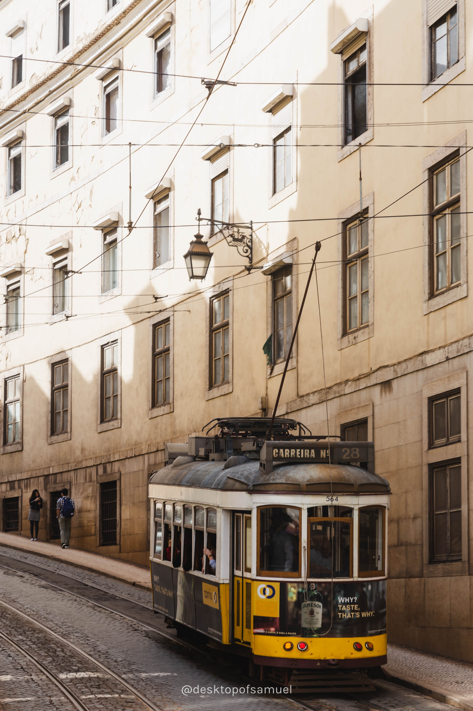
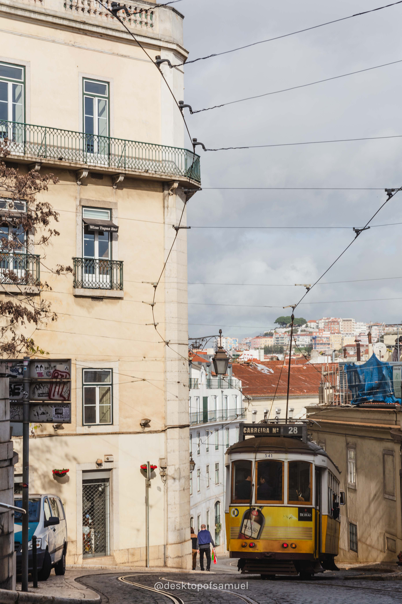
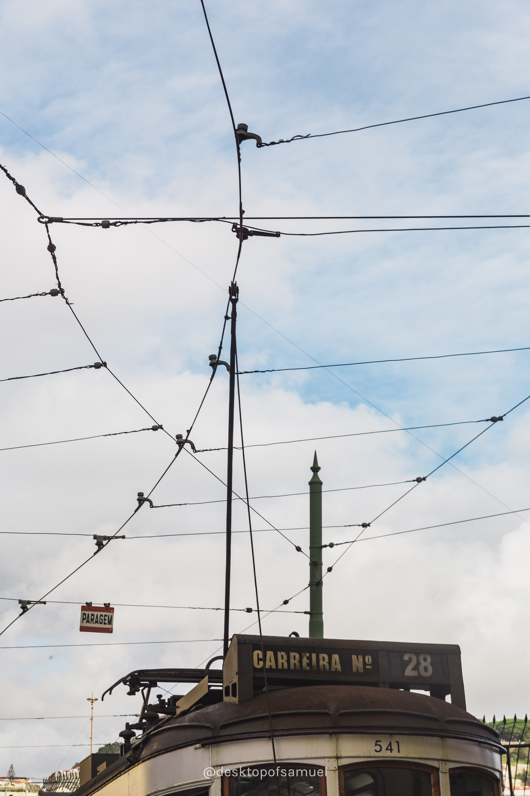
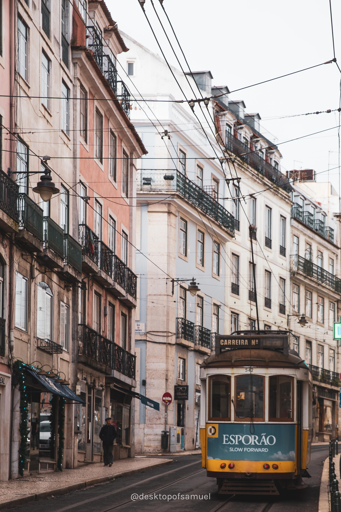

+------------------------------------------------------------------------+------------------------------------------------+
| Spent days in Lisbon capturing tramway. The earthquake in 1755 almost                                                   |
| destroyed the city, but it also gave the European port a clean slate for                                                |
| modern city design. As trams climb through the hills of Lisbon, passing                                                 |
| through streets and places other public transport do not reached.                                                       |
| It has become a unique city landscape.                                                                                  |
+------------------------------------------------------------------------+------------------------------------------------+
|                                                                                               |
+------------------------------------------------------------------------+------------------------------------------------+
| One of the hidden gems we visited was [Carris Museum](http://museu.carris.pt/en/) (Museu da Carris), located at the     |
| tram depot in Alcantara. The depot is still in use, while part of it has become exhibtion areas. In between exhibit     |
| halls, you have take a tram ride of a classic tram inside the depot. And we were the only visitors at the time.         |
+------------------------------------------------------------------------+------------------------------------------------+
|                                              |                      |
+------------------------------------------------------------------------+------------------------------------------------+
| Here are more shots on Tram 28 in Lisbon.                                                                               |
+------------------------------------------------------------------------+------------------------------------------------+
|                                                                                               |
+------------------------------------------------------------------------+------------------------------------------------+                           
|                                                                                               |
+------------------------------------------------------------------------+------------------------------------------------+
|                                              |                      |
+------------------------------------------------------------------------+------------------------------------------------+