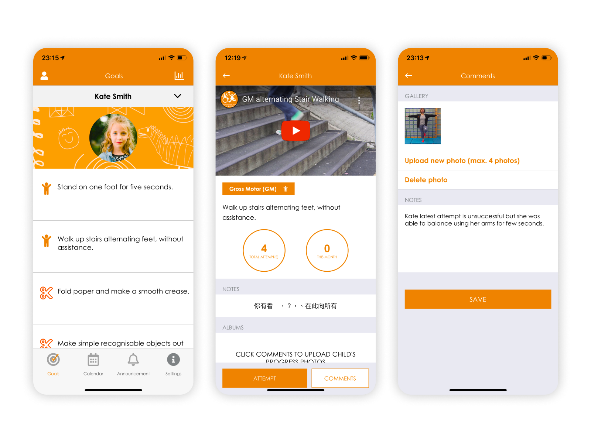
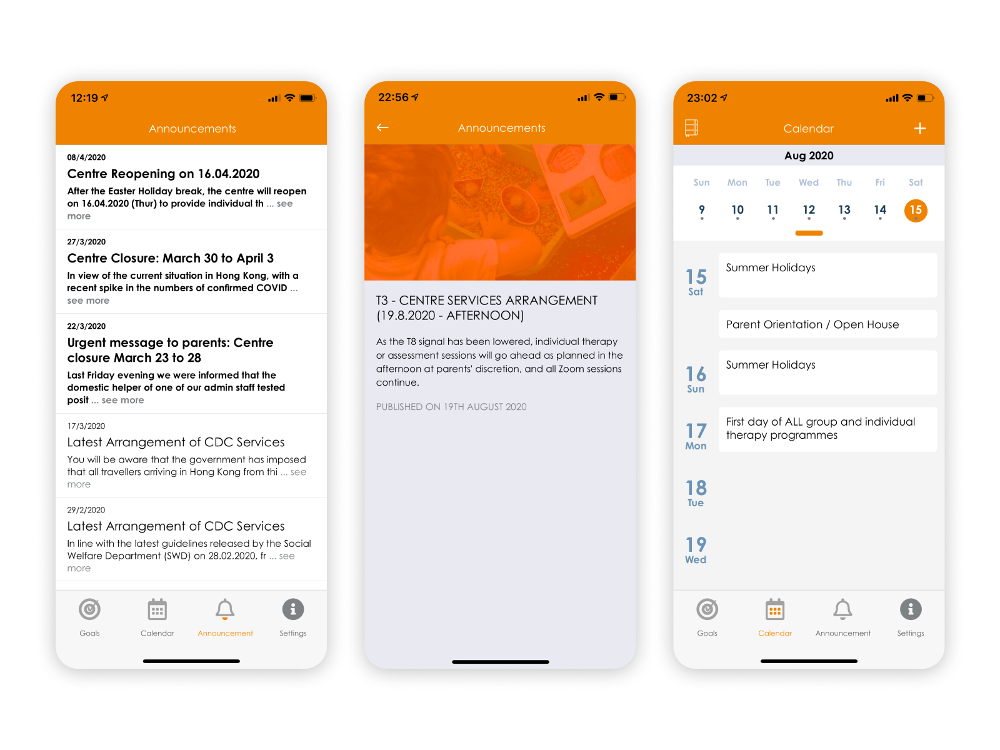

## Intro

Child Development Center 明德兒童啟育中心 provides support for child with Special Educational Needs (SEN) for more than 40 years. In 2018, Playa have collaborated on an app development project, aiming to transform the communication between students, parents and the center digitally.

## Scope of Work & Role

The project scope is a mobile app development project with a custom backend system integrated with Salesforce. I worked as a UI/UX designer in the project, delivering wireframes, mockups and final design of the mobile app on iOS and Android.

## Problems

Before, CDC use physical paper reports and worksheets to track children learning progress between parents and therapists. Designing a new digital solution would benefit all stakeholders, children, parents, therapists and also managers as well.

## Solutions

### Enhancing communications between parents and therapists

Parents are able to login to the mobile app to track Individual Learning Pathway (ILP) goals suggested by the therapist. They can also view multi-media content on how to achieve the specific goals. Real-time data could be reviewed by therapists to follow up on the learning progress.

### Implement new workflow and foster productivity
With a new internal system integrated with Salesforce, past goals statistic are all accessible by therapist easily when drafting the new report, without going through hard-copy in archive. A new workflow is also implemented by including a review status to track work progress. Approved report would be delivered to parents' app with push notification alert. 

### Keeping informed for the lastest news

Interaction between parents and the center is all digitalised. School announcements are made through push notification. Parent meetings are also scheduled via CDC Connects.

import Data from "elements/Data"
import GridBlock from "elements/GridBlock"
import ReadOn from "elements/ReadOn"

<ReadOn href="https://www.cdchk.org/zh-hant/news-zh-hant/cdc-app-launch/" text="View Project" target="_blank" />

<GridBlock>
<Data caption="Type" nodata="Client Project"/>
<Data caption="Client" nodata="CDC"/>
<Data caption="Roles" nodata="UI Designer" data2="UX Designer"/>
<Data caption="Platform" nodata="iOS & Android App"/>
<Data caption="Year" nodata="2019"/>
<Data caption="Project Timeframe" nodata="6 months"/>
</GridBlock>    