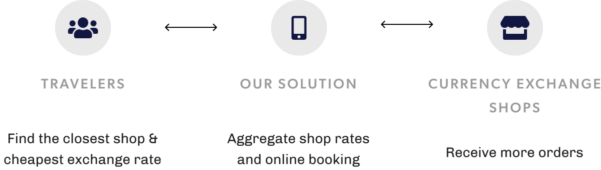
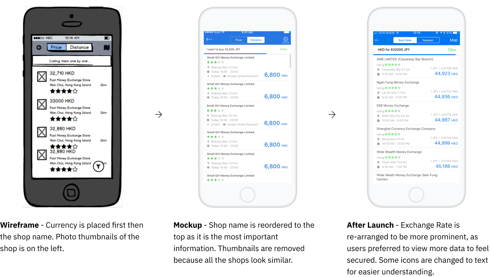

import Meta from "components/Meta";
import GridBlock from "elements/GridBlock";
import WorkMeta from "components/WorkMeta";
import ColumnItem from "components/utils/ColumnItem";
import Wrapper from "components/utils/Wrapper"

<WorkMeta>
<ColumnItem span="span 8">

> I worked with HyperAir in 2017 to build a prototype connecting travelers and currency exchange shops in Hong Kong.

> I am the sole designer contributed to the project.

</ColumnItem>
<ColumnItem span="span 4">
<GridBlock>
<Meta icon="mobile-alt" label="platform" value="Mobile App"/>
<Meta icon="calendar-alt" label="timeline" value="2017 Sep - 2018 Dec"/>
<Meta icon="mug-hot" label="type" value="Client Project"/>
</GridBlock>
</ColumnItem>
</WorkMeta>

<Wrapper style="margin-top: 2rem">

### Role

The project started as a quick iteration in validating the business idea. Majority of my work was on creating the wireframes, prototypes and app interfaces.

</Wrapper>

<GridBlock margin="0 auto" style="text-align: center; margin-top: 20px;">
  <Wrapper><small>Wireframing</small></Wrapper>
  <Wrapper><small>Prototyping</small></Wrapper>
  <Wrapper><small>Interface Design</small></Wrapper>
</GridBlock>

### Problem Statement

> Hong Kong travelers are **not able to compare currency exchange rate and service easily & transparently** in order to prepare for their oversea journeys.

Existing solutions had their own drawbacks. Exchange shops at the airport were expensive with handling fee, banks were closed on weekends and need to queue, exchange shops on the street updated their rates daily but there were no possibles ways to check their rates unless visiting the store physically.

### Proposed Solution

**Currency Exchange Comparison Platform** 

So the idea from product owners was a comparison platform with transparent exchange rates and instant booking, allowing travellers to reserve their orders online.

Thus, the project goal would simply validate if the solution is viable and gain traction for the client. Business model is not a major concern at this point as the service is free.

### Design Process

After few sessions with the client, I have visualised their business idea from concept into design drafts. I have created wireframes and screenflows to illustrate the user flow. 

I have further delivered a lo-fi interactive prototpe for client's validation on their side,  delivered UI mockup for development. 

### Key design changes & rationales

## From wireframing to end product

## Adjusting design with user feedback

### Achievements

<GridBlock margin="2rem 0;">
<Data caption="App Installs" nodata="20,000+"/>
<Data caption="Currency exchange volume" nodata="HK$38m"/>
</GridBlock>

The app has initially launched in 2018 August, **gaining tractions with 20,000+ downloads within 4 months**. Currency exchange has become a key conversion feature to drive people to download the app.

We have also receive positive feedback and reviews, endorsing our platform for making travel preparation process more convenient.

As business grew and the app has pivoted to a travel comparison platform. **HyperAir also offered a full-time design position to me.**