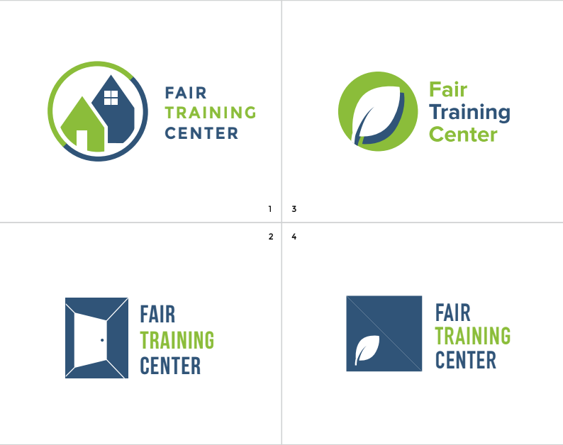
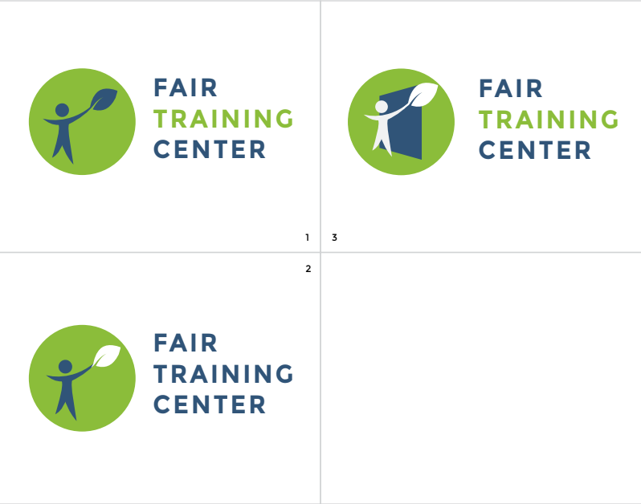
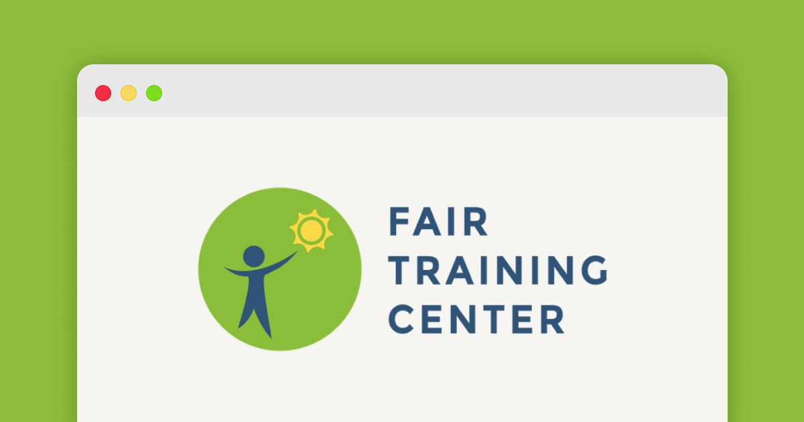

import Meta from "components/Meta"
import GridBlock from "elements/GridBlock"

Fair Training Center is a non-profit, social enterprise in the Philippines that prepares migrant workers for life overseas as a domestic worker.

In 2016, I have worked with Fair Employment Foundation, the non-profit foundation behind [Fair Employment Agency](https://fairagency.org/) to develop a new brand for its oversea training center. It is another step with the mission to eradicate forced labour of migrant workers in Southeast Asia.

## Ideation 

In the initial meeting, I have led a brainstorming session on the key message that brand logo should deliver. The idea was relate both the company's vitality and the personal growth for domestic workers. Therefore, I have worked on some ideas with two core symbols options. "Leaf" signified the growth and vitality while "Door" implied new opportunity the training center could lead. 

## Challenges

After receiving further rounds of comments, I have adjusted the design to align with existing logos adopted by its sister company "Fair Employment Agency" and the foundation.

I have continued to explore around different concepts, with the human stick figure from Fair Employment Agency's logo. Sharing the same elements would enhance the continuity under the same brand.

The final design took a step back to look beyond the symbol. I used the human stick figure from Fair Employment Agency to replace the leaf, the sun is added instead so growth was already implied. Training Center shall be the light and guiding path by offering training opportunities for migrant workers .

More Information: [Fair Training Center](https://www.fairtraining.org/)

Photos taken Fair Training Center in Manila, The Philippines

Website of Fair Training Center

<GridBlock>
<Meta icon="calendar-alt" label="timeline" value="2016"/>
<Meta icon="mug-hot" label="type" value="Freelance"/>
<Meta icon="user" label="role" value="Graphic Designer"/>
</GridBlock>    