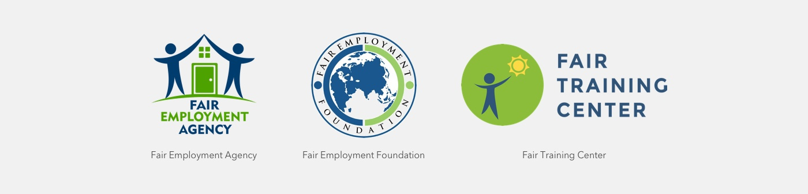
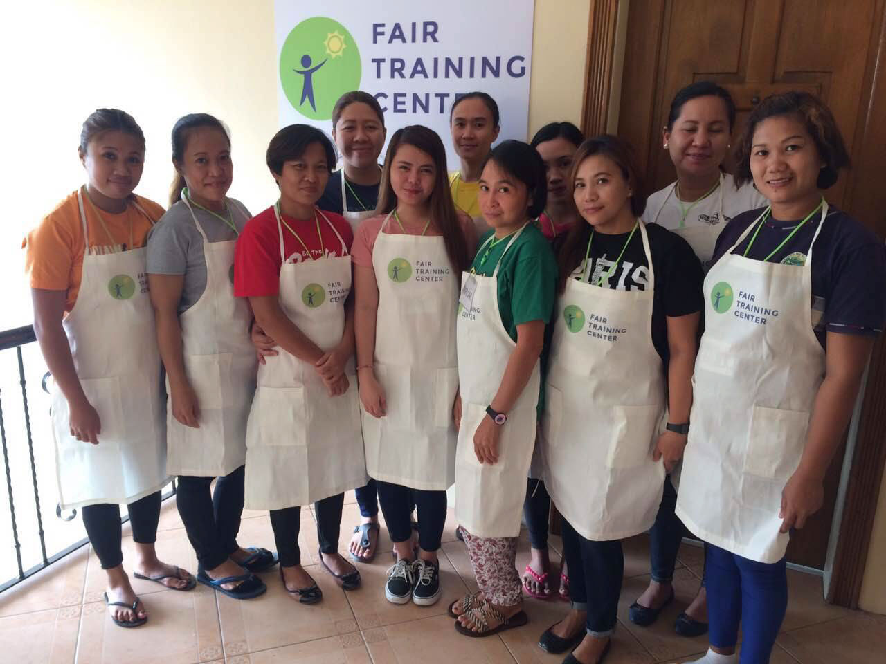
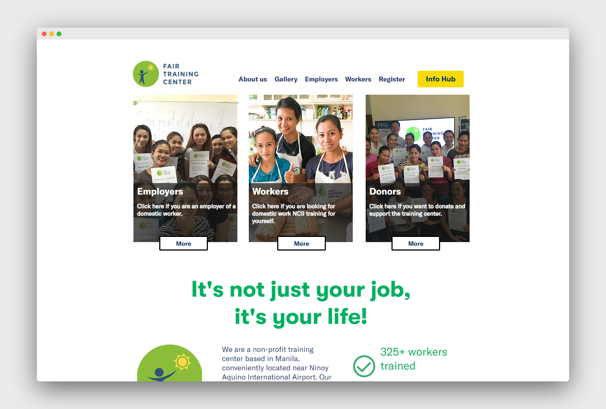

Fair Training Center is a non-profit, social enterprise in the Philippines that prepares migrant workers for life overseas as a domestic worker.

In 2016, I have worked with Fair Employment Foundation, the non-profit foundation behind Fair Employment Agency to develop a new brand for its oversea training center. With the mission to end forced labour of migrant workers in Southeast Asia, training center's logo hope to shred light on workers by offering them training opportunities. 

Photos taken Fair Training Center in Manila, The Philippines

