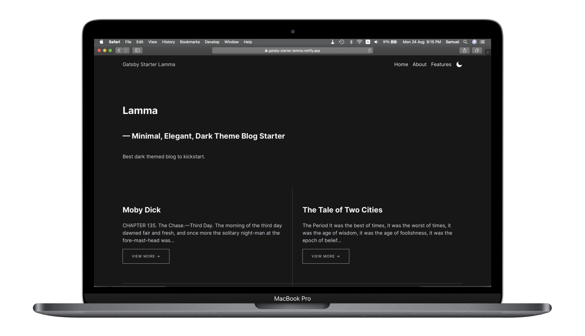

After learning Gatsby, React for nearly 2 years, I have created my very own Gatsby starter template, Gatsby Starter Lamma. Named by an island in Hong Kong, Starter Lamma aimed to be a minimal design blog template, with all the latest design features (CSS Variables, Dark Theme and more). 

This is my first attempt in contributing to open source design and please feel free to share your comments and suggestions to me on [Twitter](https://twitter.com/desktopofsamuel).

import Data from "elements/Data"
import GridBlock from "elements/GridBlock"
import ReadOn from "elements/ReadOn"

<ReadOn href="https://gatsby-starter-lamma.netlify.app/about/?ref=samuelwork" text="View Project" target="_blank" />

<GridBlock>
<Data caption="Type" nodata="Personal Project"/>
<Data caption="Role" nodata="Creator"/>
<Data caption="Year" nodata="2020"/>
<Data caption="Language" nodata="React, CSS, Javascript"/>
</GridBlock>    