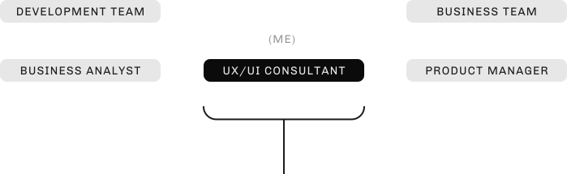
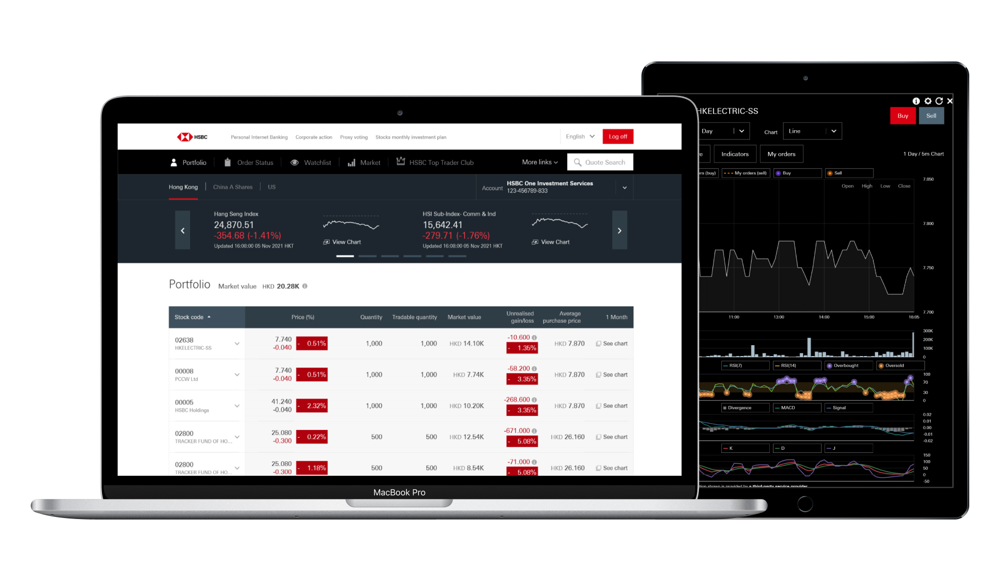

import Meta from "components/Meta";
import GridBlock from "components/GridBlock";
import WorkMeta from "components/WorkMeta";
import ColumnItem from "components/utils/ColumnItem";
import Wrapper from "components/utils/Wrapper"

<WorkMeta>
<ColumnItem span="span 8">

> In 2021, I have joined HSBC's Wealth & Personal Banking team as a UX/UI consultant. 

> Primarily I have been working on equities projects, a revamped online stock trading platform for Hong Kong, China and US stock markets, which was launched in 2021 July.

</ColumnItem>
<ColumnItem span="span 4">
<GridBlock>
<Meta icon="mobile-alt" label="platform" value="Browser"/>
<Meta icon="calendar-alt" label="timeline" value="2021 Jan - Now"/>
<Meta icon="mug-hot" label="type" value="Full-time"/>
</GridBlock>
</ColumnItem>
</WorkMeta>

### Role

Working in the equities products, my role mainly focused on with designing UI and UX journeys, working closely with product, business and the development team. 

<GridBlock margin="0 auto" style="text-align: center; margin-top: 20px;">
  <Wrapper><small>Interface Design</small></Wrapper>
  <Wrapper><small>Prototype Design</small></Wrapper>
  <Wrapper><small>User Testing</small></Wrapper>
</GridBlock>

## Building professional stock trading and analysis interface

Improving the feature set of newly revamped stock trading platform, I designed responsive interfaces for enhancing professional traders' journey using Sketch. For example, working with data provided from Thompson Reuters, new data visualisation for ESG (Environment, Social and Corporate Governance) will able to provide new investment strategy data for traders. The design process also include designing with realistic data using tools like Data Populator using JSON data feed.

## User testing for design validation

I also liaised with external agency regularly to conduct face-to-face user testing session for design validation. Using InVision and Sketch, I created high-fidelity mock-ups and interactive prototypes for user testing session. Research reports will then able to identify potential usability issues and find solutions that drives our team’s design iterations.

## Adopting UI toolkits and global design review

Coming from start-up background, working in a corporate with hundreds of designers mean I had more exposure to design governance and structure. Not only did I adopt UI component library for my design, working along side with design guild for new components to be adopted. I took the responsibility to present the design to a panel of design leads and stakeholders for approval.
