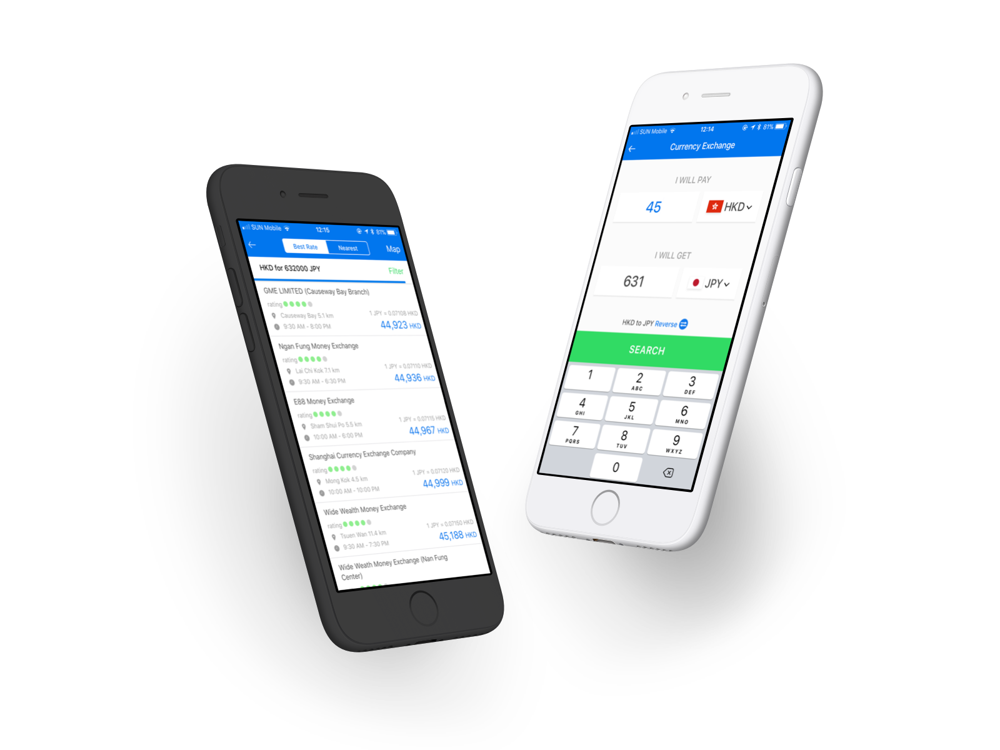

HyperAir Incorporation is a start-up in Hong Kong specialising in all-rounded travel service. In 2018, I have worked with them as a designer to launch their debut apps to embellish the experience of foreign currency exchange.

The app is trying to address such problem in Hong Kong :

> Currency exchange in Hong Kong is not transparent enough for customers to compare exchange rate and service

Adopting a B2C model to bridge the gap between FX stores and travellers, the app aims to become travellers' essential. Before departure, exchange quotes from client app will be sent to partnered FX stores, so user may compare up-to-date exchange prices and reserve online. After arriving at the destination, FX calculator will also help with your travel by matching with the exchange rate to manage your spendings. 

Appealing to frequent travellers and young people, we have designed the app to be bold and easy to use, hoping to allow the mass adopted bold and contrasting color tones in the design. Simplified call to action in key pages also help user to navigate between differnet features in this soon-to-be all-round travel app. 