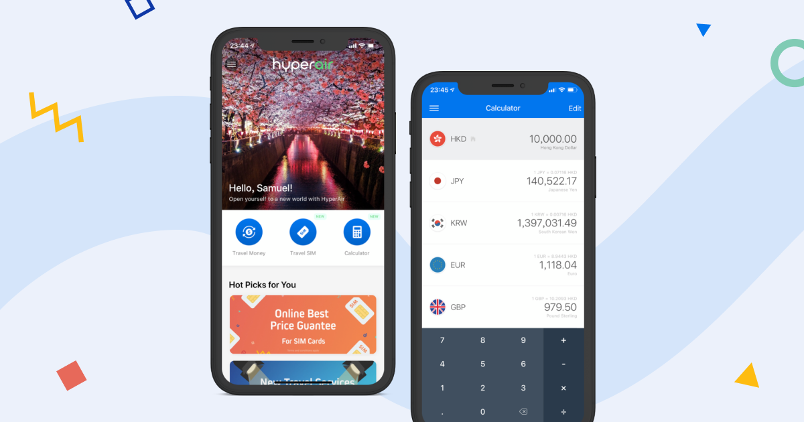

import Column from "elements/Column"
import Data from "elements/Data"
import GridBlock from "elements/GridBlock"

### Introduction

In 2018, Playa has worked with HyperAir to ship a prototype that embellish the experience of foreign currency exchange in Hong Kong. I have worked as a full-time product designer at HyperAir in 2019.

### Currency Exchange

> Currency exchange in Hong Kong is not transparent enough for customers to compare exchange rate and service

This is the mission statement of the initial app launch in 2018 Fall. Adopting a B2C model to bridge the gap between FX stores and travellers, the app aims to become travellers’ essential. Before departure, exchange quotes from client app will be sent to partnered FX stores, so user may compare up-to-date exchange prices and reserve online.

Appealing to frequent travellers and young people, we have designed the app to be bold and easy to use, hoping to allow the mass adopted bold and contrasting color tones in the design. Extravagant photos taken all around the world also showcased extensively to be immersive for users before they commence their trips.

One of the problems we encountered designing for currency exchange is data. We attempted to clear up and display necessary information only, however feedbacks proved our design assumption on keeping a minimal layout was wrong. Users choose to display more data at once when they deal with money, rather than separating in tabs and corners. We have adjusted the design to a two-column in order to fit more content within the same page.

### All-round Travel Service

As the app continues to grow, We have launched more features to facilitate the course of a traveller in preparing their trips.

- **Travel SIM** - Data SIM marketplace to get you connected while you travel. It is also first online eSIM store in Hong Kong
- **Travel Insurance** - Compare price and coverage for your travel insurance plans
- **Travel Inspiration** - Read handpicked travel articles about popular destinations to increase brand loyalty and app usage
- **Travel Experience** - Book local experience and tours with our partner network

<GridBlock>
<Data caption="Roles" nodata="UI/UX Designer, Visual Designer"/>
<Data caption="Platform" nodata="iOS & Android, Website"/>
</GridBlock>    
