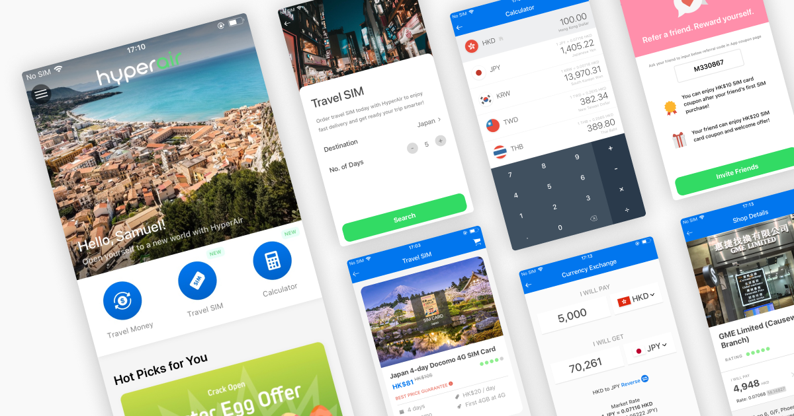
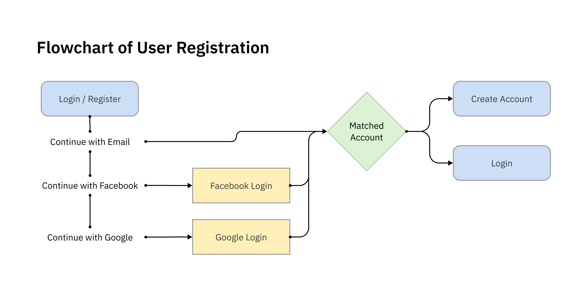
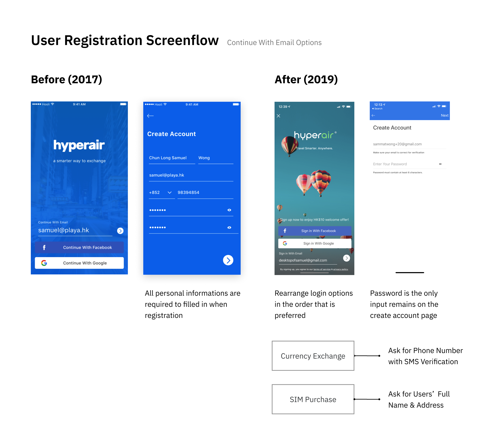
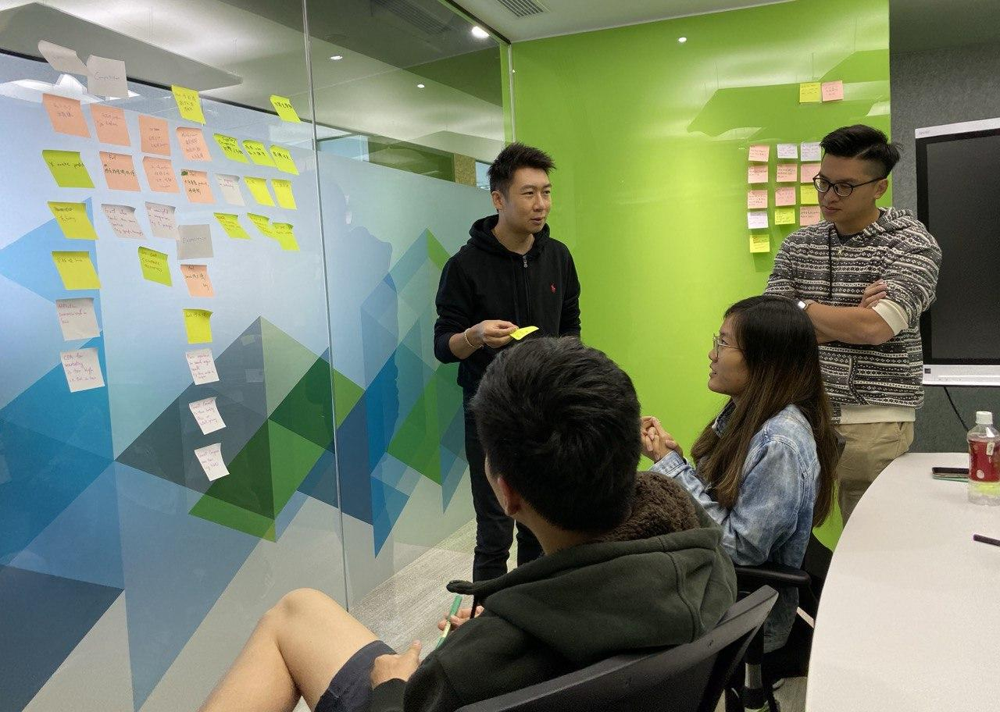
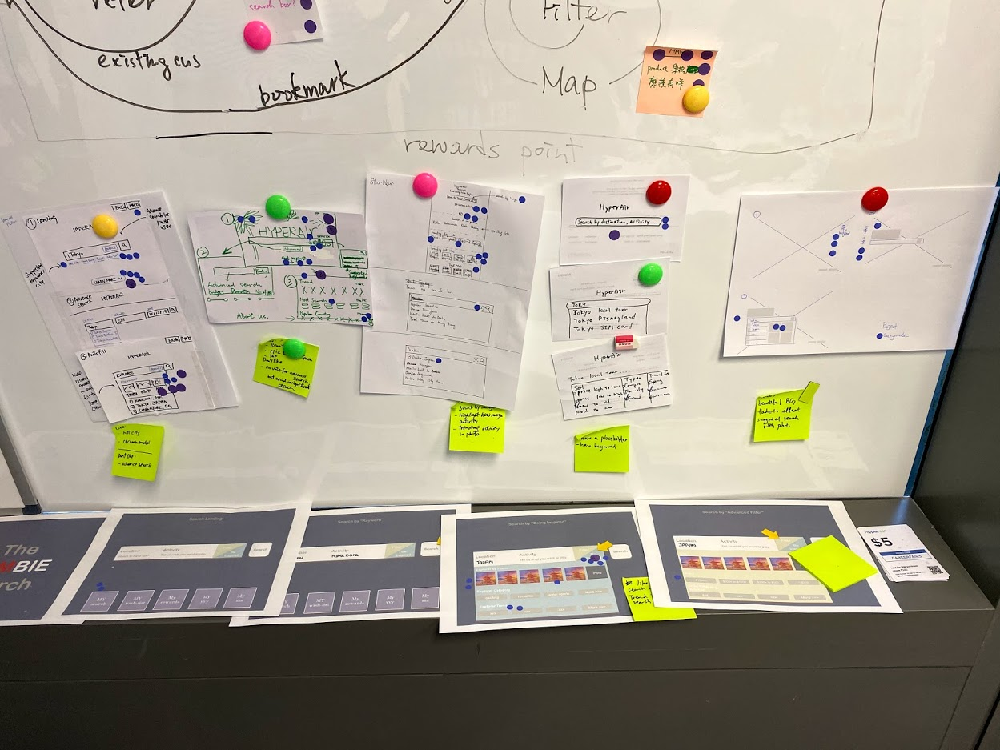

import Column from "elements/Column"
import Data from "elements/Data"
import GridBlock from "elements/GridBlock"
import InlineCarousel from "components/InlineCarousel"
import HyperAir1 from "./Hyperair-Feature3.png"
import HyperAir2 from "./Hyperair-Feature-v4.png"
import Brand1 from "./Brand-Slide-01.png"
import Brand2 from "./Brand-Slide-02.png"
import Brand3 from "./Brand-Slide-03.png"
import Brand4 from "./Brand-Slide-04.png"
import Img from "gatsby-image"

## Introduction

In 2018, Playa has worked with HyperAir to start a prototype that improves the experience of foreign currency exchange in Hong Kong. I started working  as a full-time product designer at HyperAir starting 2019. As a product designer, aside from crafting wireframes, user interfaces and prototypes, I also weigh in business goals and daily operation throughout my design process.

## Brand Style and Language

<InlineCarousel>
  
  
  
  
</InlineCarousel>

Targeting at frequent travellers and young people, we have concluded the brand style to be bold and casual. [Neon color palettes](https://zeroheight.com/055c0944d/p/68b40e) are adopted for primary buttons and header background. We bring in Cantonese (Mother tongue in Hong Kong) instead of Chinese in our UI copy to be more friendly and approachable. 

While we are developing more service modules, it is important for users to remember us as an integrated travel platform. In the early stage of building a well-known travel brand, our logo is showcased extensively in app design, as well as in third-party promotions.

Stunning photos taken all around the world were also displayed, in order to create an immersive experience to connect our app with travel. 

## Currency Exchange

> Currency exchange in Hong Kong is not transparent enough for customers to compare exchange rate and service  

This was the mission statement of the initial app launch in 2018 Fall. Adopting a B2C model to bridge the gap between FX stores and travellers, the app aimed to become travellers’ essential. Before departure, exchange quotes from client app will be sent to partnered FX stores, so user may compare up-to-date exchange prices and reserve online.

One of the problems we encountered designing for currency exchange is data. We kept a minimal design and displayed only the necessary information. However, feedback was out of our expectations. Users preferred to see more data at once when they deal with money, rather than having to look for them in tabs and corners. We quickly adjusted the design to fit more content within the same page, and adopted design hierarchy to stress on important data.

## All-round Travel Service

As the app continues to grow, We have launched more service modules to facilitate the journey of travelers in preparing their trips. 

- **Travel SIM** - Data SIM marketplace to get you connected while you travel. It is also first online eSIM store in Hong Kong.
- **Travel Insurance** - Compare price and coverage for your travel insurance plans.
- **Travel Inspiration** - Read handpicked travel articles about popular destinations.
- **Travel Experience** - Book local experience and tours with our partner networks.

## Challenges & Solutions

As the first and only designer in the company, I worked closely with two co-founders who lead business and product development, together with two software engineers to ship our app. Transitioning from an agency to a startup, we adopted an agile workflow instead of waterfall to deliver and improve continuously. 

The biggest challenges we encountered is the limitation of resources and time. We have to complete features, enhancement and bug fix in a two-week sprint.  

From the design aspect, we ideate quickly by sketching required flows and designing on possible user interfaces one sprint ahead.  We also collected feedback from our customers and analytical data to improve sales funnels after shipping our updates. 

I have also established our brand's design system, by creating a design token and projects files ready for scaling. 

### Reducing Friction for User Registration

In the MVP design in 2018, user registration flow is pretty standard. Filling in an e-mail or use Facebook or Google to continue. Detecting if the email is registered or not, it will redirect to Login Page or Create Account Page. However, Create Account page has 6 questions to input. In the later iterations, we have minimized it to 1 only. 

Not only we make it non-compulsory for privacy-concerned users to fill in personal data, we have also changed the way we collect data, by educating our users we only use their data when necessary. Phone numbers are collected when users initiate a currency exchange booking, as exchange stores may call users to confirm their booking. Addresses are collected only when users make their purchases (e.g. Travel Gadget or Travel SIM) that will be shipped. 

As users complete their user journey experiencing our various service modules, more consented data we are able to collect and analyze for our user behaviors and personas. We have seen an improved sign up rate after adopting the aforementioned approaches.

### Week-long Design Sprint To Enhance Travel Experience

In 2019 Oct, we have organized a week-long design sprint internally to kickstart building a search engine for local activities around the world. It was our first attempt in using the design sprint methodology. Our whole team of 6 has involved in the process. In the first few exercises, we have listed out long term goals and sprint goals, our potential approach (How Might We).

Then we have sketched out some of our ideas the next day, visioning how might the engine look like. Crazy Eights exercise was surprisingly useful and pushed our limits. The pressure given in a limited time to sketch the ideas has enabled interesting results.

Furthermore, the voting process opened up a balanced discussion in which everyone is involved and participated in decision making. Engineers were more clear on the design goals and business managers could provide valuable feedback in shaping the prototype.

## Takeaway

Striking a balance between user needs and business goals is a challenging task for a product designer. More factors have to be taken in consideration, like business operation, competitors, technical and design debt etc. 

Design is making conscious choices that people perceive visually. Reflecting on what I can do better, I believe it’s the documentation of the design process. As we were redesigning some old pages, I realised documenting all decisions and start building a “knowledge base” is essential to contribute to a team and also a product’s growth.  

## Download Now 

You can visit the [website](http://www.hyperair.com) or download app on [iOS](https://itunes.apple.com/hk/app/hyperair-%E5%94%B1%E9%8C%A2%E7%A5%9E%E5%99%A8-%E5%A4%96%E5%B9%A3%E9%A0%90%E8%A8%82-%E6%97%85%E9%81%8Asim%E5%8D%A1/id1397364347?mt=8) or [Android](https://play.google.com/store/apps/details?id=com.hyperair.app).
 
<GridBlock>
  <Data caption="Type" nodata="Full-time Employment" />
  <Data
    caption="Roles"
    nodata="UI Designer, "
    data2="UX Designer, "
    data2="Product Designer"
  />
  <Data caption="Year" nodata="2019 - Now" />
  <Data caption="Platform" nodata="iOS & Android App, " data2="Web"/>
</GridBlock>