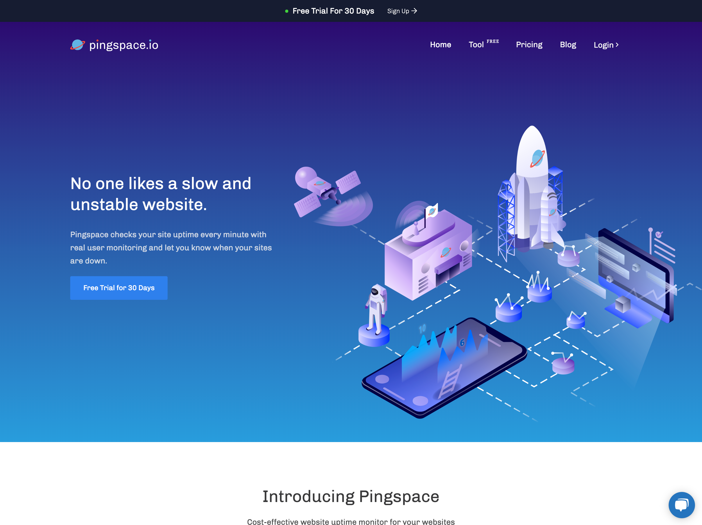
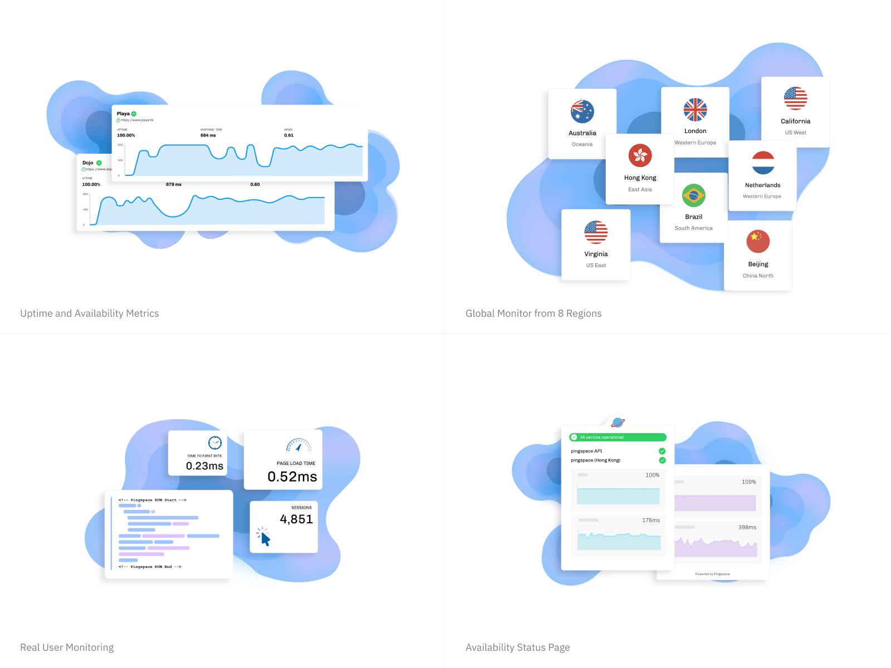

Pingspace started as a internal project at Playa. It aims to check site uptime and provide visitor insights for our agency clients. 

Biggest challenge we came across designing the brand and landing page, is to convert abstract concepts into memorable and vivid illustration. 

I was responsible for creating landing page, working with our illustrator Avery. The name “Pingspace” set up the scenario where planets across the universe trying to communicate with each other, just like any website in world wide web. And our platform is the one in between them. Therefore, we created graphics using space related elements used on the landing page. 

Pingspace offer the follow features:
* Global Monitor from 8 Regions
* Performance and Availability Metrics
* Real User Monitoring 
* Availability Status Page
* Site-down Email, Slack and Webhook Notification

