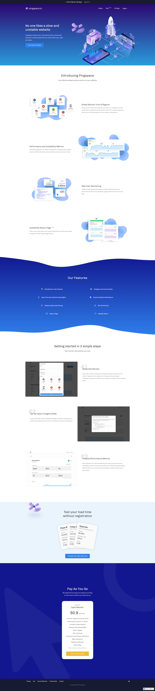

## Intro 
Pingspace started as a sideproject of my colleague Edward. It aims to check site uptime and provide visitor insights for our agency's clients. After developing the initial proptype, I have helped my partner to design a landing page for the product. 

## Problems 
Biggest challenge we came across designing the brand and landing page, is to convert abstract concepts into memorable and vivid illustration. 

I was responsible for creating landing page, working with our illustrator Avery. The name “Pingspace” set up the scenario where planets across the universe trying to communicate with each other, just like any website in world wide web. And our platform is the one in between them. Therefore, we created graphics using space related elements used on the landing page. 

Pingspace offer the follow features:
* Global Monitor from 8 Regions
* Performance and Availability Metrics
* Real User Monitoring 
* Availability Status Page
* Site-down Email, Slack and Webhook Notification

## Collaborators:
Illustrations: Avery Lau

Development & Product: Edward Mok

import Meta from "components/Meta"
import GridBlock from "elements/GridBlock"
import ReadOn from "elements/ReadOn"
import Centered from "components/utils/centered"

<Centered>
<ReadOn href="https://pingspace.webflow.io" text="View Project" target="_blank" />
</Centered>

<GridBlock>
<Meta icon="calendar-alt" label="timeline" value="2019"/>
<Meta icon="mobile-alt" label="platform" value="Web"/>
<Meta icon="mug-hot" label="type" value="Side Project"/>
<Meta icon="user" label="role" value="UI Designer"/>
</GridBlock>    
