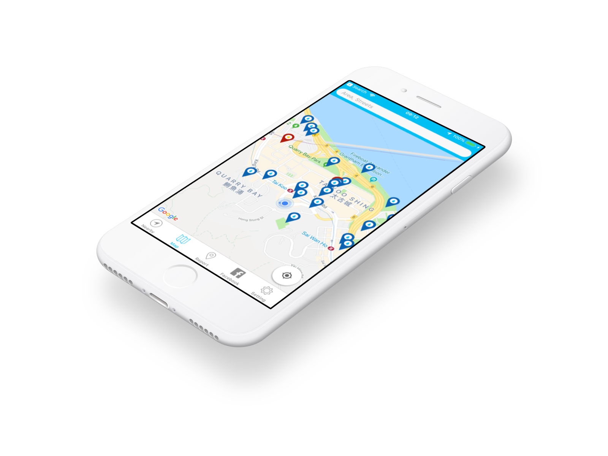
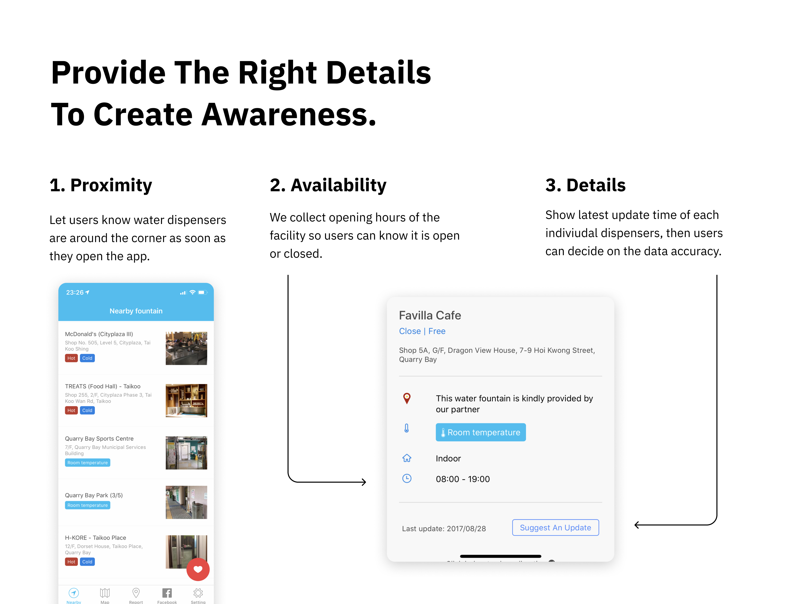
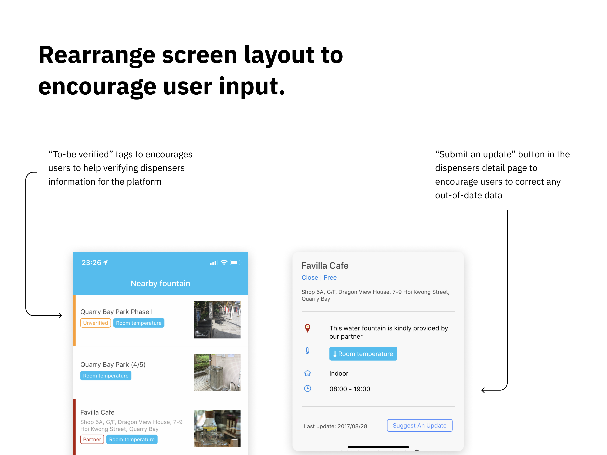
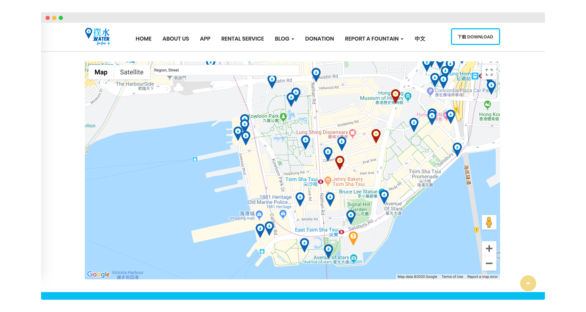

import Meta from "components/Meta";
import ZoomImage from "components/ZoomImage/ZoomImage";
import Data from "elements/Data";
import GridBlock from "elements/GridBlock";
import W4F3 from "./W4F3.png";
import W4FCaption1 from "./Caption-1.png";
import W4FCaption2 from "./Caption-2.png";
import W4FWeb1 from "./W4F-Web.png";
import WorkMeta from "components/WorkMeta";

<WorkMeta>

<blockquote>Water for Free is a mobile app that shows the locations of public water dispensers in Hong Kong & Macau. I lead the redesign allowing users to report and discover dispensers.</blockquote>

<Meta icon="phone-laptop" label="platform" value="Website, Mobile App, CMS"/>
<Meta icon="bullhorn" label="Development workflow" value="Waterfall Model"/>
<Meta icon="calendar-alt" label="timeframe" value="2016 Dec - 2017 June"/>
<Meta icon="coffee" label="type" value="Client Project"/>

</WorkMeta>

In 2017, I worked with Water For Free, a non-profit which dedicated efforts to reduce the vast amounts of single-use plastic water bottles, revamping their water dispensers map app in Hong Kong.

## Introduction

Hong Kong has hot summer and people often prefer cold drinks. However, the location of water dispensers has never been integrated by any authority’s effort.

Volunteers from Water For Free saw the opportunity and dedicated to making a water dispenser map, few years after the initial v1 app launch, Water For Free worked with Playa for v2.

## Objective & Scope of Work

The primary objective of the revamp is to facilitate users hunting water dispensers (Literal translation of the app Chinese name 撲水) and make the process more sustainable.

Playa has taken the job merging existing blog into a functional website with searchable fountain map, revamping v1 app fulfilling the objective and develop a unified content management system.

The role I have taken has been more than a UI designer, since I took part in following the lead from the beginning, outlining and discussing possible features in multiple meetings.

## Enhancements

### Provide The Right Details To Create Awareness

Working with Water For Free team, we have identified few factors that encourage users to use water dispensers. By providing the right details at the right page, users can create awareness so that can make a better choice not to buy bottle water.

### Rearrange screen layout to encourage user input

We have identified two types of users who are willing to contribute to the dispensers database. First type are power users who are volunteers of the project, the app serves as a convenient tool updating dispenser map regularly. Second type are active users who love the app and use the app to find water dispensers regularly. They usually contribute to the map when there’s incorrect data.

We also broke down the new dispensers submission process in 3 separate pages with saved process to make the contribution process more reliable.

### Approval-based Management System for Admin

In previous version, volunteer team relied on manual effort working on a shared Excel file. They receive feedbacks of the water dispensers via E-mail and Facebook Messages.

By delivering a Wordpress-based Content Management System, reported dispensers and incorrect data are now imported directly to the database pending for approval. This has drastically decrease the process time.

Also, we have also integrated the dispensers map in the website, so each individual dispensers could be shared easily.

## Achievements

Initial app revamp launch in 2017 June was very successful, we have accumulated nearly 25,000+ downloads withint 6 months, across iOS and Android with zero budget in marketing.

Reviews have been overwhelmingly positive, with 4.9 / 5 on App Store and 4.1 / 5 on Google Play Store. 

The momentum of the app is suprisingly great in the given operation scale. The project also has given sponsorships from government and commercial sector in its environmental effort.

Apple’s App Store also highlighted the app in multiple recognitions, including “New Apps We Like” during launch, later in “World Water Day”, “Pedal-powered fun” and “Make Your Life Greener” collections.

I am also honored to be interviewed by "The Pearl Report" together with Rachel Pang, the co-founder of Water For Free in 2018.

<iframe width="950" height="534" src="https://www.youtube.com/embed/YuXQS_Aqvqc" frameborder="0" allow="accelerometer; autoplay; clipboard-write; encrypted-media; gyroscope; picture-in-picture" allowfullscreen></iframe>
<GridBlock>
  <Data caption="Type" nodata="Client Project" />
  <Data caption="Client" nodata="Water for Free" />
  <Data
    caption="Roles"
    nodata="UI/UX Designer, "
    data2="Visual Designer, "
    data3="Project Manager"
  />
    <Data
    caption="Deliverables"
    nodata="iOS & Android App, "
    data2="Website, "
    data3="Content Management System"
  />
  <Data caption="Year" nodata="2017" />
  <Data caption="Project Timeframe" nodata="6 months" />

  <Data caption="App Installs" nodata="70,000+" />
  <Data caption="Launched In" nodata="2017 June" />
</GridBlock>
