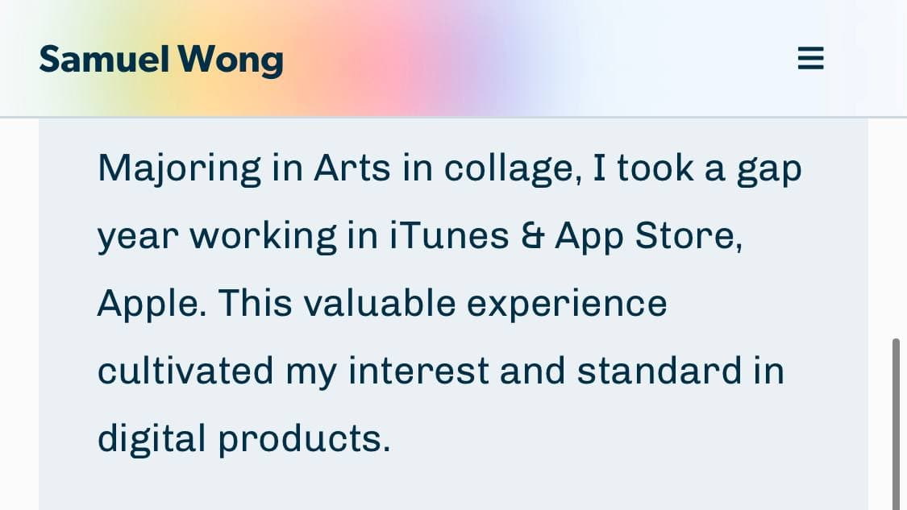

import PageTitle from "components/PageTitle"

<PageTitle title="Changelog" description="Website update and changes" type="secondary"/>

## Apr 1, 2021
- ADDED Brand new [UX Design Career Kit](/ux-design-career-kit) is here to help you to land your UX job!
- ADDED a brand new [Tools & Resources](/resources) page to aggregate all career resources and setup!
- ADDED new Tools & Resources section on [home page](/) as well
- CHANGED to Gatsby v3. Switched to Gatsby Cloud for building, Performance score has gone up from 60 to nearly 70. 
- CHANGED with increase build speed by identifying heavy package (Lodash, MomentJS) using [Import Cost](https://github.com/wix/import-cost) and [gatsby-plugin-webpack-bundle-analyser-v2](https://www.gatsbyjs.com/plugins/gatsby-plugin-webpack-bundle-analyser-v2/). Refer to this [Gatsby Conference video](https://www.youtube.com/watch?v=x4RfrJiIzBE) for more details. Build time was reduced from 14m to 7m.
- FIXED blog post layout on mobile for better reading experience
- FIXED SEO issue with trailing slash, aligning all internal link with trailing slash. Redirection from `/blog` to `/blog/` might affect SEO score

## Jan 31, 2021
- ADDED new sticky blurred navigation bar on mobile using css `backdrop-filter` and `blur`

- ADDED Check out my list of apps and services that I love on [Apps & Services](/apps/) page, created using [`gatsby-source-airtable`](https://github.com/jbolda/gatsby-source-airtable)
- ADDED share text styles using `styled-components` instead of css
- ADDED a Twitter share banner in each blog post
- FIXED gap issues for portfolio showcase on iOS Safari
- FIXED padding for Work page
- Refactor button components    

## Jan 2,2021
Massive refactoring and re-organising existing repository. Slowly switching components to Typescript.
- CHANGED Nav Bar's padding to the top of the page
- CHANGED Font style consistency in the website
- ADDED a Scroll-tracking Table of Content for blog post ([Learn how to make one for your Gatsby website](/how-to-create-a-scroll-tracking-table-of-content-in-gatsby/))
- ADDED a Scroll to Top button in the footer

## Oct 22, 2020
- CHANGED Unified boxed width across all main pages
- CHANGED blog title font style with case study using Clearendon URW (Reverted), updated layout
- ADDED subtitle for blog post to be displayed
- CHANGED Blog page layout with featured post and list view
- CHANGED resume updated

## Aug 31, 2020
- CHANGED Unordered list and ordered list bullet as browser support is not compatiable to the previous arrow.
- CHANGED new font style for all main page titles

## Aug 25, 2020
Revamped work page. I have been thinking about redesigning my work page, hoping to provide more details with clarity on my past projects. I have removed the carousel since screenshot does not really tell much things. With a new detail component for my featured projects, the rest will use a updated component same as the front page.

- ADDED Work Detail component for featured work case studies 
- CHANGED Work Index component, use detail prop to display more frontmatter information on Work page.
- CHANGED React reveal transition effect on Work page
- CHANGED Read Now button will animate when hover
- CHANGED Work template page will use a third font, [Clearendon URW](https://fonts.adobe.com/fonts/clarendon-urw)

## June 25, 2020
I am cleaning up my css and synchronize it back to my design files on Figma. I'm establishing a system on CSS variables especially on typography and color, which will hopefully laid up the foundation for upcoming new features to the website.

- ADDED Film component for blog to feature films that I reviewed
- ADDED Tag component at the bottom for each blog post
- ADDED Tip component for additional information shared on the blog
- CHANGED Page Title component
- CHANGED Button component style
- CHANGED Blockquote style
- CHANGED color scheme system for upcoming Light, Dark mode implementation and primary color
- CHANGED unordered list and ordered list style
- CHANGED body font from [Libre Caslon Text](https://fonts.google.com/specimen/Libre+Caslon+Text) to [Chivo](https://fonts.google.com/specimen/Chivo?query=chivo).

## June 7, 2020
- ADDED Load More button on Blog page to enhance load speed (Tutorial on [Codepen](https://codepen.io/grantdotlocal/pen/zReNgE))

## May 22, 2020
Work page is kind of dull right now with repeat content same as the Home page. I'm adding a screenshot carousel in replacing the "More Work" section. I have also updated the hero section for each case study, adding brand color and a transparent mock-up to let it be more attractive. In the end, I'm hoping to add some hover animation that could make the experience more interactive. 

- CHANGED Work Preview on Home Page, Limit to 2 Case Studies Only
- ADDED More Work Carousel using [React Carousel](https://github.com/brainhubeu/react-carousel)
- ADDED Prominent Hero Section for Individual Case Study Page
- UPDATED More detailed case study on the design process

## Apr 20, 2020
This is one of the biggest change since I have updated my website to Gatsby 2.0. The site has undergone massive refactor, after learning more on react, I have decided to retire some old components, switching Class Components to functional component and set up type checking using Proptype. I have also introduce a new typography system for better reading and vertical rhythm. Spacing between images and paragraph should be more loose than before. 

- ADDED New typography system
- CHANGED New primary font (Gibson from [Adobe Font](https://fonts.adobe.com/fonts/gibson))and secondary font (Libre Caslon Text from [Google Font](https://fonts.google.com/specimen/Libre+Caslon+Text))

## Mar 8,2020

My previous focus on the Photo section is to make Gatsby possible to serve as a photo portfolio. Now that it is completed (with some kind of manual work), I'm working on the aesthetic side. I have revamped the Photo Index Page and added a Photo grid section on Home page. The feature photo set seems still need some work on it as the style is incoherent. Loading speed of the home page is affected due to the photos added in the section, still working on a solution to it. 

- ADDED Photo grid section on Home Page
- CHANGED Photo page layout 

## Jan 5, 2020

- Edited About Page with new Resume section

### Dec 23, 2019

- Added [Photo](http://desktopofsamue.com/photo/) Section from previous portfolio
- Added Photo Main & Photo Post

### May 26, 2019

- Added [Gatsby-MDX](https://github.com/search?q=gatsby-mdx) to the website
- Added [GatsbyRemark-Image-Zoom](https://github.com/premieroctet/gatsby-remark-images-zoom) to add lightbox to all images processed on Gatsby Image
- Added new Gear page using MDX, more content and photos will be added
- Added new Changelog page using MDX
- Added TLDR field in markdown, Blog listing will prioritize to show TLDR, and rest will show excerpt of first 300 characters.
- Updated footer with Gear and Changelog

### Mar 21, 2019

- Launched v2 using Gatsby 2.0

### Oct 31, 2018

- Revamped landing page with new design and content. I have added my service section and an about section with [React Simple Map](http://react-simple-maps.io) as background (but it could function so much more)
- Revamped work page design. The section background is dynamic now to match every projects' brand color (manually input from the markdown files).
- Added mobile navigation and animation with some icons that I drew.
- Added 404 Page. One small step for man, one giant leap for mankind
- Added [Work Category Page](/categories/ui-ux-design/), each service can be viewed individually with relevant projects
- Enhanced landing page experience by cool reveal animation using [React-Reveal](https://www.react-reveal.com/)
- Enhanced scroll animation using [React Anchor Link Smooth Scroll](https://github.com/mauricevancooten/react-anchor-link-smooth-scroll) when you click Get In Touch on landing page
- Enhanced blog reading experience especially with code block. Code will highlight according to the language using [Gatsby-Remark-PrismicJS](https://www.gatsbyjs.org/packages/gatsby-remark-prismjs/)
- Enhanced footer design by replacing the author component, also added social media links and contact access.
- All blog posts have a feature image now on the top
- Fixed related post referenced to [Gatsby Material Starter](https://github.com/Vagr9K/gatsby-material-starter/blob/master/gatsby-node.js) node.js
- Fixed code block overflow problem in blog
- Fixed Footer Width Problem
- Fixed Tag and Category with multiple words in slug using [kebabCase](https://lodash.com/docs#kebabCase)
