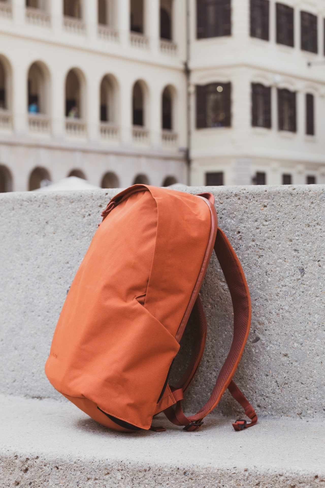

import ButtonPill from "components/button-pill"
import PageTitle from "components/PageTitle"
import Centered from "components/utils/Centered"
import { faChevronLeft } from "@fortawesome/free-solid-svg-icons/faChevronLeft";

<Centered>
    <ButtonPill
    lefticon={faChevronLeft}
    text="Back To Tools & Resources"
    to="/resources"
    isSecondary
    />
</Centered>
<PageTitle title="My Setup" type="primary" />

### Walkthrough of What I Use

## 💻 Desktop: Custom PC Build (AMD Ryzen 5 3600 + ZOTAC GTX1070)

My recent upgrade to my desktop setup are Ryzen 3600, Asus Prime X570, and Corsair Vengenance Pro RGB 2x16GB. Read more about [my journey on PC assemble](https://desktopofsamuel.com/a-journey-of-computer-setup).

(Previously: Intel i5 6400 + MSI GTX960)

## 💻 Laptop: Macbook Pro 13" (late 2017)

I miss my old MacBook Pro 13" with HDMI & SD Card slot. It's a lot simpler than the current one. No spec comparison for dongles and I think most would agree touch bar & butterfly keyboard is not the best iteration in the history of Macbooks. It came with more powerful processing power but touch bar is never an amazing feature to work with. Cooling fans are loud for unknown reason and my battery died within 2 years. Luckily, I got a free replacement part after warrant expired due to keyboard issues. Cannot wait for the next version of Apple Silicon MBA / MBP.

(Previously: Macbook Pro 13" (late 2013))

## 📚 Tablet: iPad Mini 5

I was excited the moment when I heard the rumors of new iPad mini. It's my favorite form factor and a no-brainer upgrade from my iPad Mini 2. It was too slow after 5 years(which is a valuable gift from my internship) for any kind of serious work that I only use it for media consumption and book reading. Matching up with the latest computing power and Apple Pencil gen 1 support, it has become a potential daily driver with multi-tasking & content creation.

(Previously: iPad Mini 2)

## 📱 Mobile Phone: iPhone 11 Pro

I switched to Android from iPhone 6S 2 years ago. It was a curious decision to know what Android feels like. I had a Nexus 5 way back but it never become my daily phone. Android offers so many customization and automation settings that I long for, and the deep Google service integration is my main reason to purchase a Pixel (which is still disappointingly not available for sell worldwide).

What's great about Pixel is the software. Although I experienced serious camera lag and even system slowdown in the first few months, Google solved these issues via their monthly updates. The flagship camera system is also about software as well. Low-light and HDR+ performance are the best in the market (when it was first launched). 

(Previously: Google Pixel 2)

## ⌚ Watch: Apple Watch (1st gen)

The original generation Apple Watch is more durable than I thought. I have been using it for 5 years, which is longer than any of my Apple products. Yes it is unresponsive and slow but since I switched the Android, I barely it mainly for health tracking and time. Frankly speaking, in the times of less notification and interruptions in our daily life, I'm good living without notification on my wrist. I will miss the haptic feedback when phone calls though. 

On the good side, Google Fit recently launched the long-waited iOS version, so my heart rate data can be synced from Health app. Consolidated together with my Google Map stats on Google Fit. 

## 🎧 Headphone: Bose SoundSport Wireless

There is something wrong with my ear that I never get comfortable with in-ear headphones. There isn't many alternatives in the market and I have even considered using Airpod on Android. Luckily I found SoundSport Wireless is a unique solution to my problem. It supports connecting up to 3 devices at the same time and switches automatically if any devices play anything. There is a more expensive wireless option as well. 

(Previously: [PUGZ Wireless Earbuds](/pugz/) )

## 📸 Camera: Canon 6D

## 🎒 Backpack: Moment Travelwear Backpack 

(Previously: Peak Design Everyday Backpack 20L V1) 